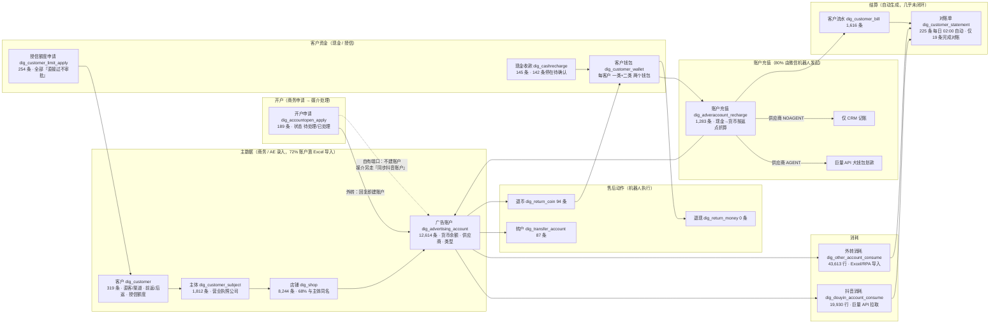

# 系统主线业务图（库表 + 代码反推）

依据：`crm_xinhuo` 生产快照（2026-09-14，上线于 2026-07-06）与 `ruoyi-digital` 反编译源码。每个节点标注对应表；数字为实测行数。

## 1. 一张图：钱和账户怎么流

## 2. 主线分解（按业务顺序）

### 2.1 客户建档 → 主体 → 店铺
- **客户**是资金和返点的归属单位：现金备款 `balance`、授信额度 `credit_money/credit_usemoney`、前返 `before_ratio`、后返 `after_ratio`、服务费点数 `service_point`、标签（直客 188 / 渠道 14；自运营 174 / 代运营 28）。
- **主体**是广告主的营业执照公司，一个客户可有多个主体（渠道客户尤其多：35 个客户挂 100+ 账户）。
- **店铺**理论上是主体下的抖音门店/店铺，但 5,628/8,244 条店铺名 = 主体名，说明对多数业务它只是被迫填的中间层。
- 三层都记 `supplier_id`（供应商）和 `account_infojson`（账户类型汇总，如 `[{"types":102,"num":1}]`），渠道归属在建档时就被钉死。

### 2.2 开户申请（商务 → 媒介）
1. 商务在「公共管理 → 开户申请」填：客户（选）、开户主体名称、店铺 ID/名称、账户类型、复制数量（平均 11 个/单）、开户类目、供应商名称、商务经理、备注。**除客户外全部是自由文本**，不与主体/店铺表关联。
2. 校验：申请的「端内/端外」必须等于客户的 `types`，否则报错（日志 12 次）。
3. 媒介在「处理开户申请」回复：账户 ID + 账户名称列表、回复内容 → `state=1`。
4. **只有外转（`data_type=10`）路径会自动创建 `dig_advertising_account`**（866 条 remark=「开户申请创建账户」）；抖音自有端口路径不建账户，媒介要再去「广告账户 → 同步抖音平台账户」按账户 ID 从巨量 API 拉取（2,607 条）。
- 平均处理时长：自有端口 2.5 小时；外转本地推 12.9 小时（要等外部代理商）。

### 2.3 客户资金进入
- **现金收款**：商务/媒介申请（客户、金额、付款人、付款时间、凭证、收款账户、钱包）→ 财务「确认到账」→ 客户 `balance` 增加。实测 145 条里 **142 条停在待确认**，只有 2 条完成；报错「客户有多个钱包，请设置收款的钱包」33 次。→ 这条链在系统里**没有真正跑通**，资金到账事实走了别的渠道。
- **授信（垫款）**：`dig_customer_limit_apply` 254 条，永久/临时额度，配置了按金额分级审批（≤20 万部门负责人、>20 万董事长），但实测全部 `approval_state=3`「直接过不审批」。
- **备款/垫款调整**：`dig_cus_operbalance` 14 条，页面标注「无需审批实时生效」。

### 2.4 账户充值（核心交易）
- 一笔充值：`cash_recharge`（从客户备款/授信扣）→ `currency_recharge = cash × (1 + 返点)`（进广告账户的货币）；`credit_pay + cash_pay = cash_recharge`；同时记供应商侧 `actual_expenditure`、`supplier_ratio`。
- 状态：0 待确认 → 1 媒介确认 → 2 已完成；5 拒回。媒介确认时按供应商类型分叉：AGENT → 巨量 API 从代理大钱包划款并回写 `sync_state=30`；NOAGENT → 只记账。
- **来源**：`source=机器人` 1,032 条（80%），`PC申请` 256 条。机器人 = 微信群机器人（`dig_robot_ex` 绑定 5 个客户群），群里发「充值 账户ID 金额」→ 后端解析 → 调 API → 回群贴「账户余额/备款余额/在途金额/授信已用/总可用金额」。
- 标签：续费 1,105 / 新开 1。首充/首续/N 续 记在现金收款 `tag`。

### 2.5 消耗
- 自有端口：巨量 API 按日拉账户消耗，带产品线（巨量本地推 / 本地推-搜索快投 / 品牌竞价 …）、报备标签（自运营 / 走量）、ROI 字段。
- 外转：Excel 导入（`DigOtherAccountConsumeServiceImpl`），产品线字段为空；遇到未知账户 ID 自动补建账户。
- 消耗行同时记服务费点数与计提（`service_spend / unsettled_service_fee / settlement_service_fee`）。

### 2.6 转户 / 退币 / 退现
- 转户：同客户账户间货币平转（`transferConversion=equipoise`，`crossCustomer=0` 禁止跨客户），87 条**全部由机器人执行**。
- 退币：账户货币退回，`refund_type` 0 退到客户备款 / 1 抵扣服务费，94 条，85% 机器人。
- 退现：备款退回客户银行账户，走审批流（财务），**0 条**。

### 2.7 结算
- 客户流水 `dig_customer_bill` 记录每次备款/授信/货币变动（业务类型 32 种枚举 `CustomerBillBusinessType`）。
- 对账单每日 02:00 自动生成（`generateType=automatic`），算欠款/回款/逾期；225 条里仅 19 条 `is_completed=1`。
- 供应商侧：`dig_supplier_bill` 282 条记欠供应商款；「向供应商支付记录」菜单已隐藏。
- 发票 / 合同 / 提成 / 工资 相关表全部 0 行，未启用。

## 3. 主线之外但影响体验的机制

| 机制 | 事实 |
|---|---|
| 数据权限 | 商务 `data_scope=5` 仅本人；`dig_customer_refuser`（231）/ `refdep`（280）另开共享 |
| 待办计数 | `dig_customer_expand` 已按客户维护「现金待确认数 / 退现待处理数 / 授信待处理数 / 充值待确认数 / 退币待处理数 / 转户待处理数」——工作台的数据基础已存在，只是没有页面 |
| 审批流 | `base_approval_process` 按流程编号 + 金额区间 + 人员/角色/部门负责人 配置，全局共 10 条流程 11 条明细 |
| 通知 | 微信机器人回执 `robot_send_record` 70 条；企业微信/飞书工具类存在但配置表为空 |

相关：[[业务逻辑说明-代码与库表反推]] · [[角色×字段×阶段-流程图]] · [[抖音事业部-vs-其他媒体-合并分析]]
