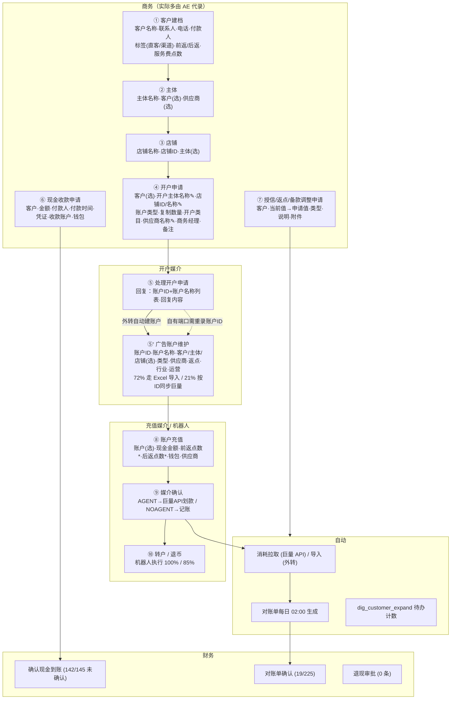

# 角色 × 字段 × 阶段 流程图（现系统实测）

说明：每个阶段列出**谁操作、在哪个页面、填哪些字段、字段落到哪张表、是选择还是手填、下游能否回填**。字段名以前端表单 label / 后端 `@Excel` 注解为准，使用率来自生产快照（详见 [[核心表与字段真实使用率]]）。标注 ⚠ 的是造成「重复填写 / 不能回填」的具体点。

角色缩写：商务 = 商务岗位（15 人，仅 2 人在用）；开户媒介（5 人）；充值媒介（2 人）；AE = AE数据（1 人，中央录入）；财务（3 人，几乎不用）；机器人 = 微信群机器人 / RPA 账号。

## 0. 全景泳道图

`✎` = 自由文本字段（不与已有主体/店铺/供应商记录关联）；`*` = 后端 `@NotNull` 必填。

## 1. 阶段明细

### ① 客户建档 — 商务 / AE
| 页面                     | 抖音事业部 → 客户管理 / 其他媒体 → 客户管理（两套入口，`types` 由入口决定）                                                                                                                                                                       |
| ---------------------- | -------------------------------------------------------------------------------------------------------------------------------------------------------------------------------------------------------------------- |
| 表                      | `dig_customer`（72 列）                                                                                                                                                                                                 |
| 填写                     | 客户名称、联系人、联系电话、付款人、客户标签（直客/渠道；自运营/代运营）、前返点数、后返点数、服务费点数、授信类型、销售（默认创建人）、备注                                                                                                                                              |
| 选择                     | 标签（字典 `customer_tag`）、销售（用户）                                                                                                                                                                                         |
| 系统生成                   | `customer_no`、`create_time`、`sale_id`、`types`（入口决定 ⚠）                                                                                                                                                                |
| 实际使用（319 条）            | 名称 100%、联系人 41%、电话 41%、付款人 <1%（213 条是空串）、前返 2%（7 条）、后返 <1%、服务费点数 0、授信额度 65%（207 条但只有 6 个不同值）、授信已用 30%、备款余额 3%（11 条）、总充值 32%、钱包开关 70%                                                                                 |
| 从未使用（72 列中 31 列全空或全 0） | 18 个 `sea_*` 公海字段、`service_id/service_name`、`service_balance/service_point`、`is_sea`、`customer_status`、`first_cooperation_time`、`new_orderfirst_*`、`is_brand`、`temp_credit_money`、`trans_ratio`、`monetary_credit*` 等 |
| ⚠                      | 同一公司名可在两个入口各建一份（54 例）；`types` 一旦选错，下游开户申请直接报错                                                                                                                                                                        |

用户口述需要但**现系统没有的字段**：行业、社会信用代码、开户银行名称/账号、住所、直客 ID / 来客 ID（本地推）。这些目前记录在系统之外（前端 245 个 js 文件搜索 0 命中）。

### ② 主体 — 商务 / AE
| 表 | `dig_customer_subject`（20 列） |
|---|---|
| 填写 | 主体名称、备注 |
| 选择 | 客户、供应商 |
| 实际使用 | 名称 100%、客户 100%、供应商 100%；联系人/电话 < 1%（有 2 条） |
| ⚠ | 65 个主体名跨两个客户类型重复；21 个在同类型下重复 |

### ③ 店铺 — 商务 / AE
| 表 | `dig_shop`（21 列） |
|---|---|
| 填写 | 店铺名称*、店铺 ID（外转可空）、备注 |
| 选择 | 主体*（`@NotNull subjectId`）、客户（自动带出） |
| 实际使用 | 名称 100%；店铺 ID 79%（外转多为空） |
| ⚠ | 5,628 / 8,244（68%）店铺名 = 主体名，即对大多数业务该层只是「必须有一个才能挂账户」的占位 |

### ④ 开户申请 — 商务（120/189 由单角色商务提交，另 32 由抖音运营、31 由开户媒介自己提）
| 页面 | 公共管理 → 开户申请 |
|---|---|
| 表 | `dig_accountopen_apply`（31 列） |
| 填写（文本） | 开户主体名称 ✎、店铺 ID ✎、店铺名称 ✎、账户类型（字典与文本混用：`102` / `1001` / `巨量AD` / `本地推` 并存 ⚠）、复制数量（均值 11）、开户类目、CID(商品ID)、供应商名称 ✎、商务经理、申请备注 |
| 选择 | 客户（唯一的外键） |
| 校验 | `dataType`（端内 1 / 端外 10）必须等于客户 `types`，否则「申请的客户类型和选择的客户的类型不一致」（12 次） |
| 系统生成 | 申请人、申请人部门、申请日期、状态 |
| ⚠ | 主体、店铺、供应商在 ②③ 已经录过，这里再手填一遍文字；回复时系统靠 `subject_name` / `supplier_name` **按名称反查**建账户 |

### ⑤ 处理开户申请 — 开户媒介（185/189）
| 填写 | 账户 ID + 账户名称 列表（可上传 ID 列表）、回复内容 |
|---|---|
| 结果 | `account_nos` JSON、`reply`、`reply_date`、`state=1` |
| 分叉 | `data_type=10` 外转：按客户 + 供应商名 + 账户类型自动 `batchInsertAdveraccount`（866 条） `data_type=1` 自有端口：**不建账户**，媒介另去「广告账户 → 同步抖音平台账户」输入账户 ID + 供应商 从巨量 API 拉取（2,607 条） |
| ⚠ | 自有端口路径，账户 ID 在「回复」和「同步」各填一次；申请单与账户之间没有外键，只能靠备注文字追溯 |

### ⑤' 广告账户维护 — 开户媒介 / AE
| 表 | `dig_advertising_account`（63 列） |
|---|---|
| 来源 | Excel 导入 9,052（72%）/ 按 ID 从巨量拉取 2,607（21%）/ 开户申请创建 866（7%）/ 消耗导入自动补建 16 |
| 导入模板必填 | 客户名称、主体名称、店铺 ID、店铺名称、账户 ID、账户名称、运营名称、运营手机号（`@Excel(name="...(必填)")`） |
| 页面填写 | 账户类型、供应商、账户前返/后返、一级/二级行业、运营、钱包一类/二类、标签 |
| 实际使用（12,614 条） | 账户 ID / 名称 / 客户 / 主体 / 店铺 / 供应商 / 类型 100%；一级/二级行业 21%（仅 API 拉取的账户有）；货币余额有值 2%（253 条）；累计消耗 6%；`original_subjectid`（媒体端主体）28% |
| 从未使用 | 运营 `service_id/service_name`（导入模板却标「必填」）、`editor_*`、`account_ratio`（14 条）/`after_ratio`（0）、`incentives`、`returnmoney`、`run_status`（全 0）、`advertiser_id`、`account_service_point` 等 |

### ⑥ 现金收款 — 商务/媒介申请 → 财务确认
| 表 | `dig_cashrecharge`（41 列） |
|---|---|
| 填写 | 客户*、充值金额*、付款人、付款时间、支付凭证、收款账户*、钱包、备注；标签 新单/首续/续费 |
| 状态 | 0 待确认 → 1 已确认 → 2 已完成；5 拒回 |
| 实测 | 145 条：待确认 142、已完成 2、拒回 1。报错「客户有多个钱包，请设置收款的钱包」33 次（每个客户固定有「一类」「二类」两个钱包） |
| 结论 | 现金到账确认**未在系统内闭环**，客户备款余额的真实性依赖别处 |

### ⑦ 授信 / 返点 / 备款调整申请 — 商务申请 → 审批
| 表 | `dig_customer_limit_apply` 254 / `dig_cus_operratio` 265 / `dig_cus_operbalance` 14 |
|---|---|
| 填写 | 客户、申请类型（永久/临时额度；前返/后返）、当前值→申请值、回款周期、合同/附件、申请说明 |
| 审批配置 | 授信 ≤20 万 部门负责人，>20 万 董事长；返点 → 厦门财务部；退现 → 财务部；客户转账 → 厦门财务部；调整充值 → 财务部 |
| 实测 | 授信申请全部 `approval_state=3`「直接过不审批」；返点申请 265 条正常审批 |

### ⑧⑨ 账户充值 — 机器人 80% / 充值媒介 20%
| 表 | `dig_adveracoount_recharge`（80 列） |
|---|---|
| PC 填写 | 广告账户（选）、现金充值金额*、前返点数*、后返点数*、钱包、供应商（账户带出）、是否开户、备注 |
| 机器人 | 微信群内「充值 账户ID 金额」→ 解析 → 校验群绑定客户 → 生成充值单 → 调 API → 回群贴余额 |
| 系统计算 | `currency_recharge = cash × (1+前返)`、`credit_pay/cash_pay` 拆分、供应商 `actual_expenditure`、`sync_state` |
| 确认 | 充值媒介「媒介确认」→ AGENT 供应商走巨量 API 大钱包划款；NOAGENT 只记账 |
| 实测 | 1,283 条，`approval_state` 2 已完成 1,112 / 5 拒回 108 / 0 待确认 24；标签 续费 1,105 |

### ⑩ 转户 / 退币 — 机器人
| 表 | `dig_transfer_account` 87（机器人 100%）/ `dig_return_coin` 94（机器人 85%） |
|---|---|
| 规则 | 转户同客户平转（`crossCustomer=0`）；退币 0 退备款 / 1 抵服务费 |

### ⑪ 消耗 / 对账 / 回款 — 自动 + 财务
| 消耗 | 自有端口 API 按日拉；外转 Excel/RPA 导入（最后一条 09-13） |
|---|---|
| 对账单 | 每日 02:00 自动生成 225 条；财务完成确认 19 条 |
| 回款 | `dig_return_money` 退现 0 条；`dig_cash_flow` 现金流水 46 条（业务类型 4 = 客户转账）|

## 2. 字段重复填写路径（回填缺失点汇总）

| 字段 | 第一次录入 | 再次手填 | 原因 |
|---|---|---|---|
| 主体名称 | ② 主体表 | ④ 开户申请 `subject_name`、⑤' 账户 `subject_name`（导入） | 申请表存文本不存 ID |
| 店铺 ID / 名称 | ③ 店铺表 | ④ 开户申请、⑤' 导入模板 | 同上 |
| 供应商 | ② 主体、③ 店铺 | ④ 开户申请 `supplier_name`、⑤' 账户 | 同上 |
| 账户 ID / 名称 | ⑤ 媒介回复 | ⑤' 同步抖音账户 / Excel 导入 | 自有端口回复不建账户 |
| 客户名称 | ① 客户表 | ④⑤'⑥⑧ 各表都冗余一份 `customer_name` | 冗余列，改名不联动 |
| 前返 / 后返 | ① 客户表 | ⑤' 账户返点、⑧ 每笔充值 `@NotNull` 必填 | 充值单不从客户/账户默认带出（代码层未 set 默认值） |
| 运营 | ⑤' 导入模板必填「运营名称 + 手机号」 | 按手机号反查用户 | 靠手机号匹配而非选择 |

## 3. 对重构的直接含义

1. 开户申请应改为「选主体 → 自动带店铺/供应商/客户」，回复即创建账户并关联申请单，两条渠道同一逻辑。
2. 充值单的前返/后返、钱包、供应商全部可由账户 → 客户默认带出，只在偏离时改。
3. 店铺层对非本地推业务可选填或自动生成（= 主体名）。
4. `dig_customer_expand` 的六个待办计数 + `sys_oper_log` 足以支撑一个按角色的工作台首页。
5. 用户口述的商务字段（社会信用代码、银行、住所、直客 ID / 来客 ID）需新增到主体层；媒介字段（纵横 ID、代理商名称/ID/开户行）需新增到账户 / 供应商层。

相关：[[系统主线业务图]] · [[抖音事业部-vs-其他媒体-合并分析]] · [[业务类型与字段矩阵-假设]]（早期假设版，以本文为准）
