# 薪火 CRM 重构 · 完整产品需求文档

**2026-09-22 当前修订 · V1.5 完整评审稿**

本文件在原PRD上直接修订，沿用“薪火CRM-完整PRD-V1.0”文件名及原目录入口；文件名中的V1.0不代表正文仍是旧规则。回退备份另行保留，不作为当前阅读入口。

覆盖完整业务范围，按依赖分期开发。核心工作台、列表、商务合并申请页与媒介表格批量办理分别详设；全部模块提供字段、规则、状态和验收。图为本次绘制的产品结构及页面示意，不表示页面已经开发。

[TOC]

## 0. 文档信息

| 项目 | 内容 |
| --- | --- |
| 文档编号 | XH-CRM-PRD-001 |
| 状态 | 待业务评审；未会签，未宣称已上线或通过运行测试 |
| 适用对象 | 公司内部普通商务、渠道商务、媒介及主管、财务、Boss、人事行政和系统管理人员 |
| 交付形态 | 同源 Markdown、可浏览 HTML、Word；PNG 图源、生成脚本、需求/证据清单及质量检查记录 |
| 范围 | 客户到开户、充值/续费、收款、结算、对账、收益与人事行政；后台表单、流程、权限和通知配置 |
| 依据 | 用户最新确认优先，随后为最新修订记录；旧代码/数据库观察只证明旧行为，不自动成为正确的新规格 |
| 编写与审核 | Codex 统筹编写；独立代理检查方法及财务一致性；业务会签由实际评审参与人完成，本文不代签 |
| 版本 | V1.5：按创建人多份个人草稿、按申请聚合的个人通知、Excel TSV粘贴预览；沿用批量登记与显式完成，保留40模块及已确认财务规则 |

本文件执行 pg-prd 的第 0–13 章结构、证据链、模块六要素与质量门禁。调整记录见《方法论检查与执行说明》：图示既做程序检查也实际查看；非首期模块仍详设；未测性能和未发布参数不写成既定制度；不修改共享技能本体。

证据分为：用户已确认规则、历史调研观察、本次产品设计、示例数据、上线前技术核验。文中 R01–R18 对应附录 B；R17 为本轮最新用户确认，替代旧来源中相冲突的关系和交互要求。所有示例人名、短码和页面数据均为演示。受影响的开户、关系和页面图已按当前V1.5程序重绘，其余图复用已保留的V1.0原图；未调用AI生图。

### 0.1 版本及变更原因

| 版本 | 日期 | 变更原因 | 当前用途 |
| --- | --- | --- | --- |
| V1.0 | 2026-09-21 | 汇总完整40模块、既有资金规则及当时关系方案 | 原内容由回退备份留存，当前同名文件已直接更新 |
| V1.1 | 2026-09-22 | 补充来客直客可空、媒介补资料及通用交互 | 历史补充；被本轮关系与商务数量申请替代的部分不再适用 |
| V1.2 | 2026-09-22 | 用户确认客户1:N主体、主体1:1店铺和直客；简化商务申请、配置资质上传；追加修正选客户立即展示主体及店铺复用 | 原入口完整更新；本次修复的界面验证由协调者另记，不代签上线 |
| V1.3 | 2026-09-22 | 用户确认开户逐行保存后显式完成、汇总待办与权限；补齐行业字典，普通维护备注选填，供应商字段来源核实 | 沿用已确认规则；界面实现和浏览器验证由协调者另记 |
| V1.4 | 2026-09-22 | 用户确认原申请内表格批量录入、供应商搜索及批量应用、整表草稿、选中行全部校验后一次登记 | 历史V1.4范围当时不含Excel粘贴；现由V1.5扩展，UI验证由协调者另记 |
| V1.5 | 2026-09-22 | 用户确认多份个人草稿、个人申请通知和Excel TSV粘贴预览，保留身份、原单与分步登记边界 | 当前完整正文；文件名及入口沿用，界面验证由协调者另记 |

V1.5沿用V1.2确认新建及有据更正的目标关系；存量出现同主体多店或旧直客按账户分散时，保留源记录并标“历史关系待核对”。文档修订不代表历史数据已经迁移。财务计价、授信、资金归属和账户负责商务保持已确认口径。

## 1. 背景与价值论证

### 1.1 业务背景与可核实基线

公司现有抖音事业部与其他媒体两条主要业务线，共享内部人员、公共客户资料和财务过程。用户的核心不满是缺少贴合岗位的数据处理与操作方式；重构目标是保留有效业务计算和兼容范围，改善任务办理、信息复用与数据流转。[R03、R05、R16]

| 历史观察 | 证据含义 | 本 PRD 的处理 |
| --- | --- | --- |
| 119 张表、156 项页面/目录配置、494 项动作配置 | 既有调研元数据时间为 UTC 2026-09-21 03:22:10；配置数量不等于可用功能数量 [R04] | 覆盖矩阵逐项对应，不凭菜单标题判已实现 |
| 12,675 条未删除账户相关记录 | 其中 12,672 条普通账户、3 条平台共享钱包记录；统计范围见 R05 | 平台共享钱包是单独对象类型，不能混为普通广告户 |
| 146 组跨旧入口重复账户，共 292 行 | 旧入口隔离存在身份合并风险 [R05] | 新录入拦截真实重复账户；旧冲突先核验，保留原行与关系 |
| 66 条本地推普通账户未匹配店铺 | 旧关系缺失并不等于允许任意补造来客 [R05] | 建立待核对任务与来源映射 |
| 64 张业务表格曾被检查 | 未找到足以确认现行工资/提成制度的权威工作簿 [R14] | 先兼容已核验旧分支，后续模板发布前财务样本复算 |

上述是研究文档中的历史观察，本轮编写没有再登录生产或执行数据库事务。它们用于揭示设计约束，不用于虚构新系统的性能、节省工时或现网损失。

### 1.2 问题、原因和改进方向

| 使用痛点 | 结构性原因 | 产品处理与可验证价值 |
| --- | --- | --- |
| 同客户/主体/店铺重复填写 | 公共资料、账户责任和结算身份混杂 | 先检索路由，再复用资料；一条账户明确展示三类关系 |
| 换业务线就换一套操作逻辑 | 产品、办理路径、供应商与旧入口耦合 | 统一工作台与账户列表，按产品能力动态显示字段；保持原资金分支 |
| 不知道任务到谁、下一步做什么 | 通知、审批、派单和执行状态混在一起 | 原单统一时间线；按责任与异常提供明确下一步 |
| 钱已到、已批、已充被当成同一件事 | 原始事实、资金分录、外部交付、核对未分层 | 各层状态关联但独立；重复/未知/部分成功可恢复 |
| 财务尾差及后返方式不适应日常工作 | 固定规则和备注无法表达实际处理 | 财务节点填写并快照；有依据接受尾差或记录其他返付方式 |
| 人事、提成、收益变更缺乏一致证据 | 当前人员/规则覆盖历史 | 保留任职、业务归属、核算规则和发布快照；更正以差额版衔接 |

### 1.3 定位与价值主张

薪火 CRM 是内部广告业务办理及结算协作系统。统一的是资料入口、任务体验、权限与可追溯事实；产品差异、资金属性和已核验计算继续保留。系统承担内部账的可解释性与一致性，不依赖公司其他会计或税务账本打通。

## 2. 目标与成功指标

### 2.0 不做清单

1. 不设置商务个人用款额度、耗用恢复或转授模型；已确认取消，操作留痕保留。
2. 不接管公司会计税务系统或另一套账本，不把外部集成作为内部闭环前提。
3. 不给普通商务开放渠道跨结算客户 CRM 转账。
4. 不赋予渠道商务自行批准客户授信的权力。
5. 不在子广告账户消耗同步时重复扣渠道总账。
6. 不把直客、来客、纵横、广告账户 ID 合成一个通用编号。
7. 不把公共客户、主体、店铺的维护人自动视为广告账户归属人。
8. 不把旧 shop_no 的号长或 WZ 占位直接认定为真实来客。
9. 不把超时和未知结果直接视为失败后释放资金或重试。
10. 不为普通开户固定增加合同、财务或 Boss 审批；实际产品资质与可配置规则另行执行。
11. 不假定各媒体已提供或已打通自动开户、付款和查询接口；保留人工有据办理及接口适配。
12. 不继续生成已暂停的 AI 图片原型；本 PRD 提供可追溯的程序绘制图示和页面结构。

### 2.1 业务目标

让已存在的资料被安全复用，让每项待办有责任人和下一步，让每笔资金与外部业务有唯一事实链，并让已确认的旧核算分支兼容可复算。完整业务范围与开发顺序分开，不能因人事行政后期开发而删除需求。

### 2.2 价值指标与护栏

| 编号/指标 | 统计定义与口径 | 基线/目标状态 | 事件/验证 |
| --- | --- | --- | --- |
| K01 可解释闭环率 | 已闭合业务单中，责任、输入版本、结果证据和账务/无需记账依据均可追溯的比例；未知结果不计完成 | 基线待采集；发布验收关键样本全覆盖，正式经营目标待基线后设定 | E02/E03/E04；按产品及办理方式分组 |
| K02 有效办理周期 | 提交至闭合的时长，拆分本人处理、等他人、外部等待；中位数与 P95 同时看 | 不承诺未经测量的提效百分比 | E01/E02/E05；撤销、未知和退回单分列 |
| K03 资料复用率 | 具备可复用资料的申请中，引用已有对象而非重复建档的比例 | 待埋点采集；不以阻止合法新建提高指标 | E06；记录候选/选择结果，不记录敏感原文 |
| G01 重复资金生效次数 | 同一业务事实重复产生净资金变化的事件数 | 验收目标 0；按事件唯一键和分录复算 | E03，重复/并发/故障注入 |
| G02 未解释对账差异 | 金额差异与来源覆盖差异分别统计；合法在途单列 | 不能以隐藏差异达标；发布样本无未解释差异 | E04；期初+有效变动=期末及真实来源覆盖 |
| G03 未授权成功操作次数 | 无当前有效权限仍发生成功业务动作 | 验收目标 0；不是承诺无安全风险 | E07/E08，接口及页面双层验证 |

## 3. 用户与场景

### 3.1 角色、责任与工作方式

| 角色 | 主要目标与原痛点 | 本系统入口及职责 | 关键边界 |
| --- | --- | --- | --- |
| 普通商务 | 少重复录入、知道进度；以往多处查档 | 个人工作台、公共资料、开户/充值/退款/续费申请 | 无渠道转账和自行授信批准 |
| 渠道商务 | 管理多主体多账户及渠道总账 | 普通商务能力＋授权渠道资金范围、代客户申请信用 | 角色与渠道客户标签分开；非无限权限 |
| 协办 | 代办指定业务并清楚责任 | 受托任务及授权账户 | 保留实际经办人；不因点击获得归属 |
| 商务主管 | 查看团队积压及交接 | 团队视图、继承/转交与异常处理 | 团队范围由后台配置，不自动拥有财务付款权 |
| 媒介主管 | 依地区均衡派单 | 区域待派、负载、异常升级 | 派单不同于审批；需权限才能亲自办理 |
| 开户媒介 | 资料齐备后办理并回填结果 | 开户队列、批次逐行回填、纵横补资料 | 直客ID随主体维护、可空；媒介可在原单补资料，补录人不成为归属商务 |
| 充值媒介 | 准确执行与确认结果 | 充值/退币/转户队列及核实未知 | 不能把通知已读或接单作为交付成功 |
| 财务确认/核算 | 实际到账、规则、对账可核 | 收款、费用返点、债务核销、对账和开票 | 动作独立授权，发布配置不授予余额改写权 |
| 财务付款 | 实际支出可核销 | 退款、后返、供应商、费用与工资付款队列 | 审批完成不等于已支付；记录真实付款证据 |
| Boss/授权审批者 | 依据金额、用途与版本做决策 | CRM/企微同一审批实例 | 只有有效版本批准并保存 CRM 才生效 |
| 人事/行政/薪酬 | 组织、任职、考勤、工资可衔接 | 人事工作台和权限内薪资页 | 企业微信组织是来源，CRM 角色不是工资岗位 |
| 资料/配置/审计管理员 | 资料、模板和异常可管理 | 后台配置、资料治理、只读审计 | 管理角色不能天然继承业务资金权限 |

一人可以同时拥有多个 RBAC 角色；同一待办去重，数据范围和敏感字段权限按动作明确。岗位、角色、商务归属、财务结算方四者独立。不虚构使用者每天耗时或投诉次数；正式量化画像由 K02 的基线采集补齐。

### 3.2 典型用户故事

| 场景 | 操作与验收要点 |
| --- | --- |
| A、B 为同一店铺开户 | A已有AD-001，B复用同一主体与唯一店铺继续开AD-003；两户共享主体直客和店铺来客，归属分别保存，旧申请快照不覆盖 |
| 直客查询无结果 | 商务可提交符合当前阶段资料要求的申请；保留主体公司名称作为直客名称，直客ID可空；不编造ID、不增加强制补ID待办 |
| 渠道给其他客户账户充值 | 指定渠道为本次结算资金方；渠道扣款一次，目标客户钱包不额外增加，原账户归属不变 |
| 客户回款含尾差 | 财务看到应收 950.52、实收 950 及差额；匹配模板后一次确认，保存接受短款 0.52，真实现金不改 |
| 充值接口超时 | 执行结果显示待核实，保留在途；可查原请求；核实成功只补 CRM，不新充值 |
| 商务离职 | 主管按授权交接账户和在途待办；历史收益/操作人保留；离职账号后续操作拒绝 |

## 4. 产品结构

### 4.1 功能结构总览

**图 4-1　功能结构：业务域 → 模块 → 子功能**

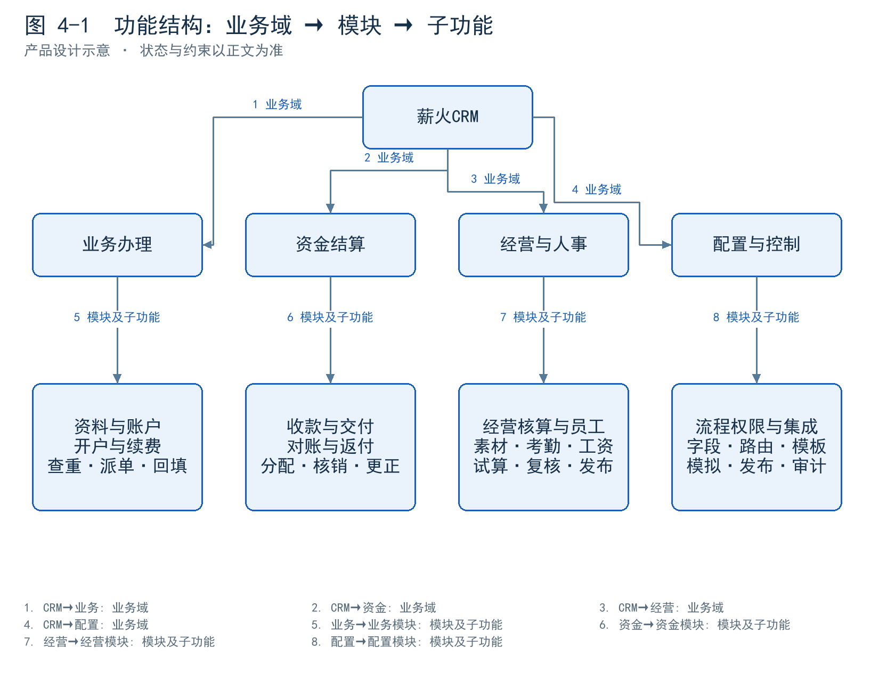

图 4-1 将完整范围拆为业务域、模块和子功能。第 6 章给出 40 个模块；附录 D 将旧功能检查项映射到这些模块。

| 一级导航 | 内容/模块 | 默认视图 |
| --- | --- | --- |
| 工作台 | M01；我的待办、申请、异常、主管待派 | 当前岗位与授权范围，允许保存个人视图 |
| 公共资料 | M02/M03/M04/M38；客户、主体、店铺、供应商、公海 | 先搜索再新增；关系路由而非复制树 |
| 广告业务 | M05–M08、M12–M17；账户、开户、充值/续费、退款/转户 | 统一账户列表，产品/路径/对象类型筛选 |
| 资金与财务 | M09–M11、M18–M23、M39 | 待确认、待支付、待核实、对账及期间 |
| 经营与交付 | M24–M28、M32 | 消耗、收益、报表、激励、素材与目标 |
| 人事行政 | M29–M31、M23 | 员工、任职、考勤、工资、费用 |
| 管理配置 | M33–M37、M40 | 组织角色、工作流、财务模板、导入迁移、通知及接口任务 |

### 4.2 通用交互约定

全局搜索支持客户、主体、店铺和平台 ID，结果标明对象类型与完整上下文。查询不到、无权限、资料待核对、同步失败四种状态给出不同说明，不能统一显示“暂无数据”。

列表采用固定主键列、可选列、分组筛选、个人视图、批次选择及侧栏详情。操作后返回原筛选、分页和行位置。全筛选选择与本页选择必须区分，批量提交前显示对象数和作用范围。金额显示单位、数据截至时间与可用/冻结/在途含义；完整 ID 可复制，不用科学计数法。

栏目标题和可点击功能页明显区分；提交、补资料后留在原模块及原单，保留筛选和展开状态。未保存离开先提示。保存草稿保留用户已填数据；退回定位到字段和原因；后台产品切换导致不适用的旧值不静默提交。操作禁用说明状态或权限原因，并提供可执行下一步。表格支持键盘焦点、明确错误文字，不仅靠颜色传达状态。

### 4.3 核心页面、商务合并录入与媒介办理

以下为V1.5字段和布局示意，短码和公司名称为演示，不代表真实样本或平台编号格式。商务原前三步合并为一个连续页面，正文的分区示意不是新增向导步骤。[R17]

**图 4-2　个人工作台：个人草稿与申请通知**

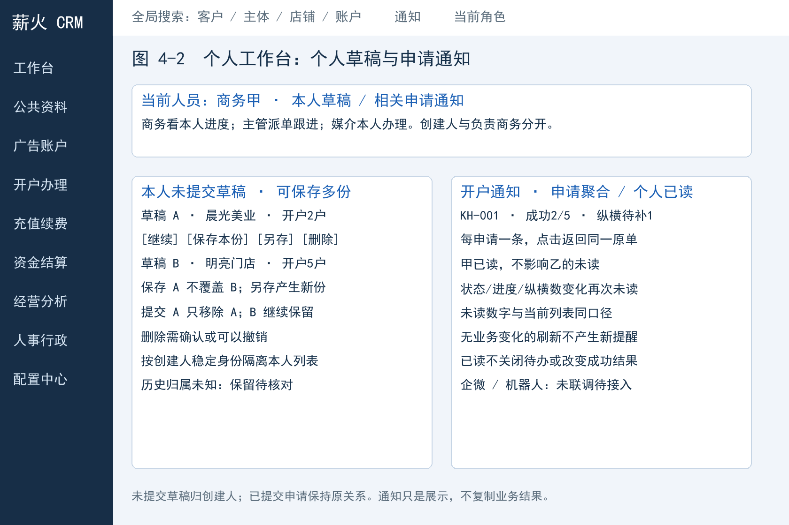

开户工作台按原申请汇总待办，一张5户申请只显示一项任务，并列成功、待办理、异常和纵横待补数量。中途退出可回原单继续；全部录完但未点击“完成本次开户”仍有待办入口，完成后在已办或资料待补回原单。

**图 4-3　广告账户完整列表：一账户一行**

账户列表仍为一账户一行，账户名称可空，完整账户ID可复制；主体直客由关系派生展示，同主体多账户可见同一个直客ID。

**图 4-4　一条账户的完整资料**

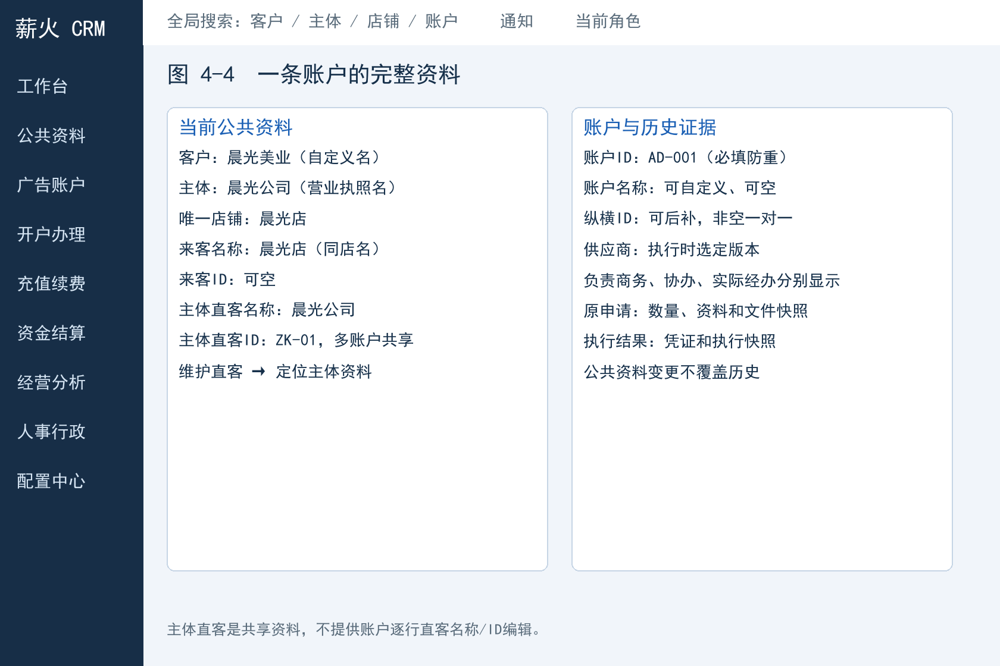

详情分别展示当前公共资料、申请快照和执行快照；直客ID入口定位到主体维护，不提供独立直客名称或按账户另绑直客。

**图 4-5　商务申请：合并录入与搜索选择**

商务在同页输入客户名称，搜索查重并选择已有客户或新增自定义名称。未选择客户时不展示主体候选；选择已有客户后立即完整列出该客户已关联主体，搜索框为空也显示，不截断为前10条；可按主体名称或统一社会信用代码筛选。当前客户主体列表与全局未关联查重候选分区展示，后者只有明确选择才关联；空搜索也可进入新增主体，保存查重未命中才新建。产品、区域及负责商务仍在同页填写。客户1:N主体；每个主体当前一个店铺和一个直客资料。[R17]

**图 4-6　同页主体店铺与名称联动**

选择主体后立即查询该主体店铺：有唯一当前店铺时自动展示并复用，无店铺时明确提示并提供同页新增；历史存在多店时逐条保留并显示“历史关系待核对”，不得自动选择第一店或绕过冲突新建第二店。主体公司名与营业执照主体名一致，直客名称直接使用该名称；店铺名称自定义真实店名，同时作为来客名称。直客ID和来客ID均可空，商务优先填写，媒介可在原申请补全和更正；不要求双填名称。[R17]

**图 4-7　同页账户数量与资质附件**

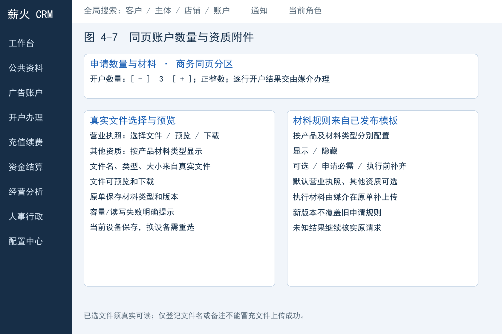

商务用“− 数量 +”选择正整数开户数，不逐行填写账户名称、供应商、ID或直客。营业执照及其他资质按产品和材料类型显示，并标明必需、可后补等要求；选择真实文件后可预览，按原单保存文件与版本。原型只承诺本地演示保存，生产存储与权限另行验收。

**图 4-10　产品资质：主体与供应商资料分开**

其他媒体复用同一商务申请结构。开户页只选择供应商并只读引用必要资料，不在开户录入供应商银行；供应商多收款账户在独立主档维护。主体银行资料与供应商银行资料分开，独立银行地址未核实为旧字段。行业搜索选择后台启用字典，普通主体/店铺/直客维护使用可选流转备注。

**图 4-8　合并页提交与原单摘要**

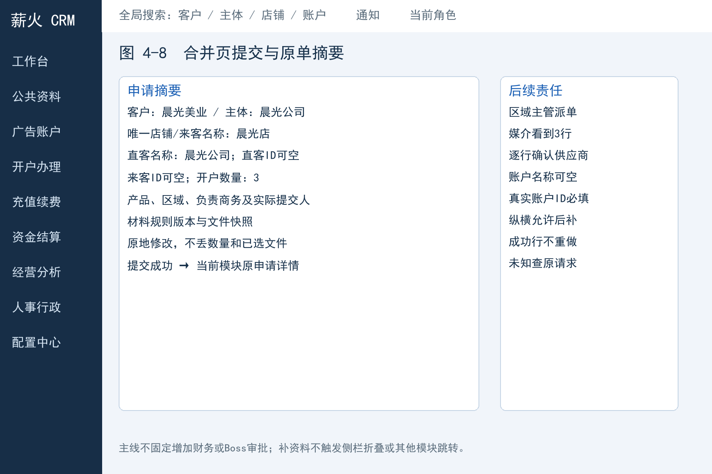

核对同页摘要后提交；保存申请数量、当前资料及附件快照、责任与流程版本。成功后停留原模块的原申请详情；默认开户不固定增加财务或Boss审批。

**图 4-9　媒介批量办理：TSV预览与草稿填入**

媒介在原申请内看到与申请数量一致的可编辑表格：可选账户名称、可搜索供应商、成功登记必填防重的广告账户ID、可后补且非空一对一的纵横ID。Tab连续录入；选中可编辑行可批量应用供应商，默认只填空值，覆盖已有值需显式选择。整表保存草稿允许空ID；一次登记选中行成功须全部校验通过，有错则整批不写入并按行按字段显示。同主体行共享直客资料；成功、未知、待同步、已取消行不批改，异常仍在原单单行处理。批量保存不自动结束申请，“完成本次开户”保持独立；本轮支持TSV粘贴预览，只填草稿，不直接登记开户。

商务申请数量与媒介行数保持一致；缩减数量不得删除已受理、未知、成功或待同步的行。账户名称可由媒介自定义且非必填，不作为成功门槛。外部成功但CRM有冲突时保留成功事实和待同步状态，不通过改ID重新开户。

## 5. 业务流程

### 5.1 开户主流程及责任

商务选客户→空搜索立即完整显示本客户主体→优先选择已有主体或查重后新增→自动复用唯一店铺，无店则同页新增；历史多店先核对关系。全局未关联主体必须由用户明确选择才关联，更换客户或主体重新处理下游资料和附件。[R17]

**图 5-1　开户主线泳道**

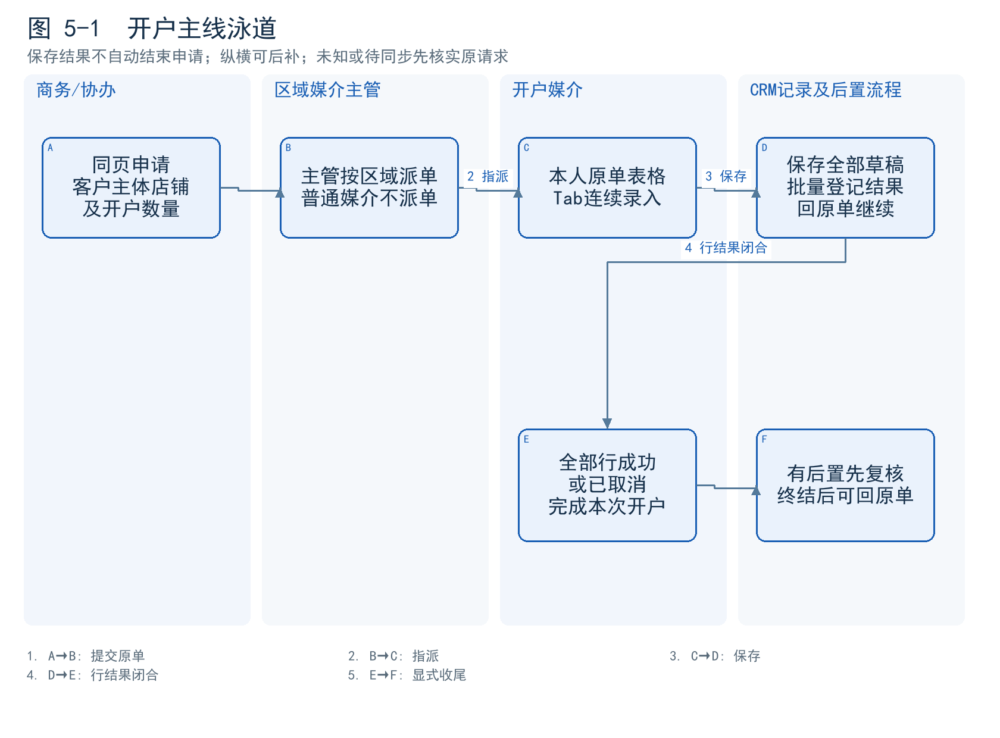

图 5-1 的派单与重派仅由媒介主管权限执行，普通媒介只能办理当前指派给本人的原单。后台决定匹配条件及兜底队列。逐行或批量保存结果后进度汇总在原申请，全部录完仍须显式“完成本次开户”；历史已完成保留，纵横待补不阻挡完成。负责商务是业务责任，提交人、协办、开户媒介是实际办理记录；完成点击者不自动取得账户归属。[R01、R06、R12]

### 5.2 资金主线与对账闭环

**图 5-2　收款认领、分配与还债**

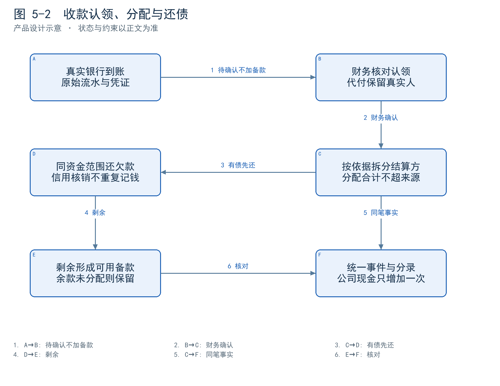

财务证实到账后形成公司收款事实，再按依据认领/拆分；同结算方同资金范围先核销欠款，余款形成备款。上传凭证和拆分草稿均不产生可用余额。[R08、R10]

**图 5-3　充值结果、入账与重试**

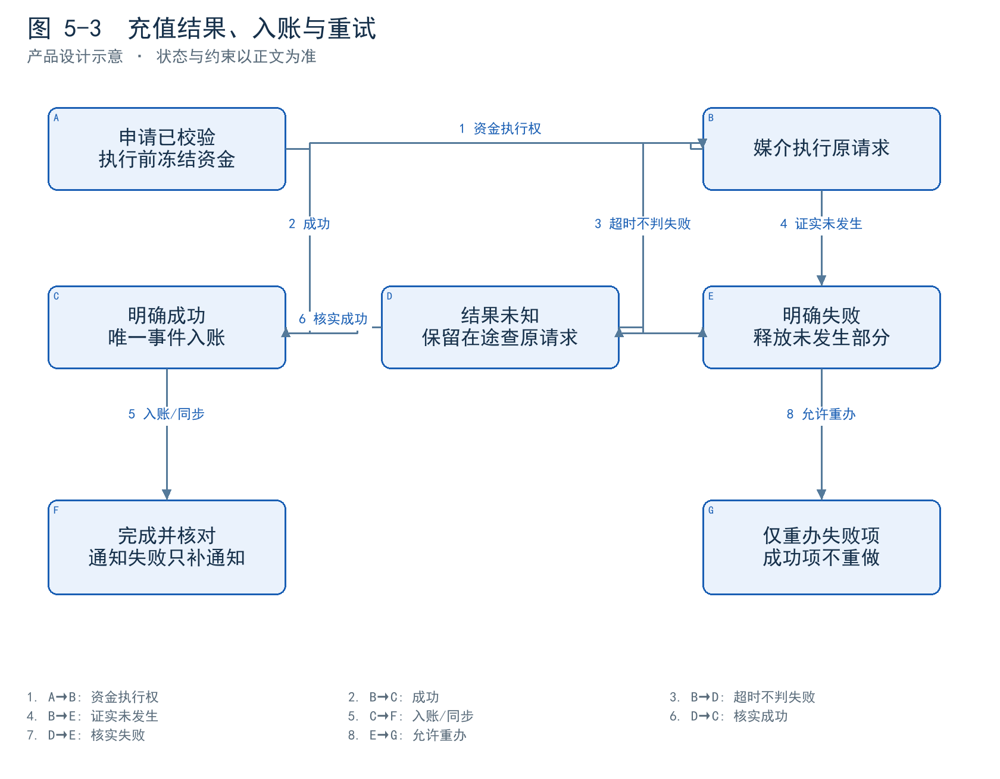

充值执行前取得唯一执行权并冻结资金；审批、派单、外部执行、资金入账、对账分别记录。未知不释放、不新执行；已成功仅补同步。[R10]

**图 5-4　渠道三种资金动作**

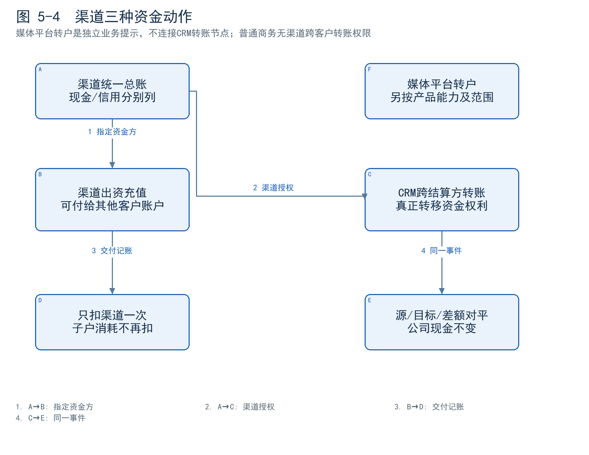

渠道出资充值、CRM 跨结算方转账、媒体平台转户是三个动作。渠道为其他客户账户出资不等于给该客户增加备款；普通转账等额同单位；旧资方差额分支见下表。[R07、R10]

**图 5-5　信用、欠款与实际还款**

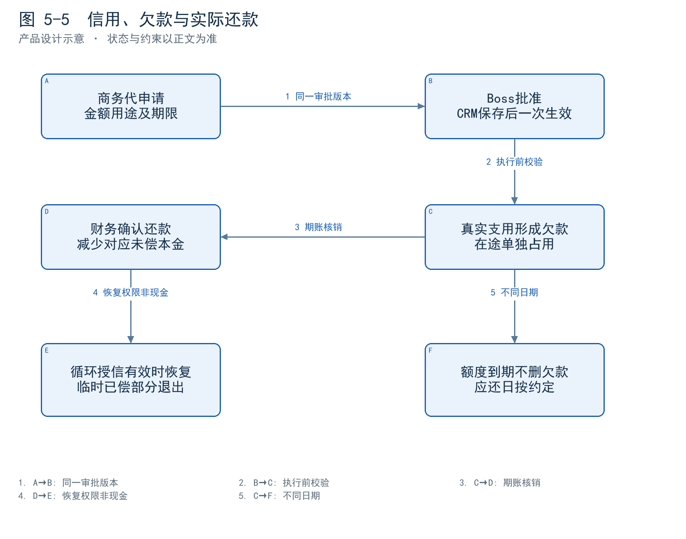

渠道商务可代客户申请，Boss 批准并保存 CRM 后生效。额度不是现金，支用才形成欠款；有效循环授信真实还款后恢复权限，临时/单次已偿部分退出。可支用截止与应还日期分别保存。[R08]

**图 5-6　对账差异、调整及期间**

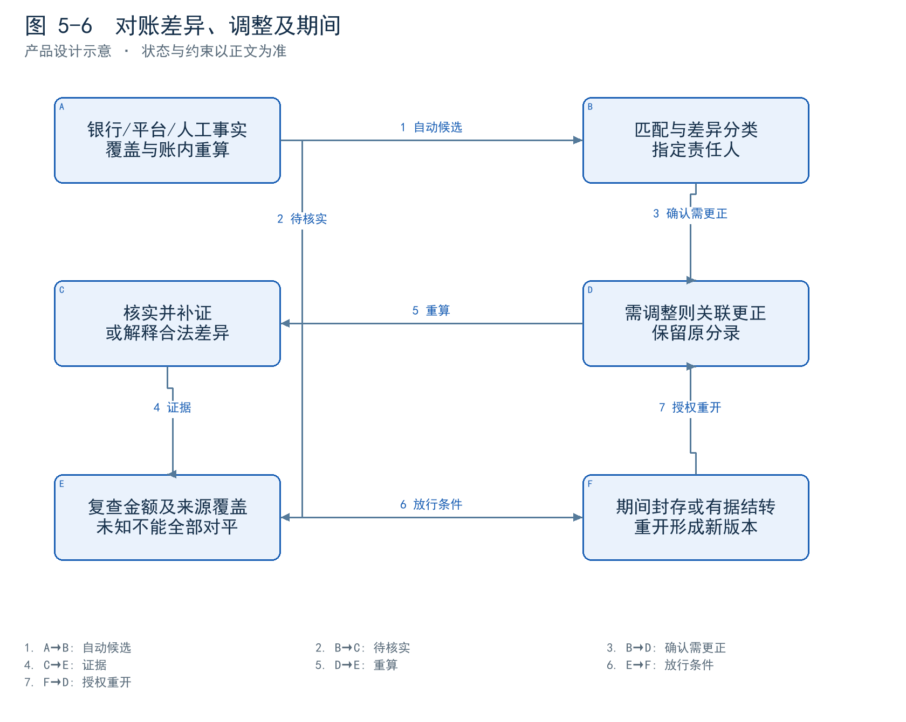

对账同时检查账内重算与来源覆盖。资金事件后做局部检查，按日/期间做全量核对；差异必须有归因、责任、处理及复查，合法在途可按规则结转，但缺资料不能伪装为已平。[R10]

同一笔事实可在公司收支、客户/渠道结算、供应商往来、客户返利视图中追溯，不表示增加了四份现金。可用余额必须从可信期初及有效分录重算；现金、广告币、信用与返点比例不可混加。

### 5.3 资金动作、金额与账务效果

| 事实/动作 | 必须产生的结果 | 禁止的结果 |
| --- | --- | --- |
| 提交收款或上传付款凭证 | 记录待证实和来源；无可用备款变化 | 仅凭提交就可以消费 |
| 财务确认到账 R | 按真实现金用途分配：R=欠款/应收核销D+本金备款B+独立费用F+已接受多款差额A+未分配U；各项互斥不重计，公司现金增加R一次；无费用/多款的本金分支可简写R=D+B+U | 先加R备款再额外还债；把非现金短款减免算进实际到账 |
| 现金充值成功 | 现金冻结转实际扣减，形成平台交付/账户业务记录，按模板计算单位转换 | 现金和广告币按数字直接相加 |
| 信用充值成功 | 在途占用转未偿本金；没有客户真实收款 | 把批准额度当收入或备款 |
| 明确失败 / 结果未知 | 失败释放未发生部分；未知保留在途并查询原请求 | 未知当失败重做；整批释放成功行 |
| 信用还款 | 真实到账核销相应欠款；适用循环信用恢复可支用权 | 恢复额度另计一笔现金 |
| 渠道出资给其他客户账户 | 渠道总账扣一次；保留资金方和目标账户归属 | 目标客户再加备款，或后续消耗再扣渠道一次 |
| 普通渠道 CRM 转账 T | 源 −T、目标 +T，同单位；公司现金净变化0 | 半笔入账、未使用授信作为现金转出 |
| 旧资方转账分支 | 转入=M×(1+客户返点/100)；转出=M×(1+资方返点/100)；差额有独立科目/去向并整体守恒 | 把差额消失，或把本分支套给所有普通转账 |
| 平台退币 | 核实平台退回后按原资金来源、返点及费用规则处理 | 提交退币立即加备款；信用来源退回虚构现金 |
| 客户现金退款 | 冻结可退数→财务实际付款→确认真实结果→核销 | 审批通过就标已付；重复回调再次扣钱 |
| 后返实际支付 / 转备款 / 抵欠款 | 按选择路径核销应返；保留真实收款方与证据 | 转备款同时登记银行付款；只记备注 |
| 仅撤销错误认领 | 撤销客户分配，回到待认领或重新分配；公司现金不减少 | 把仍在银行的钱视为已退 |
| 重复记账纠正 / 真实退款 | 前者冲正多记事件，后者保留原收款并新建付款事实 | 删除原始收款抹去历史 |
| 发票或平台消耗同步 | 更新票据/履约/经营记录，与账关联 | 开票增加备款；消耗再扣已充值的资金总账 |

**计算基线。** 普通充值前返分支：现金本金＝广告币÷(1＋前返点数/100)，现金按该旧分支保留两位；8 点的示例为 1,000 元现金对应 1,080 广告币，不是乘 92%。丽人常见 8 点只是参考，前返后返通常在财务节点填写，不设全局固定 8。旧现金授信分支的后返货币＝现金本金×后返点数/100，保留三位；该输出不是等额已付人民币，后续折现金额按相应旧分支处理；不得将该分支扩大为全部产品。完整一类/二类、币种和舍入位置按 R05/R11/R14 的旧分支复算后发布模板。[R11、R14]

**欠款示例。** 循环信用批准 10 万，实际已用 8 万且无在途，则欠款 8 万、剩余可支用 2 万。客户实际回款 3 万核销后，欠款 5 万、现金备款 0、有效信用剩余 5 万。再回款 6 万，欠款清零、现金备款 1 万、有效信用恢复至 10 万。临时/单次不照此自动恢复，已偿部分退出。对于单一有效且未冻结的循环现金信用，可用授信＝批准上限−未偿本金−在途占用；发现异常负数必须暴露与处置，不能删掉债务使显示好看。[R08]

**尾差示例。** 应收 950.52 元、实收 950 元，匹配已发布规则或财务有据确认后，保留现金 950、接受短款 0.52、剩余待收 0；实收 951 时，保留现金 951、原应收 950.52、接受多款 0.48，不默认产生客户备款。原应收、实收和差额各自可查。模板未发布或超范围走财务人工处理，不要求每笔小额尾差找 Boss，不硬编码 1 元或 0.1 元阈值。现金来源 265.490 只能分配至该额，265.494 的差额不能通过尾差规则扩大实际现金来源。[R10、R11]

### 5.4 工作流配置与人事衔接

**图 5-10　实际退款/返付：审批、支付、核销分开**

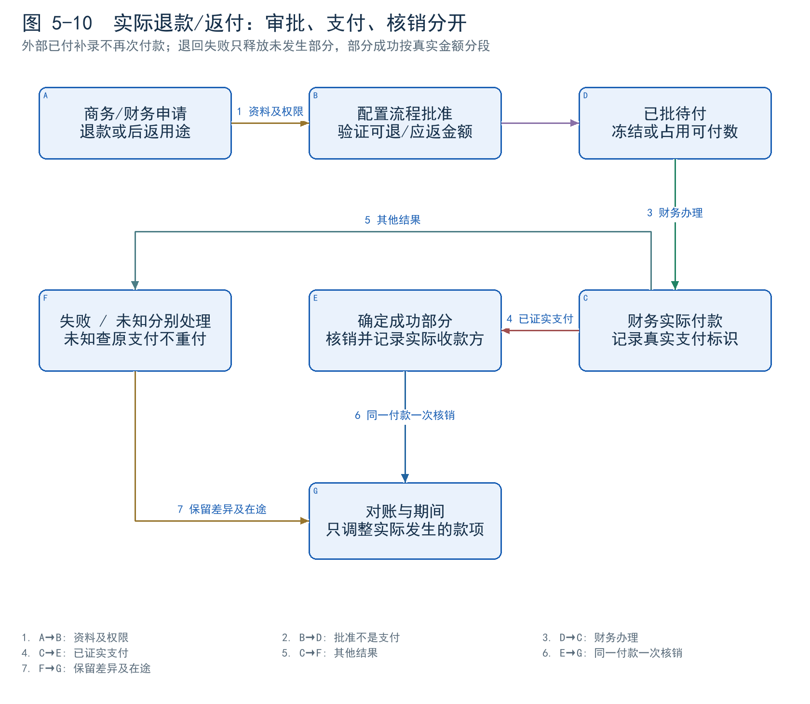

退款与后返返付共用真实付款结果控制，但款项来源和核销对象各自保存。批准不等于已付，未知不重付，部分成功按金额核销；退款最终由财务实际付款。

**图 5-7　配置发布与在途版本**

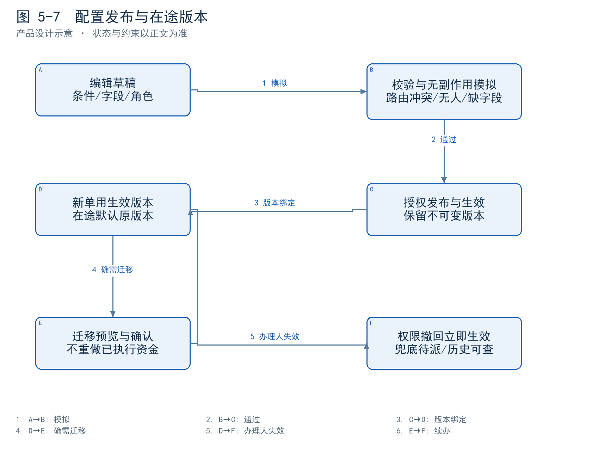

图 5-7：草稿→校验模拟→授权发布→生效→保留版本。在途默认原流程版本，迁移预览影响且不重复真实动作。权限撤回立即生效，不因旧流程版本继续授权离职人员。模拟不得入账、调媒体或发真实业务通知。[R12]

**图 5-8　人事与薪资的事实分层**

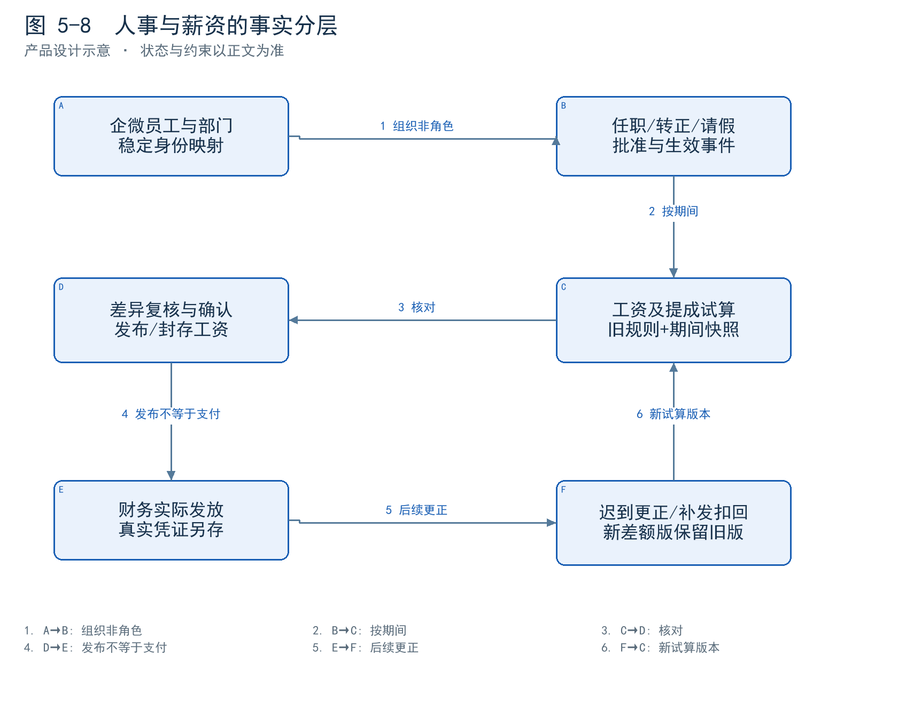

图 5-8：企业微信员工/部门来源与 CRM 任职、岗位、角色分离。考勤/业务收益进入期间试算，复核发布工资后由财务记录实际发放；发布不是支付。跨期补发、扣回和异议形成差额版。[R03、R04、R13]

### 5.5 单据状态机与可办动作

**图 5-9　批量校验与行级状态：原单续办**

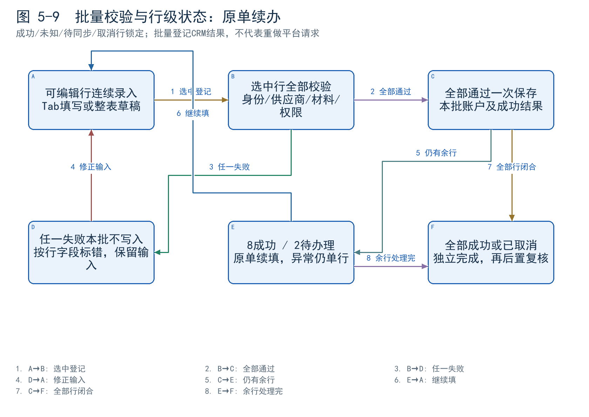

图 5-9 为批次与行级状态。开户新申请在全部行成功或明确取消后进入“待确认完成”，当前被指派媒介显式确认后，无后置节点时进入已完成；有后置节点时先进入“开户已完成，流程待复核”，后置节点完成后终结。全取消最终显示已取消；其他业务各按自身完成规则。草稿可改，外部受理后的撤销需核实真实结果；成功行不可逆改成未发生；未知先核实，明确失败才允许重办。资金、入账、对账及期间状态独立保存，不压成一个成功按钮。

| 界面状态 | 允许动作 | 离开状态的条件 |
| --- | --- | --- |
| 草稿 | 编辑、保存、删除未提交草稿 | 提交校验通过或取消 |
| 待预审/待补资料 | 补件、退回说明、主管检查 | 满足当前阶段；执行前另做资质检查 |
| 待派单 | 主管指派、升级无匹配区域 | 有效办理人与权限成立 |
| 待办理 | 办理人接单/退回；发起人符合条件撤销 | 执行前重复、权限和资金校验成功 |
| 执行中 | 查看请求、保留执行锁 | 取得可证实成功/失败/未知结果 |
| 结果待核实 | 查原请求/证据、授权核实 | 确定结果，不能单凭超时转换失败 |
| 部分成功 | 查看逐行结果、只续办未发生/明确失败行 | 所有行闭合，无未知项后汇总 |
| 外部成功/CRM待同步 | 补同步、核对冲突、升级主管 | 同一事实登记成功，不新执行平台 |
| 开户待确认完成 | 查看成功/已取消结果，当前被指派媒介显式完成 | 全部行成功或明确取消；未知/待同步不能取消绕过；纵横可后补 |
| 开户已完成，流程待复核 | 保留开户结果，按模板处理后置审批/复核 | 完成按钮先确认开户事实，再走后置节点；不重开户 |
| 已完成/待对账 | 从已办回原单查看、补纵横、核对或发起关联更正 | 纵横补齐不重复开户；财务期间规则独立 |
| 已撤销/终止 | 查看原因与未执行范围 | 不能删除已有外部事实；后续新单关联原单 |

### 5.6 异常及边界

| 情形 | 处理规则与负责人 |
| --- | --- |
| 重复提交或并发操作 | 同一请求与事件只生效一次，返回原结果；前端按钮防重不能替代后端约束 |
| 渠道5万、两人各充4万 | 资金冻结原子完成，至多一笔取得执行权；不引入个人额度 |
| API 超时且平台可能成功 | 媒介核实原请求，未知保留在途；财务可查来源，不释放后再充 |
| 批次部分成功 | 每行/分段保存结果与金额，只结算成功部分，失败行独立重试 |
| 外部成功但CRM保存失败 | 进入待同步，持久化外部请求与证据；修复重放只补内部登记 |
| 外部已发生后补录且资金不足 | 记录真实发生日和登记日、欠款及异常；不再调平台，不伪造信用批准 |
| 区域未配或无有效办理人 | 进入主管/配置异常队列；保留申请及资金状态，不跳过节点 |
| 原办理人离职或协办到期 | 立刻禁止新操作，主管继承/重派；保留所有历史责任和操作记录 |
| 旧企微卡片批准被修改的申请 | 拒绝旧版本回调，要求当前有效版本审批；不重复加额 |
| 后台发布新流程/返点规则 | 新单新版本，在途默认原版；历史金额不被当前模板重算 |
| 银行同额多候选或代付 | 财务看真实付款人和依据，不能按最近时间自动误认 |
| 撤销已使用的收款分配 | 显示下游依赖，按事实走归属更正/欠款/退款，不删流水伪造余额 |
| 退款或后返已在外部支付 | 仅补付款事实与凭证，查重后核销，不能再次下发付款 |
| 已封存期间新增/更正 | 保留发生日与记账日；授权重开或调整期产生新版本及复查 |
| 公共资料合并/修改 | 预览账户、资金、合同及收益关系；身份冲突先核对，不按名字合并钱包 |
| 接口/通知失败 | 分别记录；通知补发不重做业务，审批未保存不能视为已生效 |

## 6. 功能需求

### 6.0 需求池与优先级

P0 表示形成核心业务与正确性依赖的候选先行范围，P1 表示完整规划中的后续能力；两者均在本 PRD 详设。优先级是产品依赖判断，尚不构成排期或预算承诺。

**图 6-1　价值与确定性优先级矩阵**

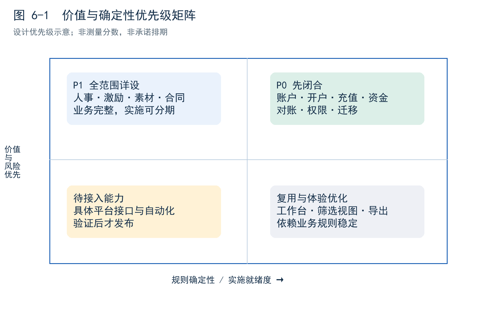

图 6-1 使用业务价值与规则确定性定性分组，不编造评分。低确定性的技术参数可继续验证，不影响已确认规则进入文档。

| 模块 | 名称 | 优先级 | 来源 |
| --- | --- | --- | --- |
| M01 | 个人工作台与任务中心 | P0 | R05 R04 |
| M02 | 公共客户检索与查重路由 | P0 | R01 R02 R05 R17 |
| M03 | 主体、店铺与本地推平台资料 | P0 | R01 R05 R17 |
| M04 | 供应商、端口与办理能力 | P0 | R05 R02 |
| M05 | 广告账户总表与完整详情 | P0 | R01 R05 R04 R17 |
| M06 | 开户申请、预审与逐行办理 | P0 | R01 R02 R04 R05 R17 |
| M07 | 复制账户与平台落档 | P1 | R04 R05 R17 |
| M08 | 账户关系变更、协办与离职交接 | P0 | R02 R04 R13 |
| M09 | 银行流水、收款、认领及分配 | P0 | R10 R11 R02 |
| M10 | 客户与渠道资金总账 | P0 | R07 R08 R10 |
| M11 | 授信、欠款、期账与还款 | P0 | R08 R02 R10 |
| M12 | 充值执行与已发生业务补录 | P0 | R10 R05 R07 |
| M13 | 续费与业务分类 | P0 | R09 R04 R14 |
| M14 | 平台退币 | P0 | R10 R05 |
| M15 | 客户现金退款 | P0 | R10 R02 |
| M16 | 渠道CRM跨结算方转账 | P0 | R07 R10 R02 |
| M17 | 媒体广告账户余额转户 | P1 | R05 R10 R02 |
| M18 | 公司收支与供应商往来 | P0 | R10 R03 |
| M19 | 服务费、前返后返与返付 | P0 | R11 R10 R14 |
| M20 | 客户合同与版本 | P1 | R04 R03 |
| M21 | 开票申请、占用及实际票据 | P1 | R11 R10 R04 |
| M22 | 内部对账、核销、尾差与重开 | P0 | R10 R11 R12 |
| M23 | 报销、费用与采购付款 | P1 | R03 R04 |
| M24 | 消耗数据与充值来源匹配 | P0 | R04 R05 |
| M25 | 经营报表与指标口径 | P1 | R04 R05 |
| M26 | 收益、提成与差额核算 | P1 | R14 R04 R09 |
| M27 | 激励政策与期间核算 | P1 | R04 |
| M28 | 素材绩效与剪辑统计 | P1 | R04 |
| M29 | 员工任职、转正与劳动合同 | P1 | R13 R04 |
| M30 | 考勤异常、请假与调休 | P1 | R03 R04 |
| M31 | 工资导入、发布与发放 | P1 | R04 R14 |
| M32 | 考核、目标与经营责任 | P1 | R03 R04 |
| M33 | 组织、RBAC与数据字段权限 | P0 | R13 R02 R12 |
| M34 | 产品表单、工作流与财务模板 | P0 | R12 R05 R17 |
| M35 | 站内信、企微审批与机器人 | P0 | R12 R04 |
| M36 | 导入、导出、附件与批次更正 | P0 | R04 R05 R17 |
| M37 | 迁移、历史查询与切换 | P0 | R05 R03 R01 R17 |
| M38 | 公海资料与客户跟进 | P1 | R03 R04 |
| M39 | 业务审计、期间封存与更正 | P0 | R10 R12 R04 |
| M40 | 同步任务、接口契约与运行控制 | P0 | R04 R05 |

### 6.1 M01 个人工作台与任务中心

**优先级：P0　证据：R05 R04 R17**

**① 入口：** 工作台／我的待办。

**② 使用者：** 全体员工；主管；财务。

**③ 字段契约：**

| 字段 | 类型 | 必填/适用阶段 | 约束 |
| --- | --- | --- | --- |
| 任务ID | 标识 | 是 | 单据+节点+责任人唯一 |
| 业务单 | 引用 | 是 | 可回原单 |
| 当前节点 | 枚举 | 是 | 来自流程实例 |
| 下一步 | 文本 | 是 | 由状态与权限生成 |
| 责任人 | 人员 | 是 | 有效任职 |
| 等待时间 | 时间差 | 是 | 含数据截至 |
| 个人视图 | 配置 | 否 | 不覆盖组织默认 |
| 开户进度 | 申请级汇总 | 开户任务 | 成功/待办理/异常/纵横待补分列，均回原单 |
| 申请完成状态 | 枚举 | 开户任务 | 待办理/办理中/待确认完成/已完成，与行结果独立 |
| 角色视图 | 权限与显示配置 | 开户任务 | 商务关注关系与进度，主管关注队列与办理人，媒介关注本人申请与续办；同一applicationId |
| 本人未提交草稿 | 列表 | 本人身份 | 多份，创建人稳定身份隔离，负责商务不是草稿所有者 |
| 通知未读数 | 计数 | 个人通知 | 全部可见未读通知，开户按申请去重，范围与列表一致 |

**④ 业务规则：**

- M01-R01：一个待办对应原业务单及当前节点，多角色去重；查看和办理分别授权。
- M01-R02：工作台突出待补、未派、未知、同步失败及待付款，主管按地区看负载；通知已读不关闭待办。
- M01-R03：个人筛选、列顺序、密度、固定列可保存；动作返回后保持列表位置及筛选。
- M01-R04：开户待办按一张申请汇总，显示申请数量及成功、待办理、异常、纵横待补数量；5个账户仍是一项申请待办，点击返回同一原单逐行续办，不拆成5个丢失上下文的任务。
- M01-R05：已保存的账户结果离开或刷新后保留；再次进入工作台可从待办、异常、已办或资料待补返回原申请。纵横待补是资料状态，独立于开户成功和本次申请是否已完成。
- M01-R06：新申请的全部行录完后，工作台仍提示待确认完成，直到当前被指派媒介显式点击“完成本次开户”；历史已完成申请保留完成结果，不因新版规则重新产生未完成待办。
- M01-R07：工作台按当前角色组织同一申请：商务查看我发起/我负责申请，突出客户、主体、店铺与办理进度；媒介主管可按待指派/办理中/待确认完成筛选，突出当前办理人；开户媒介只将本人当前指派申请列为可办任务，突出申请账户数量、逐行结果汇总与续办入口。角色视图以同一applicationId稳定关联，不复制申请或改变归属；其他媒介在获准查看时只读，不能因可查看而取得办理权。
- M01-R08：批量录入和草稿保存始终归属同一开户申请；工作台仍以一申请汇总已成功、待办理、异常和纵横待补，不按本次勾选批次另建任务。保存10行草稿后退出，从原申请续填；选8行登记成功后另2行继续待办，不能据本批成功直接结束整单。
- M01-R09：未提交开户草稿按创建人稳定身份保存为多份，本人草稿列表支持继续、保存本份、另存一份及删除。创建人与负责商务分别记录，不按当前负责商务改移草稿所有者；保存本份不覆盖其他草稿，删除需确认或可撤销。已提交申请的行草稿继续归原申请，不与未提交草稿列表混同。
- M01-R10：开户通知按申请聚合一条并遵循角色相关范围：商务查看我发起/我负责的进度，媒介主管看派单跟进，开户媒介看本人办理申请；点击回同一原单。个人已读和状态变化提醒按M35管理，顶部未读数字与通知列表使用同一权限范围和未读口径。

**⑤ 状态与异常：** 待处理／处理中／待他人／已办；转派立即重算可办人，无人办理进入主管或配置异常队列。

**⑥ 验收：**

- M01-AC01 正向：一人兼两角色看到同一任务一次，可从下一步连续办理并回到原筛选。
- M01-AC02 反向/边界：已转派给他人的任务，旧责任人继续提交被拦截。
- M01-AC03 专项边界：申请5个账户，保存2个成功结果后退出；工作台仅显示1张原申请及2成功、3待办理，点击继续保留2个结果。
- M01-AC04 专项边界：全部5个结果保存后尚未点完成，仍有“待确认完成”入口；无后置节点时点完成进入已办；有后置节点时先待复核、后置完成后终结，之后可在已办与纵横资料待补回原单，不产生5个分散任务。
- M01-AC05 专项边界：同一申请分别用商务、媒介主管、被指派媒介查看，三个视图字段重点与操作不同，applicationId、客户/主体/店铺及已保存进度一致；主管三项状态筛选命中对应申请，其他媒介获准查看时没有办理操作且提交被拦截。
- M01-AC06 专项边界：人员甲保存草稿A和B，继续并保存A后B内容不变；A另存为C不覆盖A/B，删除C须确认或可撤销；人员乙的本人列表不显示甲的草稿，修改负责商务也不转移创建人。
- M01-AC07 专项边界：提交草稿A成功只移除A，B保持；提交失败A保留。可可靠定位原商务的历史全局草稿归回原商务，未知归属草稿保持待核对，不被当前人认领或删除。
- M01-AC08 专项边界：同一开户申请多次逐行更新，通知列表只有一条当前申请通知；甲已读不改变乙未读，顶部数字等于当前身份通知列表的全部未读条数，开户按申请去重计数。

### 6.2 M02 公共客户检索与查重路由

**优先级：P0　证据：R01 R02 R05 R17**

**① 入口：** 公共资料／全局搜索。

**② 使用者：** 商务；媒介；资料管理员。

**③ 字段契约：**

| 字段 | 类型 | 必填/适用阶段 | 约束 |
| --- | --- | --- | --- |
| 客户ID | 标识 | 是 | 稳定内部ID |
| 客户名称 | 文本 | 是 | 用户自定义名称、规范化查重 |
| 普通/渠道 | 枚举 | 是 | 非权限角色 |
| 所属主体 | 引用列表 | 否 | 选客户即完整展示已关联主体；空搜索可见，名称/信用代码筛选 |
| 检索命中类型 | 枚举 | 是 | 客户/主体/店铺/账户 |
| 规范化名称 | 文本 | 是 | 保留原名 |
| 联系人 | 文本 | 否 | 字段权限 |

**④ 业务规则：**

- M02-R01：先搜索后新增，同名客户不重复建立；空白清理等规范化规则保留原名，近似名称只提示候选。
- M02-R02：名称已存在时可复用资料；确需新增不同业务档案须使用不同名称，不以改名自动判为不同法律实体或独立资金。
- M02-R03：路由展示完整路径及命中原因；公共资料可检索不暴露未授权资金、薪酬、他人账户办理入口。
- M02-R04：客户下可有多个主体；新建主体明确所属客户。主体保留既有customerIds共享引用，不由客户1:N反推主体只能属于一个客户；公共搜索不授予归属或资金操作权。

- M02-R05：在开户页的客户—主体选择器中，未选择客户时不展示主体候选；选择已有客户后立即完整列出该客户已关联主体，搜索框为空也显示，不截断为前10条；可按主体名称或统一社会信用代码筛选。
- M02-R06：在开户页的客户—主体选择器中，当前客户没有主体或筛选无匹配时明确显示对应空态；全局已有主体查重结果单独列为“全局已有主体（尚未关联此客户）”，不得混入本客户主体或自动关联，只有用户选择复用时才新增当前客户关联，保留既有customerIds引用。
- M02-R07：在开户页的客户—主体选择器中，选择客户后，主体搜索为空也可进入同页新增主体；保存前按主体名称及可靠信用代码查重，命中已有资料时引导选择复用，未命中才新增并关联当前客户。独立全局检索仍可直接搜索主体、店铺和账户，不要求先选客户。

**⑤ 状态与异常：** 草稿／有效／停用／历史待核对；多路径不自动取第一条。

**⑥ 验收：**

- M02-AC01 正向：同主体被A、B复用时，展示各自账户与授权动作，能从命中店铺继续开户。
- M02-AC02 反向/边界：并发创建同名客户只有一条成功，另一条返回已有记录入口。
- M02-AC03 专项边界：客户已关联12个主体，选客户后不输入搜索即可看到全部12个；按名称或信用代码筛选后再清空搜索，恢复全部12个。
- M02-AC04 专项边界：本客户无匹配而全局命中时分区提示尚未关联；查看或输入搜索不修改关系，显式选择后才关联并复用，不复制主体。

### 6.3 M03 主体、店铺与本地推平台资料

**优先级：P0　证据：R01 R05 R17**

**① 入口：** 客户全景／主体详情／店铺详情。

**② 使用者：** 商务优先维护；媒介在原申请有权新增、补全和更正；资料管理员。

**③ 字段契约：**

| 字段 | 类型 | 必填/适用阶段 | 约束 |
| --- | --- | --- | --- |
| 主体ID/客户引用 | 标识引用 | 是 | 客户1:N主体 |
| 主体名称/直客名称 | 文本 | 是 | 填写一次，与营业执照主体名一致 |
| 统一社会信用代码 | 文本 | 按资质阶段 | 字符串与可靠证照查重 |
| 店铺ID | 标识 | 是 | 唯一店铺自动展示复用；无店同页新增；历史多店待核对 |
| 店铺名称/来客名称 | 文本 | 是 | 自定义真实店名，填写一次 |
| 直客ID | 主体资料 | 否 | 主体当前1:1直客；同主体账户共享 |
| 来客ID | 店铺资料 | 否 | 每店一个当前值，可被多账户使用 |
| 营业执照及资质 | 文件版本 | 按产品材料规则 | 真实文件预览及原单引用 |
| 来源/关系核验状态 | 系统状态 | 系统维护 | 新关系或历史待核对，不要求手填来源长文本 |
| 旧shop_no/历史直客 | 来源文本 | 迁移时 | 只读保留、不自动覆盖 |
| 流转备注 | 文本 | 否 | 普通主体/店铺/直客维护均可空，系统审计仍保存 |
| 行业 | 字典引用 | 按产品材料规则 | 搜索选择启用项，历史停用值保留 |
| 证照来源说明 | 文本或附件引用 | 否 | 可选补充，不是附件或平台已核验结论 |

**④ 业务规则：**

- M03-R01：客户1:N主体；每主体当前1:1店铺、1:1直客资料；主体可有多个广告账户，共享主体直客。
- M03-R02：主体名称必须与营业执照主体名一致，直客名称自动使用主体名称，不另行录入；直客ID可空，非空按主体身份检查冲突，不限制同主体账户复用。
- M03-R03：店铺名称由商务自定义真实店名，直接作为来客名称，不另填来客名称；来客ID可空，一店一个当前值，多账户可共用。
- M03-R04：商务与有当前原单办理权限的媒介维护主体、店铺和ID；普通维护使用“流转备注（选填）”，不强制填写补全或更正依据。系统仍记录前后值、操作者和时间；当前资料修改不覆盖申请或执行快照，也不改账户商务归属。
- M03-R05：历史同主体多店或不同直客值标“历史关系待核对”，保留原行、原值和关联；不得自动取第一条、合并、删店或伪称已迁移。
- M03-R06：营业执照、行业、银行、地址及联系信息按产品材料与阶段规则采集；缺少可后补材料不伪造文件，不把来客ID或直客ID变成开户完成门槛。
- M03-R07：选择主体后立即查询该主体店铺：有唯一当前店铺时自动展示并复用，无店铺时明确提示并提供同页新增；历史存在多店时逐条保留并显示“历史关系待核对”，不得自动选择第一店或绕过冲突新建第二店。
- M03-R08：信用代码、来客ID和主体直客ID按身份规则校验，不因licenseEvidence或流转备注为空拦截保存；证照来源说明如保留为可选资料，不冒充真实附件或已核验结果。材料是否必需仍按已发布产品规则，不能用文字备注代替必需文件。
- M03-R09：行业从后台已启用行业字典搜索选择；后台授权人员可新增、修改、启用、停用。停用后不供新选择，已有资料和历史快照仍保留原值并明确状态，不自动清空。
- M03-R10：页面明确标注“店铺名称（来客名称）”“来客ID（选填）”“主体直客ID（选填）”；不以开发术语、评审提示或来源核验任务代替业务字段说明。

**⑤ 状态与异常：** 资料待补／待核验／有效／冲突；资料状态不等于开户结果。

**⑥ 验收：**

- M03-AC01 正向：同主体申请两个账户，共享一个直客及一个店铺来客；主体名与直客名、店铺名与来客名分别一致，两个ID可同时为空。
- M03-AC02 反向/边界：新建关系给已有主体添加第二个当前店铺，或给主体另建第二份直客时被拦截；历史多店保留并提示核对，不静默合并。
- M03-AC03 专项边界：更正主体名后当前直客名称随之展示新值；原申请和执行快照仍保留旧名与原文件。
- M03-AC04 专项边界：选择仅有一家店的主体，已有店铺立即展示且复用原ID；选择无店主体可同页新增；选择历史多店主体显示冲突，未自动选中第一店。
- M03-AC05 专项边界：已有主体补信用代码、店铺来客ID或主体直客ID，流转备注与证照来源说明均留空时可按身份规则保存；审计仍含操作者、时间及前后值，必需附件仍单独校验。
- M03-AC06 专项边界：后台停用某行业后，新选择不再显示该项；原主体与旧申请仍保留原行业，字段标签清楚区分店铺名称和来客ID。

### 6.4 M04 供应商、端口与办理能力

**优先级：P0　证据：R05 R02 R17 R18**

**① 入口：** 公共资料／供应商；开户选择。

**② 使用者：** 媒介；供应商管理员；财务按字段权限。

**③ 字段契约：**

| 字段 | 类型 | 必填/适用阶段 | 约束 |
| --- | --- | --- | --- |
| 供应商ID/名称 | 引用/文本 | 是 | 稳定身份 |
| 代理商外部ID | 文本 | 条件 | 平台命名空间 |
| 支持产品 | 列表 | 是 | 能力匹配 |
| 端口 | 引用 | 条件 | 不冒充媒体类型 |
| 供应商收款账户 | 子表列表 | 收付款业务需要时 | 保留多账户、账户类型、户名、账号、开户行和有效版本 |
| 动作能力 | 枚举 | 是 | API/人工/待接入/不适用 |
| 有效期 | 日期 | 否 | 过期不可新选 |
| 平台代理商名称 | 文本 | 按已核实来源 | 与CRM供应商名称、代理公司法定名区分 |
| 平台范围 | 媒体引用 | 外部代理ID存在时 | 限定代理ID命名空间，不代替支持产品和动作能力 |
| 开户行/支行名称 | 账户资料 | 银行卡按业务需要 | 旧bankname，不与地址混用 |
| 开户行地址 | 文本 | 否 | 未定位旧独立结构，不推定可自动迁移 |

**④ 业务规则：**

- M04-R01：供应商按本次开户或账户服务关系选择，不锁死主体；可推荐同主体同产品最近成功且有效的供应商。
- M04-R02：平台、产品、接入方式、供应商、端口、对象类型分别记录；不由dy_agentId或旧入口判断媒体。
- M04-R03：能力按产品×供应商×对象类型×动作配置，查余额可用不代表充值自动可用。
- M04-R04：开户流程只选择适用供应商并只读引用已有资料，不在开户页编辑或补填供应商银行资料。银行资料在独立供应商档案按字段权限维护，不作为每次开户的默认录入门槛。
- M04-R05：旧dig_supplier.supplier_name承载CRM供应商名；媒体端口agent_name、corporation_name等仅是平台代理名称候选。外部代理ID来自dig_dy_developinfo.agent_id或dig_kuaishou_jinfu.agent_id；dy_agentId/ks_agentId是内部端口引用，不可冒充外部ID。
- M04-R06：旧供应商平台/账户类别见dig_supplier.types、account_type及端口关联；本次统一平台范围属于归一化表达，必须逐来源核对，不宣称旧库已有同名自由文本字段。
- M04-R07：旧dig_supplier_account通过supplier_id关联多条收款账户，保存account_no、account_name、bankname、account_type。银行卡、支付宝、微信分型，账号不是银行机构行号；不得把旧多账户压成一个永久覆盖的银行字段。
- M04-R08：独立银行网点地址未在旧供应商账户结构中定位；bankname是开户行/支行名称，不是地址。确需新增地址时按可选新字段说明来源，不能从支行名猜出地址或宣称旧字段已迁移。
- M04-R09：供应商账户新增、更正、停用保留版本及权限控制，历史执行/付款引用当时有效资料；选中账户不等于实际付款，供应商收款资料不与主体登记银行、客户付款账户或公司自身银行合并。

**⑤ 状态与异常：** 草稿／有效／停用；旧单保留原服务与版本。

**⑥ 验收：**

- M04-AC01 正向：同主体在两个供应商新开不同账户，历史账户不被修改。
- M04-AC02 反向/边界：停用或不支持当前产品的供应商不能被新申请提交选中。
- M04-AC03 专项边界：开户选择已有供应商，页面不出现供应商银行编辑或必填项；供应商主档两条不同收款账户均保留，按实际业务选择版本，不覆盖成一条。
- M04-AC04 专项边界：内部dy_agentId与外部agent_id数值不同，界面不得互换；开户行只有支行名时不生成银行地址，不把未知地址写成已迁移。

### 6.5 M05 广告账户总表与完整详情

**优先级：P0　证据：R01 R05 R04 R17**

**① 入口：** 广告账户／账户全景。

**② 使用者：** 商务；媒介；主管；授权运营财务。

**③ 字段契约：**

| 字段 | 类型 | 必填/适用阶段 | 约束 |
| --- | --- | --- | --- |
| 内部账户ID | 标识 | 是 | 稳定主键 |
| 平台+真实广告账户ID | 文本 | 成功时 | 真实身份唯一 |
| 账户名称 | 文本 | 否 | 自定义，可空，非查重唯一键 |
| 产品/办理方式 | 枚举 | 是 | 独立字段 |
| 客户/主体/店铺 | 引用 | 是或历史缺件 | 公共引用 |
| 主体直客ID | 关联展示 | 否 | 由主体取得，同主体多个账户共享 |
| 纵横ID | 文本 | 否 | 媒介手填一对一可后补 |
| 负责商务 | 人员 | 是 | 账户归属 |
| 协办 | 授权引用 | 否 | 动作范围期限 |
| 结算方 | 引用 | 业务时 | 资金归属独立 |
| 供应商 | 引用 | 是 | 有效服务关系 |
| 开户来源/原单 | 引用 | 是 | 原始事实 |
| 历史编号 | 文本 | 迁移时 | 不可冒充真实ID |

**④ 业务规则：**

- M05-R01：列表以账户为一行，归属商务、实际经办、公共资料和结算方明确分列；固定账户名称+完整ID及操作列。
- M05-R02：重复真实广告账户ID提示并拦截，不能用旧自有/外转入口、供应商另造唯一空间；历史冲突先核定不自动合并余额。
- M05-R03：资料页展示全路径、平台资料、责任协作、服务结算与原单；不因列表展开泄露字段权限。
- M05-R04：纵横为空可完成开户与充值；已填时一对一校验，补资料不改变归属。
- M05-R05：账户名称自定义且非必填；空名称仍显示完整账户ID并可完成开户。账户详情的直客展示引用主体，编辑入口回到主体维护，不提供账户独立直客或直客名称输入。
- M05-R06：已成功账户可从账户详情与已办申请回到原开户单；显示开户成功状态和纵横待补状态。补纵横保持原账户ID、成功事实、负责商务与原申请，不重新开户、不重新产生整单办理任务。

**⑤ 状态与异常：** 正常／CRM停办／历史冲突待核对／缺关联；平台封禁等独立显示来源与更新时间。

**⑥ 验收：**

- M05-AC01 正向：同主体两条账户展示同一主体直客，一条名称为空仍可通过完整ID定位并展开申请、来客、纵横及责任。
- M05-AC02 反向/边界：在另一旧入口提交同平台同号仍被拦截；无权限用户无法导出隐藏资金列。
- M05-AC03 专项边界：完成开户但纵横为空，账户仍显示成功且可在已办原单后补纵横；补值后账户身份、归属和原成功状态不变。

### 6.6 M06 开户申请、预审与逐行办理

**优先级：P0　证据：R01 R02 R04 R05 R17**

**① 入口：** 账户列表新增开户／工作台快捷入口。

**② 使用者：** 商务／协办；区域媒介主管；开户媒介。

**③ 字段契约：**

| 字段 | 类型 | 必填/适用阶段 | 约束 |
| --- | --- | --- | --- |
| 申请ID/行ID | 标识 | 是 | 申请数量对应媒介办理行 |
| 产品 | 枚举 | 是 | 一单同产品，应用产品材料规则 |
| 客户/主体/店铺 | 引用 | 是 | 客户确定后完整展示主体；已有复用、无则新增；唯一店铺自动展示 |
| 开户数量 | 正整数 | 是 | 商务仅用−/数字/+，不逐行填账户 |
| 主体直客/店铺来客 | 关联资料 | ID非必填 | 名称派生，快照保留 |
| 供应商 | 行引用 | 媒介执行前 | 每行适用供应商可不同 |
| 负责商务/实际提交人 | 人员 | 是 | 分别记录 |
| 区域 | 枚举 | 是 | 路由主管 |
| 营业执照和资质文件 | 文件版本 | 按产品材料规则 | 显示/必需/可后补，真实文件预览 |
| 最终账户名称 | 文本 | 否 | 媒介自定义可空 |
| 广告账户ID | 文本 | 成功时 | 媒介回填，完整字符串防重 |
| 外部请求/凭证 | 引用 | 执行时 | 真实成功依据 |
| 纵横ID | 文本 | 否 | 可后补，非空一对一 |
| 完成模式 | 枚举 | 新申请 | manual显式完成，历史完成事实保留 |
| 逐行/批量保存动作 | 受控动作 | 办理时 | 保存结果不等于结束申请 |
| 完成本次开户 | 申请动作 | 全部行成功或明确取消后 | 被指派媒介显式确认，纵横可后补 |
| 申请进度 | 汇总 | 系统计算 | 成功/待办理/异常/纵横待补分列 |
| 批量选择 | 行ID集合 | 批量登记时 | 只选当前可编辑行，按钮显示数量 |
| 供应商批量应用 | 受控动作 | 选中可编辑行 | 默认只填空值，覆盖已有值须显式操作 |
| 整表草稿 | 行草稿 | 办理时可选 | 允许空账户ID，原单恢复，不生成账户或成功结果 |
| 登记选中行成功 | 受控动作 | 全部校验通过后 | 全部通过一次保存；任一失败本批不写成功结果 |
| 行/字段错误 | 定位消息 | 校验失败时 | 同批重复双方标注，保留输入供修正 |
| 未提交草稿ID/创建人 | 稳定标识 | 保存个人草稿时 | 独立于负责商务，一人多份，只更新指定草稿 |
| TSV列映射 | 预览结构 | 粘贴时 | 有表头必含账户ID，可部分列；无表头1至4列固定顺序 |
| TSV目标行/有效值 | 预览列表 | 确认填表前 | 原行序前N个，默认填空，替换非空，显示跳过数 |
| TSV预检结果 | 行字段错误 | 确认填表前 | 错误不填入，不增加账户数，不直接登记成功 |

**④ 业务规则：**

- M06-R01：商务原前三步合并为一页：搜索查重客户并选择/新增，原地维护主体和唯一店铺，填写产品责任及资料，选择数量并提交；商务不展示逐行账户或按行直客编辑。返回和原地维护不丢输入，提交后留在原模块原单。
- M06-R02：营业执照及资质按已发布的产品、材料类型和阶段规则校验。可后补材料可继续预审；需在执行前补齐的材料未满足时不得执行。来客ID、直客ID和账户名称均不成为完成必填。
- M06-R03：只有具备媒介主管权限的角色才能按区域派单或重派；派单不是审批。普通媒介只能办理当前指派给本人的任务，不能自行派给自己、替他人提交结果或完成整单；主管亲自办理也须具备办理权并被指派。普通开户不额外要求Boss、财务或有效合同。
- M06-R04：申请明确负责商务；保存数量、提交资料、附件及配置快照。媒介按数量在原申请表格录入并逐行或批量登记，成功后各户继承申请归属，实际点击者不自动取得归属。
- M06-R05：每行保存未提交、执行中、成功、失败、未知、取消及待同步；外部成功CRM失败只补同步，只重办明确失败行，重复同请求返回原结果。
- M06-R06：当前被指派媒介在本人原单内按字段权限维护主体、店铺及其直客/来客ID；普通维护的流转备注选填。当前资料、申请快照和执行快照分开，关键变更按影响重新校验，通知相关商务并留痕。
- M06-R07：同主体多行共享主体直客，不再按直客ID取得一户专属占用；每行真实广告账户ID仍按平台身份防重，纵横非空一对一独立校验。
- M06-R08：增加数量生成空白媒介办理行；缩减只能移除未受理未执行的尾部行，已受理、成功、未知或待同步行不因减号消失。新行不复制广告账户ID、纵横ID和外部执行结果。
- M06-R09：上传前先选择主体，附件元数据保存subjectId；切换主体解除本申请原附件关联并提示重新选择，保留已提交历史快照。提交或新的外部执行前发现跨主体附件必须拦截；未知/成功待同步仍处理原请求，不伪造新执行。
- M06-R10：未选择客户时不展示主体候选；选择已有客户后立即完整列出该客户已关联主体，搜索框为空也显示，不截断为前10条；可按主体名称或统一社会信用代码筛选。
- M06-R11：当前客户没有主体或筛选无匹配时明确显示对应空态；全局已有主体查重结果单独列为“全局已有主体（尚未关联此客户）”，不得混入本客户主体或自动关联，只有用户选择复用时才新增当前客户关联，保留既有customerIds引用。
- M06-R12：选择客户后，主体搜索为空也可进入同页新增主体；保存前按主体名称及可靠信用代码查重，命中已有资料时引导选择复用，未命中才新增并关联当前客户。
- M06-R13：选择主体后立即查询该主体店铺：有唯一当前店铺时自动展示并复用，无店铺时明确提示并提供同页新增；历史存在多店时逐条保留并显示“历史关系待核对”，不得自动选择第一店或绕过冲突新建第二店。
- M06-R14：更换客户时清空当前主体、店铺及派生直客/来客展示，并解除本申请原附件关联及提示；更换主体时重新加载其店铺和主体直客，同时按附件归属规则解除旧关联。保留已提交历史快照，不把上一客户或主体资料带入新选择。
- M06-R15：新申请采用显式完成模式completionMode=manual。逐行或批量“登记成功”只保存选定行事实与账户资料，不自动结束申请；全部行已成功或明确已取消后，当前被指派媒介必须显式点击“完成本次开户”才确认本次申请收尾；全取消最终显示已取消；如配置后置节点，同样先完成后置复核。该模式不改变已有API/人工办理路径。
- M06-R16：存在未办理、处理中、明确失败待续办、未知或外部成功待同步行时，不允许结束整单；失败行必须重办或明确取消，未知或待同步不能通过取消绕过核实。说明具体未完成行并回原单处理。纵横可后补，不作为本次开户完成门槛。历史已完成申请保留原完成状态与时间，不因新模式被强制重新完成。
- M06-R17：开户按一申请汇总进度和待办；中途退出后从原申请继续，已保存结果不丢。成功、待办理、异常和纵横待补分别展示；纵横待补可与成功/已完成同时存在，不与异常混成开户失败。
- M06-R18：全部行已成功或明确取消但尚未点击“完成本次开户”时，申请保持“待确认完成”并保留工作台入口；无后置节点时完成后进入已办；有后置节点时先待复核，后置完成后终结。已办、待复核或资料待补都保留同一原单查看和补资料入口。重复点击保持既有完成结果，可提示已完成；不能新增账户或重复外部执行。
- M06-R19：开户时只选择供应商并展示必要只读信息；供应商银行资料维护不嵌入开户表单。用户页面使用业务动作和明确字段标签，移除开发调试、重构评审、虚构已核验或仅用于验收的提示。

- M06-R20：开户办理明细置于原申请详情顶部，材料及历史资料折叠但保留入口；明确区分“保存全部草稿”“登记选中账户成功（数量）”和“完成本次开户”，异常仍可单行处理。整表保存草稿持久保留可编辑行pendingValues，下次回原单恢复未提交输入；草稿不冒充外部已成功或已落档结果。
- M06-R21：配置存在后置审批/复核时，必须在媒介点击“完成本次开户”确认收尾后才进入该节点；显示“开户已完成，流程待复核”，保留真实开户结果及原单入口。后置批准不再次调用开户，普通开户不强制新增未配置的财务或Boss审批。
- M06-R22：开户列表沿用工作台的角色范围与信息层次：商务以我发起/我负责和客户、主体、店铺、进度定位申请；媒介主管可按待指派/办理中/待确认完成筛选并查看办理人；开户媒介以本人申请、账户数量、结果和续办入口办理。查看与办理分别授权，跨角色进入始终回到同一applicationId的原单，其他媒介在获准查看时只读。
- M06-R23：批量办理位于同一原申请详情的账户明细表，按固定行ID展示申请数量对应的行；本人当前指派的开户媒介可编辑；系统管理员按既有授权可代办，其他业务角色按查看权限只读。待办理和明确失败的行可编辑；成功、未知、待同步、已取消及外部处理中行锁定，不得被批量动作改写。
- M06-R24：可编辑表格支持在供应商、广告账户ID、账户名称、纵横ID等可编辑单元格间按Tab连续录入；名称和纵横选填，不造必填值。账户ID按完整字符串保留，批量录入不新增或删除申请行，不改变客户、主体、店铺、负责商务、申请数量、行ID及已保存申请/执行快照。
- M06-R25：供应商支持搜索后逐行选择，也可将选定供应商批量应用到选中可编辑行；默认只填空值，已有供应商保持。只有显式选择覆盖已有值后才替换选中可编辑行，未选中和锁定行保持；仍校验供应商启用状态和产品适用能力，开户不填写供应商银行资料。
- M06-R26：整表保存草稿允许账户ID为空，保存可编辑行的未提交值并明确提示草稿已保存；退出或刷新后从同一原申请恢复。草稿不新增广告账户、不改变成功数和办理结果，不修改锁定行；未保存离开按既有提示处理。单行登记为失败或结果待核实时，供应商、名称、账户ID和纵横ID继续保存为本申请该行草稿；核实未发生归为失败后仍可续办，不因此生成成功账户或增加成功数，成功登记后才清除对应草稿。
- M06-R27：登记选中行成功按钮显示本次选择数量。先校验全部选中行的本人办理权限、当前状态、供应商、必填账户ID、产品材料及现有身份约束，再检查同批与既有有效结果的账户ID及非空纵横ID冲突；全部校验通过才一次写入本批成功结果及账户。任一行失败则本批不写入成功结果，不得偷偷部分成功；保留输入并指出对应行和字段，同批重复在冲突双方标注。
- M06-R28：批量登记结果不等于批量发起平台开户，也不回滚已经发生的外部事实。成功、未知、待同步、已取消行均不参加本批改写；失败登记、未知核实、外部成功待同步、取消等异常动作继续原单单行处理，未知不重试、待同步只补登记保持。
- M06-R29：可选择10行中的8行一次登记成功，剩余2行保留待办理和已保存草稿继续补齐；汇总显示8成功/2待办理。纵横待补仍是独立资料状态，成功行纵横空值不阻止本批登记。全部行成功或明确取消后，仍由本人另行点击完成本次开户，再按已配置后置节点流转。
- M06-R30：本轮支持Excel复制的TSV文本粘贴预览，确认后只填原申请表格草稿；不是上传xlsx文件，也不直接发平台请求。后续仍须选中行全批校验登记，并单独完成本次开户。
- M06-R31：切换当前角色或人员同样触发未保存保护；有未保存输入时可取消切换或明确放弃，存在可用草稿保存器时可保存成功后切换，保存失败不离开当前内容。当前角色与人员选择按实际身份保留，刷新后仍为原选身份，不静默回退另一商务；页面演示身份不替代生产鉴权。
- M06-R32：M06开户列表搜索词和状态筛选按当前角色与人员身份分别保存；进入原申请后返回列表保留该身份原搜索、筛选和位置。切换身份加载新身份自己的视图设置，不继承上一人的筛选造成误判或越权展示；单据关系和办理权限始终按当前身份重新校验。
- M06-R33：从已有或共享主体进入开户但缺少本次客户上下文时，若有多个关联客户，必须先选择本次客户；只有唯一有效关联客户时才可自动带出。不得静默使用customerIds[0]作为本次客户；无关联时先明确客户并按已有主体复用规则处理，不能编造或自动改写关联。
- M06-R34：新建未提交草稿保存独立草稿ID、创建人稳定身份及创建/更新时间，创建人与负责商务不等同；同一人可有多份草稿，切换角色或负责商务不改变其创建人。本人列表按当前人员稳定身份定位，不能仅凭显示名或负责商务取得别人的草稿。
- M06-R35：继续或保存本份只更新指定草稿ID；另存一份生成新的草稿ID并保留原份，删除指定草稿需确认或提供撤销。提交成功仅移除本次对应的未提交草稿，其他份保持；提交失败保留原草稿。未提交草稿的删存不改已提交申请行、成功结果或历史材料快照。
- M06-R36：历史全局草稿只有可靠businessOwnerId能够定位原商务时才归回该原商务；这只是旧数据迁移依据，不把新草稿的创建人与负责商务合并。归属未知的旧草稿保留待核对，不认领为当前人、不覆盖也不删除。
- M06-R37：TSV预览接受Excel复制的制表符文本；有表头时必须包含广告账户ID，可仅带账户名称、纵横ID、供应商中的部分列，列顺序任意。无表头时接受1至4列，固定顺序为广告账户ID、账户名称、纵横ID、供应商；第一列必须是账户ID。未知/重复表头或非法列数、不一致列结构必须定位报错。
- M06-R38：粘贴映射到当前选中可编辑行并按原申请顺序排序；数据N行可少于选中行，只填前N个目标，超过选中数时报错，不截断、不新增申请行。默认只填空单元格；明确替换也只写粘贴的非空值，空白不清除原值。预览列出将填入的原申请行号、有效值及跳过数，未选中行保持。
- M06-R39：预检检查列/行数量、目标可编辑性、编号格式、重复和供应商精确匹配等；科学计数或公式形式的编号拒绝，不猜测还原，19位账户ID按字符串保留。供应商名称按适用范围精确查选，不猜近似名；无唯一有效匹配须报错。同批账户ID和非空纵横ID重复定位冲突行；预检有错误时整次不填入。复制范围中间空行不得压缩，保留原行映射；按空白不覆盖规则计算后，若有效账户ID仍为空则报错、整次不填入，仅忽略末尾空行。打开粘贴弹窗时保留选中的原申请行；预览后原行变为不可编辑状态或有效预览结果变化时阻止确认，要求重新预览，不得自动把文本转填下一条。
- M06-R40：预览无错误后用户确认才将有效值填入表格草稿；确认时复核当前权限、选中目标和行状态，发生变化时重新预览。确认填表不生成广告账户、不改变成功数，也不调用平台开户；仍需保存草稿或执行既有材料、完整性、权限及身份防重的全批成功登记，最后单独完成整单。
- M06-R41：TSV填表沿用本人媒介办理、系统管理员按既有授权代办的边界；成功、未知、待同步、已取消及处理中行保持锁定，异常仍单行处理。不改变申请数量、原行ID、客户主体店铺、负责商务和申请/执行快照；未选择有效目标或预览取消时不修改原表格。

**⑤ 状态与异常：** 草稿→待预审/补资料→待派单→处理中/部分成功→待确认完成；显式确认后，无后置节点则已完成或已取消，有后置节点先进入“开户已完成，流程待复核”再终结；行级未知/待同步单独处理，纵横待补与已完成可并存；已外部受理不能直接撤销为未发生。

**⑥ 验收：**

- M06-AC01 正向：商务选择数量10，媒介得到10行；7成功2失败1未知时保留7/2/1，只重办2失败，未知查原请求。
- M06-AC02 反向/边界：重复广告账户ID或非空纵横重复拦截相应行；成功行再次提交不新开户；直客相同但主体相同不阻断第二行。
- M06-AC03 专项边界：主体名与直客名、店铺名与来客名分别一次输入；直客ID、来客ID、账户名称和纵横均空时，媒介填唯一账户ID及适用供应商可完成满足材料条件的开户。
- M06-AC04 专项边界：数量减到会删去已受理、未知或成功行时拦截并说明具体行；禁止通过数量变化绕过未知不重试。
- M06-AC05 专项边界：选择真实营业执照图片后可预览、保存并在原单读回；只填写文件名或备注不能冒充上传了文件。
- M06-AC06 专项边界：未选客户不出现主体候选；选择已有客户后空搜索完整展示已关联主体；空搜索可新增但保存仍查重，已有主体优先复用。
- M06-AC07 专项边界：当前客户无匹配时区分本客户空态与全局未关联候选，未经选择不得改变关联；选择主体后按唯一店铺、无店、多店冲突分别处理。
- M06-AC08 专项边界：先选客户甲及主体并上传材料，再切客户乙：原主体、店铺、派生ID和附件关联清空；切换主体重新加载资料并提示重选附件，已提交历史快照不变。
- M06-AC09 专项边界：申请5户分别保存全部结果，申请仍待显式完成；当前被指派媒介点击“完成本次开户”后，无后置节点时进入已办；有后置节点则先“开户已完成，流程待复核”，后置完成后终结，重复点击不新增账户。
- M06-AC10 专项边界：普通媒介查看他人申请、未被指派或已被转派后，不能派单、保存结果或完成整单；主管重派保留原结果与审计。
- M06-AC11 专项边界：保存2/5后关闭页面并从汇总待办重开，成功2行保留，其余3行可继续；未知只核实原请求、待同步只补登记，不能为完成按钮重做成功行。
- M06-AC12 专项边界：纵横空值不阻止显式完成；完成后从资料待补回同一申请补纵横，历史已完成单不会被新规则变为未完成。
- M06-AC13 专项边界：3行成功、2行已取消可以显式收尾，全取消显示已取消；失败未取消、未知或待同步行不能绕过门槛结束。
- M06-AC14 专项边界：保存未提交的办理进度后退出重进，pendingValues输入恢复但不显示为成功；模板后置审批只在显式完成后进入，不重复开户。
- M06-AC15 专项边界：申请10户显示固定10行；媒介按Tab填写账户名、供应商、账户ID、纵横，名称及纵横可空；申请数量、行ID、客户主体店铺及负责商务不变。
- M06-AC16 专项边界：10行中部分账户ID为空，整表保存草稿成功；退出后从一项原申请待办重开，未提交输入恢复，成功数和账户数量未增加。
- M06-AC17 专项边界：选择8个资料合格可编辑行，按钮显示登记成功数量8；一次登记后新增8个对应账户、汇总8成功/2待办理，未选2行及草稿保留，整单仍不能完成；随后处理2行并另点完成。
- M06-AC18 专项边界：选中行含两条相同账户ID或非空纵横ID，双方对应字段均报错，全部选中行均不新增账户或成功结果；与既有有效结果冲突、供应商不适用或必填ID为空也整批不写入，修正后可再次校验。
- M06-AC19 专项边界：选中3个可编辑行，其中2行已有供应商、1行为空：默认应用只改空行；显式覆盖后才改3行，未选及成功/未知/待同步/已取消行不变。
- M06-AC20 专项边界：其他媒介、未被指派或已被转派人员批量保存/登记被拦截；混入成功、未知、待同步、已取消或处理中行时不得批量改写；未知核实、待同步补登记和取消仍使用原单单行动作。
- M06-AC21 专项边界：批量表格有未保存输入时切换角色/人员，取消则留在原身份和原输入；保存后切换须等待草稿保存成功，失败保持原内容。选择商务B后刷新仍为商务B，不能静默切为商务A。
- M06-AC22 专项边界：商务B在M06设置搜索和状态筛选，进入原申请再返回仍保留；切换到媒介读取媒介自己的列表设置，切回商务B恢复B的筛选，权限始终按当前身份校验。
- M06-AC23 专项边界：同一主体关联客户甲、乙，从无客户上下文入口进入开户时必须选择本次客户，不默认甲；仅关联乙的主体可以带出乙，原customerIds及账户归属不被改写。
- M06-AC24 专项边界：同一行已填供应商、名称、账户ID和纵横ID，单行登记失败后退出重开四项输入仍在；登记结果待核实后再核实未发生，归为失败仍可续填，均不新增成功账户或增加成功数；随后成功登记才清除该行草稿，其他行草稿保留。
- M06-AC25 专项边界：甲创建两份未提交草稿并将其中一份负责商务设为乙，保存、另存和提交都只作用于明确的草稿ID；乙不能因成为负责商务覆盖甲的草稿。
- M06-AC26 专项边界：从Excel复制含广告账户ID及账户名称的两列表头，或将四个标准表头任意换序，预览仍正确映射；无表头的1至4列按固定顺序解释，缺少账户ID表头、重复/未知表头或非法列结构报错不填入。
- M06-AC27 专项边界：选中原申请第2、5、8行，粘贴2行时预览目标为第2和5行，第8行不变；粘贴4行则整次报错不截断，不新增行或修改申请数量。目标账户ID均为空且复制范围为有效行、空行、有效行时，空行仍映射第5行并提示有效账户ID为空，整次不填入，第8行的数据不得上移至第5行；若第5行已有账户ID，则按空白不覆盖规则保留原值；仅末尾空行可忽略。
- M06-AC28 专项边界：目标已有名称与供应商时默认填空保留原值，显式替换只替换粘贴非空单元格，空白不清除原值；预览显示原行号、最终有效值和跳过数，取消预览不改表格。
- M06-AC29 专项边界：19位账户ID和前导零按字符串保持；科学计数编号、公式编号、重复账户ID或非空纵横ID、无法精确唯一匹配的供应商均提示对应错误，整次不填入，不猜测纠正。
- M06-AC30 专项边界：确认无错误预览只填草稿，账户总数和成功数不变；材料或完整性未满足时后续批量登记仍被拦截，登记成功后仍须独立完成整单。
- M06-AC31 专项边界：打开粘贴弹窗时保留选中的原申请行；预览后目标行已成功/未知/待同步/取消、被转派或有效预览结果改变，确认填表被拦截并要求重新预览，不得将文本自动转填下一条可编辑行；锁定行、未选行、原关系与申请执行快照不改，其他业务角色不能借粘贴取得办理权。

### 6.7 M07 复制账户与平台落档

**优先级：P1　证据：R04 R05 R17**

**① 入口：** 账户更多／复制开户任务。

**② 使用者：** 有复制权限的媒介。

**③ 字段契约：**

| 字段 | 类型 | 必填/适用阶段 | 约束 |
| --- | --- | --- | --- |
| 复制任务 | 标识 | 是 | 幂等请求 |
| 源账户 | 引用 | 是 | 能力有效 |
| 申请数量 | 整数 | 是 | 接口能力上限非业务总量 |
| 目标责任/资料 | 引用 | 是 | 新户不复制唯一ID |
| 平台结果 | 行列表 | 执行时 | 真实新ID |
| 同步状态 | 枚举 | 是 | 逐行 |
| 失败依据 | 文本 | 条件 | 可重试判断 |

**④ 业务规则：**

- M07-R01：复制生成独立任务单，平台复制与CRM落档分开；同主体目标户共享主体直客引用；广告账户ID、纵横ID和外部执行结果不可直接复制给新户。
- M07-R02：平台数量限制按能力配置，不将单请求上限写成主体或账户总量上限。
- M07-R03：切换目标主体时重新加载该主体唯一店铺及直客资料，不把源主体直客写成目标主体事实。

**⑤ 状态与异常：** 待执行／外部处理中／部分成功／待同步／完成／未知。

**⑥ 验收：**

- M07-AC01 正向：请求10户，平台8成功CRM6落档，显示6已同步2待同步2失败。
- M07-AC02 反向/边界：点击补同步不能再向平台复制已成功8户。

### 6.8 M08 账户关系变更、协办与离职交接

**优先级：P0　证据：R02 R04 R13**

**① 入口：** 账户关系变更／组织交接。

**② 使用者：** 商务主管；媒介主管；授权管理员。

**③ 字段契约：**

| 字段 | 类型 | 必填/适用阶段 | 约束 |
| --- | --- | --- | --- |
| 变更单 | 标识 | 是 | 原单关联 |
| 账户清单 | 引用列表 | 是 | 明确范围 |
| 变更项及前后值 | 结构 | 是 | 字段级 |
| 生效时间 | 时间 | 是 | 历史版本 |
| 协办范围期限 | 结构 | 条件 | 动作账户范围 |
| 接收商务/任务人 | 人员 | 条件 | 职责分别 |
| 批准依据 | 引用 | 是 | 配置节点 |
| 在途依赖 | 列表 | 是 | 执行前展示 |

**④ 业务规则：**

- M08-R01：账户归属交接由商务主管确认；媒介办理任务由媒介主管派，二者分开。
- M08-R02：离职停用先撤操作权限，未接管任务进入主管队列；不因通讯录一时失败判全员离职。
- M08-R03：变更只作用清单账户，不整主体迁移，不隐式清返点、转钱包或改债务；历史业务保留当时归属。
- M08-R04：协办在已授权范围内代提交，不每笔要求原商务再点授权；不复制个人额度模型。

**⑤ 状态与异常：** 草稿／依赖待处理／待确认／生效／部分待接管／撤回。

**⑥ 验收：**

- M08-AC01 正向：只交接A两户，B同主体账户与历史收益不变；任务分别给合适人员。
- M08-AC02 反向/边界：仍有未核实充值的本单结算方不得被直接改写。

### 6.9 M09 银行流水、收款、认领及分配

**优先级：P0　证据：R10 R11 R02**

**① 入口：** 资金结算／收款／待认领流水。

**② 使用者：** 商务登记；财务确认。

**③ 字段契约：**

| 字段 | 类型 | 必填/适用阶段 | 约束 |
| --- | --- | --- | --- |
| 原流水ID | 标识 | 是 | 来源账户+流水号防重 |
| 实际付款人 | 文本 | 是 | 代付不改名 |
| 实际到账 | 精确金额 | 是 | 单位及原精度 |
| 发生/登记日期 | 日期 | 是 | 分别记录 |
| 结算方分配 | 行列表 | 条件 | 合计不超来源 |
| 代付/拆分依据 | 附件 | 条件 | 可追溯 |
| 应收引用 | 引用 | 否 | 不改实收 |
| 确认人/时间 | 人员时间 | 确认时 | 财务 |
| 剩余未分配 | 金额 | 是 | 实时计算 |

**④ 业务规则：**

- M09-R01：凭证登记不增加可用备款，财务确认真实到账后按互斥用途分配；同结算方允许资金范围内的广告本金先还债后备款，独立服务费、已接受多款差额等单列，短款减免不属于收到现金；公司现金只记来源一次。
- M09-R02：一笔到账可有据拆多结算方；同额多个银行候选只能供核对，不自动最近匹配。
- M09-R03：撤销认领、冲正重复账、实际退款分开：认错客户钱仍在，公司现金不减少。
- M09-R04：分配被充值、还债、开票等引用时先预览依赖，不能删除历史并直接减余额。

**⑤ 状态与异常：** 待认领／待确认／已确认待分配／部分分配／已分配；更正另单。

**⑥ 验收：**

- M09-AC01 正向：10万拆6万和4万，各自形成分配，公司现金仍10万。
- M09-AC02 反向/边界：再分1元被拦截；来源265.490不能分配265.494。

### 6.10 M10 客户与渠道资金总账

**优先级：P0　证据：R07 R08 R10**

**① 入口：** 客户资金全景／渠道总账。

**② 使用者：** 授权商务；渠道商务；财务。

**③ 字段契约：**

| 字段 | 类型 | 必填/适用阶段 | 约束 |
| --- | --- | --- | --- |
| 结算方ID | 引用 | 是 | 非公共客户名称 |
| 总账ID | 标识 | 是 | 渠道一个逻辑总账 |
| 现金备款 | 金额 | 是 | 与信用分开 |
| 冻结/在途 | 金额 | 是 | 绑定业务来源 |
| 未偿欠款 | 金额 | 是 | 期账可展开 |
| 常规/临时信用 | 金额 | 条件 | 单位分别 |
| 旧一类二类 | 属性 | 迁移时 | 保留隔离 |
| 资金用途 | 引用 | 是 | 账户或业务单 |
| 期初/有效分录 | 金额列表 | 是 | 可重算 |

**④ 业务规则：**

- M10-R01：渠道统一收款、总账；旧一类/二类及特殊资金属性保留，页面统一不等于无差别相加。
- M10-R02：渠道为其他公共客户账户出资，直接指定渠道资金方，只扣渠道账，不再给目标客户加一份备款。
- M10-R03：子账户消耗可供分析，不再从渠道总账二次扣款；同结算方可用资金不按商务A/B分存现金。
- M10-R04：查询公共资料不自动拥有钱包权限；不建立员工个人预算余额。

**⑤ 状态与异常：** 可用／部分冻结／对账差异／停用新支用；历史债务和还款入口保留。

**⑥ 验收：**

- M10-AC01 正向：渠道10万，A充值3万B充值2万，总账剩5万，责任各自保留。
- M10-AC02 反向/边界：用客户公共资料访问未授权资金被拒绝，重复消耗导入不再扣5万余额。

### 6.11 M11 授信、欠款、期账与还款

**优先级：P0　证据：R08 R02 R10**

**① 入口：** 结算方信用页／申请临时授信。

**② 使用者：** 授权普通商务/渠道商务代申请；Boss审批；财务核销。

**③ 字段契约：**

| 字段 | 类型 | 必填/适用阶段 | 约束 |
| --- | --- | --- | --- |
| 申请/批准版本 | 引用 | 是 | 版本一致 |
| 结算方 | 引用 | 是 | 不是员工 |
| 信用类型 | 枚举 | 是 | 常规/临时/单次 |
| 批准上限 | 金额 | 是 | 现金货币分单位 |
| 支用有效期 | 日期 | 是 | 与应还日分开 |
| 用途及订单范围 | 引用 | 条件 | 按批准 |
| 在途/未偿本金 | 金额 | 是 | 实际使用 |
| 还款约定/期账 | 引用 | 是 | 可覆盖且留版本 |
| 冻结状态 | 枚举 | 是 | 不删债务 |

**④ 业务规则：**

- M11-R01：渠道商务有申请入口不等于自行批准；Boss在企微/CRM批准，CRM保存成功一次生效。
- M11-R02：财务真实到账后同结算方范围先核销欠款，余款入备款；旧负备款与已用信用先核对，不能重复债务。
- M11-R03：有效未冻结循环现金信用可用=上限−未偿本金−在途占用；临时/单次已偿部分退出不自动循环。
- M11-R04：到期/冻结停新增用款，欠款仍可还；可支用截止日和应还日期不同。展期不自动增额。

**⑤ 状态与异常：** 草稿／待批／拒回／待同步未生效／有效／冻结／到期；期账未还/部分还/已还独立。

**⑥ 验收：**

- M11-AC01 正向：批10万用8万仅欠8万；回3万后欠5万、现金备款0、可用循环信用5万。
- M11-AC02 反向/边界：旧金额版本企微回调不能批准新金额；重复回调不重复增额。

### 6.12 M12 充值执行与已发生业务补录

**优先级：P0　证据：R10 R05 R07**

**① 入口：** 账户充值／批量充值／充值媒介工作台。

**② 使用者：** 商务及协办；媒介主管；充值媒介。

**③ 字段契约：**

| 字段 | 类型 | 必填/适用阶段 | 约束 |
| --- | --- | --- | --- |
| 业务/行ID | 标识 | 是 | 幂等 |
| 目标账户/实际交付对象 | 引用 | 账户级新执行必填 | 渠道级已发生补录可用真实平台钱包/批次及待匹配明细 |
| 资金方/钱包属性 | 引用 | 是 | 明确选取 |
| 金额/币种单位 | 金额 | 是 | 现金广告币分开 |
| 计价/返点版本 | 引用 | 是 | 财务快照 |
| 冻结及来源 | 引用 | 执行前 | 并发防超用 |
| 外部请求/结果 | 引用 | 执行时 | 原请求查询 |
| 补录发生日/凭证 | 时间附件 | 补录时 | 不触发执行 |
| 实际人/归属人 | 人员 | 是 | 分别记录 |

**④ 业务规则：**

- M12-R01：提交→资金权限校验→主管派单→媒介办理；执行前原子取得资金使用权并冻结。
- M12-R02：成功统一入账；明确未发生部分释放，超时未知保留在途查原单，部分成功逐行或分段结算。
- M12-R03：媒体已成功CRM失败只补入账/同步，通知失败只补通知。人工与API使用同一业务校验。
- M12-R04：已发生补录如实登记外部事实及真实欠款/异常，不再次充值、不伪造授信审批；新申请仍必须先满足可用资金。
- M12-R05：渠道级或批量实际交付有可靠证据时，允许先建渠道主单与待匹配明细，记录真实目标、结算方、金额单位、发生时间、经办及凭证；不编造子账户，不因缺子消耗拒绝登记。后续明细只补关联，不再次充值或扣账。
- M12-R06：公司先向自有代理商平台钱包预存属于采购/平台库存，只有证据确认实际交付渠道时才记渠道侧充值，避免公司预存与客户交付重复扣渠道。

**⑤ 状态与异常：** 待办理／资金冻结／执行中／未知待核实／部分成功／成功待入账／完成／明确失败／取消。

**⑥ 验收：**

- M12-AC01 正向：渠道余额5万，两人各申请4万，至多一笔取得4万资金执行权。
- M12-AC02 反向/边界：超时后另建重试单重复扣款被拦截；补录不能再调用平台充值。

- M12-AC03 专项边界：渠道平台钱包已实际获充值5万、子账户未匹配：有据建主单并入账一次；后来补齐子户只补关联，不再次扣5万。
- M12-AC04 专项边界：渠道补录有真实交付但资金不足，显示实际欠款/异常且不伪造批准；未发生的新业务仍被资金前置校验拦截。

### 6.13 M13 续费与业务分类

**优先级：P0　证据：R09 R04 R14**

**① 入口：** 收款/充值分类；续费台账。

**② 使用者：** 商务；财务；收益核算员。

**③ 字段契约：**

| 字段 | 类型 | 必填/适用阶段 | 约束 |
| --- | --- | --- | --- |
| 收款分类 | 枚举 | 是 | 首充/首续/N续原映射 |
| 账户标签 | 枚举 | 是 | 新开/续费独立 |
| 收益分类 | 枚举 | 是 | 规则版本 |
| 旧结算对象 | 引用 | 迁移时 | 兼容分类 |
| 首单台账 | 引用 | 条件 | 金额数量来源 |
| 改类理由 | 文本 | 更正时 | 影响预览 |

**④ 业务规则：**

- M13-R01：三种分类分别存，不把标签当到账或成功状态。
- M13-R02：沿用核验后的旧结算身份及公式，不能用共享公共客户全部次数给不同商务自动定首单。
- M13-R03：分类更正保留来源和版本，对已确认提成以差额版本处理。

**⑤ 状态与异常：** 待分类／已分类／待核对／改类待确认／已更正。

**⑥ 验收：**

- M13-AC01 正向：同批历史业务迁移后按旧规则复算分类一致。
- M13-AC02 反向/边界：改成续费不能修改实际到账或静默覆盖已发布提成。

### 6.14 M14 平台退币

**优先级：P0　证据：R10 R05**

**① 入口：** 账户更多／退币申请。

**② 使用者：** 商务；媒介；财务按节点。

**③ 字段契约：**

| 字段 | 类型 | 必填/适用阶段 | 约束 |
| --- | --- | --- | --- |
| 原充值/来源 | 引用 | 是 | 来源可拆 |
| 可退数 | 金额 | 是 | 单位 |
| 退币数量 | 金额 | 是 | 不超可退 |
| 原返点/服务费版本 | 引用 | 是 | 不可用现价代替 |
| 外部请求结果 | 引用 | 执行时 | 真实退回 |
| 返利追回/抵扣 | 明细 | 条件 | 已返处理 |
| 结算去向 | 引用 | 是 | 原资金范围 |

**④ 业务规则：**

- M14-R01：申请与审批不增加可用备款；确认平台实际退回后按原来源和旧计价分支记账。
- M14-R02：本金、广告币、费用、返点及债务影响分别列出；抵服务费为旧备选，默认不自动启用。
- M14-R03：部分退回只记已退部分，未知继续查原请求。

**⑤ 状态与异常：** 待审/待办／执行中／未知／部分退回／已退待入账／完成／失败。

**⑥ 验收：**

- M14-AC01 正向：退回部分广告币后，原来源已退量与剩余可退量可复算。
- M14-AC02 反向/边界：未证实平台退回时增加客户可用现金被拦截。

### 6.15 M15 客户现金退款

**优先级：P0　证据：R10 R02**

**① 入口：** 资金结算／退款。

**② 使用者：** 商务申请；配置审批人；财务付款。

**③ 字段契约：**

| 字段 | 类型 | 必填/适用阶段 | 约束 |
| --- | --- | --- | --- |
| 退款单 | 标识 | 是 | 原款关联 |
| 结算方及可退来源 | 引用 | 是 | 已用依赖 |
| 申请/批准/实付 | 金额 | 是 | 分别 |
| 收款人及银行/方式 | 文本 | 是 | 真实身份 |
| 冻结数 | 金额 | 执行前 | 绑定单据 |
| 付款结果/凭证 | 引用 | 付款时 | 不可用审批代替 |
| 差额说明 | 文本 | 条件 | 剩余去向 |

**④ 业务规则：**

- M15-R01：最后由财务实际付款；审批通过、待付款、真实付款成功分别记录。
- M15-R02：付款前确认可退与依赖并冻结；新收款账户核对依据，不由原代付款人自动推定退款对象。
- M15-R03：失败释放可确认未付部分；未知保留在途；真实退款新增事件不删除原收款。

**⑤ 状态与异常：** 待审批／已批待付／部分付／未知／已付／失败／取消。

**⑥ 验收：**

- M15-AC01 正向：批准1000、实付900显示已付900及余100，凭证可回原单。
- M15-AC02 反向/边界：批准未付不能显示已退款，重复付款确认不重复出账。

### 6.16 M16 渠道CRM跨结算方转账

**优先级：P0　证据：R07 R10 R02**

**① 入口：** 渠道总账／资金转账。

**② 使用者：** 有转账权限的渠道商务；财务配置节点。

**③ 字段契约：**

| 字段 | 类型 | 必填/适用阶段 | 约束 |
| --- | --- | --- | --- |
| 转账单 | 标识 | 是 | 幂等 |
| 源/目标结算方及钱包 | 引用 | 是 | 显式选择 |
| 转出/转入 | 金额 | 是 | 同单位 |
| 资金属性 | 枚举 | 是 | 可转备款 |
| 计价分支版本 | 引用 | 条件 | 资方模板 |
| 差额及去向 | 分录 | 条件 | 必须对平 |
| 依据及审批 | 引用 | 按模板 | 留痕 |

**④ 业务规则：**

- M16-R01：普通商务不开放；默认转已确认未占用备款，不将未用信用当现金。
- M16-R02：普通同单位转账两边等额、公司现金不变；旧资方计价分支若两边不同，差额单列并与已核验模板一致。
- M16-R03：源目标与差额同一事件原子落账，不取第一只钱包。渠道给外部账户出资充值不强制先做转账。
- M16-R04：冲正前检查目标剩余、冻结及下游充值/转出/核销依赖；未使用且无占用部分才可有据反向。已使用部分进入财务更正、追回或真实债务处理，不自动恢复来源可用额、不抹去支出或擅自搬移欠款。

**⑤ 状态与异常：** 草稿／待审/待办／冻结／入账中／完成／失败／冲正。

**⑥ 验收：**

- M16-AC01 正向：普通转出1万、转入1万，源减目标增，公司现金不变。
- M16-AC02 反向/边界：普通商务调用转账接口被拒绝；失败不能留下单边资金变化。

- M16-AC03 专项边界：转入1万已使用8千后申请全撤，必须提示下游依赖并走受控处理，不直接恢复来源1万可用额。

### 6.17 M17 媒体广告账户余额转户

**优先级：P1　证据：R05 R10 R02**

**① 入口：** 账户更多／平台转户。

**② 使用者：** 授权商务；媒介。

**③ 字段契约：**

| 字段 | 类型 | 必填/适用阶段 | 约束 |
| --- | --- | --- | --- |
| 源/目标广告账户 | 引用 | 是 | 同结算客户范围 |
| 产品/供应商能力 | 引用 | 是 | 动作可用 |
| 转出币/转入币 | 金额 | 是 | 单位及换算 |
| 原结果/请求 | 引用 | 执行时 | 两段留痕 |
| 差额/补偿单 | 引用 | 条件 | 不伪造回滚 |

**④ 业务规则：**

- M17-R01：媒体平台转户与CRM资金转账分开，渠道权限不自动放开平台跨客户转户。
- M17-R02：两段操作分别保存真实结果；转出成功转入失败进入待补偿，不把源端成功清成未发生。

**⑤ 状态与异常：** 待核验／转出中／待转入／未知／部分完成待补偿／完成。

**⑥ 验收：**

- M17-AC01 正向：源端已转出、目标失败，显示真实结果与补偿待办。
- M17-AC02 反向/边界：不支持的跨客户平台转户不能借渠道CRM转账权限执行。

### 6.18 M18 公司收支与供应商往来

**优先级：P0　证据：R10 R03**

**① 入口：** 资金结算／供应商付款及对账。

**② 使用者：** 财务；授权媒介查看。

**③ 字段契约：**

| 字段 | 类型 | 必填/适用阶段 | 约束 |
| --- | --- | --- | --- |
| 供应商往来单 | 标识 | 是 | 稳定 |
| 公司收支事实 | 引用 | 是 | 真实现金 |
| 预付/关联充值付款 | 枚举 | 是 | 不同用途 |
| 分配业务 | 列表 | 条件 | 不超款 |
| 应付/实付/欠款 | 金额 | 是 | 单位 |
| 实际收款方凭证 | 引用 | 付款时 | 可核对 |
| 退款/冲正源单 | 引用 | 条件 | 历史保留 |

**④ 业务规则：**

- M18-R01：公司供应商预存不等于客户已收到广告充值；交付事实、供应商资金、客户资金分别关联。
- M18-R02：关联充值付款与直接付款保留不同来源，可有据分配；不从客户信用复制未经确认的供应商授信。
- M18-R03：公司收支、客户总账、供应商往来是同一事实的不同账面，不能当多笔现金相加。

**⑤ 状态与异常：** 待付款／部分付款／已付款待分配／已分配／待对账／差异。

**⑥ 验收：**

- M18-AC01 正向：付供应商10万分配两笔交付，只存在一笔公司实际支付。
- M18-AC02 反向/边界：重复确认或累计分配超来源款项被拦截。

### 6.19 M19 服务费、前返后返与返付

**优先级：P0　证据：R11 R10 R14**

**① 入口：** 财务节点／费用与返利台账。

**② 使用者：** 财务；业务查看授权范围。

**③ 字段契约：**

| 字段 | 类型 | 必填/适用阶段 | 约束 |
| --- | --- | --- | --- |
| 前返/后返点数 | 小数 | 财务确认时 | 单位%不是现金 |
| 计算基数/分支 | 引用 | 是 | 旧兼容规则 |
| 本金/广告币/服务费 | 金额 | 是 | 分别 |
| 规则与本单快照 | 引用 | 是 | 不能只存当前值 |
| 应返/已返/剩余 | 金额 | 后返适用 | 同单位 |
| 返付方式与实际收款方 | 文本 | 返付时 | 含其他方式 |
| 凭证/抵扣对象 | 引用 | 返付时 | 金额不重复 |
| 服务费来源/收费方式 | 引用枚举 | 收费时 | 独立收款或按旧适用分支计提扣减 |
| 服务费可用/占用/已用/待退 | 金额 | 适用时 | 与广告本金分别核算 |
| 服务费退回/更正原单 | 引用 | 退回更正时 | 保留真实现金效果 |

**④ 业务规则：**

- M19-R01：前返后返一般财务节点填，丽人常见8点仅参考；不做全局默认8，不把有计算语义的后返改成纯备注。
- M19-R02：普通前返分支现金本金=广告币/(1+前返/100)，现金保留两位；其他分支按已核验旧规则及各自舍入。
- M19-R03：后返约定、应返、真实返付、核销分开；其他方式返付也记录CRM。转备款或抵欠款不能同时记银行付款。
- M19-R04：改返点或已完成单用影响预览及差额事件；已付后返的追回/抵扣须有明细。
- M19-R05：旧现金授信分支后返货币=现金本金×后返点数/100，按该分支保留三位；折现金额另按旧分支，不默认后返货币与人民币1:1，计算不等于支付。
- M19-R06：服务费单独记录应收、实际收取、计提/扣减、可用/占用/已用/待退与原业务。独立服务费收款不增加广告本金备款；从现有资金扣费须按适用旧分支形成清楚的用途转移，不再虚构一笔银行收款。
- M19-R07：服务费确认、使用、申请退回、实际退回和核销分别留痕。冲正只反向原服务费分录；钱仍在只更正认领/用途，真实退钱另记付款，已用部分先处理依赖。退币抵服务费保留为旧备选，不默认启用。

**⑤ 状态与异常：** 待财务确认／已确认／待返／部分返／已返／调整待复核；服务费待收/已收/可用/已用/待退/已退，是否已付以真实资金事实为准。

**⑥ 验收：**

- M19-AC01 正向：示例8点1000现金对应1080广告币；后返两次返付累计可追溯。
- M19-AC02 反向/边界：累计超应返被拦截，外部已付补录不得再次出款。

- M19-AC03 专项边界：独立确认服务费收款，只增加公司真实现金及相应服务费用途，不增加广告本金备款。
- M19-AC04 专项边界：服务费认领纠错只反向原用途，公司现金不减少；真实退回时新增付款，已使用部分不能无依据撤掉。

### 6.20 M20 客户合同与版本

**优先级：P1　证据：R04 R03**

**① 入口：** 客户全景／合同档案。

**② 使用者：** 商务；合同审核；财务。

**③ 字段契约：**

| 字段 | 类型 | 必填/适用阶段 | 约束 |
| --- | --- | --- | --- |
| 合同ID/版本 | 标识 | 是 | 版本唯一 |
| 签约主体/结算方 | 引用 | 是 | 对象分开 |
| 有效期间 | 日期 | 是 | 历史保留 |
| 条款及金额范围 | 结构 | 是 | 不等于已收 |
| 关联业务/发票 | 引用 | 否 | 影响预览 |
| 附件及批准 | 引用 | 是 | 保留批准原件 |

**④ 业务规则：**

- M20-R01：维护草稿、审批、签订、变更、到期、作废与原版本关联；签约主体变化不覆盖历史发票。
- M20-R02：不擅加无合同不能开户/收款的统一门槛；适用前置规则由经确认的模板承载。

**⑤ 状态与异常：** 草稿／审批中／签订有效／变更中／到期／作废。

**⑥ 验收：**

- M20-AC01 正向：V2生效后旧发票仍指向合同V1及其条款。
- M20-AC02 反向/边界：作废合同不能释放实际已开票金额或删除旧证据。

### 6.21 M21 开票申请、占用及实际票据

**优先级：P1　证据：R11 R10 R04**

**① 入口：** 资金结算／发票。

**② 使用者：** 商务申请；财务办理。

**③ 字段契约：**

| 字段 | 类型 | 必填/适用阶段 | 约束 |
| --- | --- | --- | --- |
| 申请及票据ID | 标识 | 是 | 实际票号另存 |
| 抬头/税号 | 文本 | 是 | 不由付款方自动推定 |
| 申请额/占用额/实际票额 | 金额 | 是 | 分开 |
| 来源收款/业务分配 | 行列表 | 是 | 金额明确 |
| 合同版本 | 引用 | 条件 | 适用规则 |
| 开票日/附件 | 时间附件 | 开出时 | 真实凭证 |
| 红冲/作废源票 | 引用 | 更正时 | 不删除 |

**④ 业务规则：**

- M21-R01：应收、实收、开票三套金额与分配关系独立；开票不增加备款，票据差异不改银行实收。
- M21-R02：合并/部分开票按模板及来源可用数核对；申请占用，拒绝或取消释放未开出部分，真实已开部分不能仅取消申请释放。
- M21-R03：税务操作只记录真实凭证和关系，不宣称已打通税务系统。

**⑤ 状态与异常：** 草稿／占用待审／待开／部分开／已开／退回／作废或红冲处理中。

**⑥ 验收：**

- M21-AC01 正向：应收950.52、实收950、票950.52能看到差额依据，三额不互相覆盖。
- M21-AC02 反向/边界：重复占用超过适用可开金额被拦截，收款已撤销时不能静默继续占用。

### 6.22 M22 内部对账、核销、尾差与重开

**优先级：P0　证据：R10 R11 R12**

**① 入口：** 财务工作台／对账中心。

**② 使用者：** 财务；授权复核人；主管异常升级。

**③ 字段契约：**

| 字段 | 类型 | 必填/适用阶段 | 约束 |
| --- | --- | --- | --- |
| 对账批次/期间 | 标识 | 是 | 范围与截至 |
| 原始来源覆盖 | 列表 | 是 | 银行/平台/人工证据 |
| 期初/变动/期末 | 金额 | 是 | 分账及单位 |
| 差异类型金额 | 结构 | 是 | 不能只存说明 |
| 责任人及结论 | 引用 | 是 | 处理闭环 |
| 核销分配 | 金额引用 | 条件 | 不超来源 |
| 接受差额 | 有符号金额 | 条件 | 规则依据 |
| 调整/复核事件 | 引用 | 条件 | 闭环 |
| 封存/重开版本 | 引用 | 条件 | 历史保留 |

**④ 业务规则：**

- M22-R01：事件后局部检查，按日/期间全量重算：覆盖完整性、身份、金额、单位、状态、重复/缺失分别检查；内部账平不能证明外部来源没漏。
- M22-R02：差异关闭必须对应解释证据或真实调整后复核；缺来源、未知结果不能直接判全部对平。
- M22-R03：常见小额尾差允许财务默认接受并结清，保留应收、实收及差额；具体阈值未发布时走人工有据处理，不硬编码1元/0.1元。
- M22-R04：少收950.52/950，接受短款0.52可结清；多收951，接受多款0.48可结清，不默认转备款。
- M22-R05：期账结清、核对完成、期间封存不同；重开保留旧版，调整先预览对余额、票据、返利和收益影响。

**⑤ 状态与异常：** 待匹配／待核实／已解释／需调整／调整后复核；期间开放/检查中/封存/重开。

**⑥ 验收：**

- M22-AC01 正向：账内总额平但漏一笔银行事实时产生覆盖差异；同一核销复核不改变余额。
- M22-AC02 反向/边界：未知交易强制标对平、无来源超额核销、关闭守恒检查均被拦截。

### 6.23 M23 报销、费用与采购付款

**优先级：P1　证据：R03 R04**

**① 入口：** 个人申请／行政财务／待付款。

**② 使用者：** 员工；审批岗位；财务付款。

**③ 字段契约：**

| 字段 | 类型 | 必填/适用阶段 | 约束 |
| --- | --- | --- | --- |
| 申请ID及类别 | 标识枚举 | 是 | 报销/费用/采购 |
| 明细及部门 | 行列表 | 是 | 数量单价金额 |
| 实际收款方 | 文本 | 付款时 | 可核验 |
| 申请/批准/实付 | 金额 | 是 | 版本一致 |
| 发票及凭证 | 附件 | 按模板 | 单据版本 |
| 付款分配 | 列表 | 条件 | 不超可付 |
| 更正原因 | 文本 | 条件 | 留历史 |

**④ 业务规则：**

- M23-R01：批准后生成真实财务待付款任务，不能只在审批展示里虚加一行。
- M23-R02：财务先校验批准版本、金额及未付数；部分付款按模板开放，差额不可消失。
- M23-R03：已付款采购改明细保留旧批准和凭证，付款撤销按事实冲正；通知失败不重付。

**⑤ 状态与异常：** 草稿／审批中／退回／已批待付／部分付／已付／更正。

**⑥ 验收：**

- M23-AC01 正向：应付1000实付900，申请人和财务都看到剩100及下一步。
- M23-AC02 反向/边界：未完成必需审批不能从现金流水入口直接记已付。

### 6.24 M24 消耗数据与充值来源匹配

**优先级：P0　证据：R04 R05**

**① 入口：** 经营分析／数据导入与匹配。

**② 使用者：** 运营；媒介；财务核对。

**③ 字段契约：**

| 字段 | 类型 | 必填/适用阶段 | 约束 |
| --- | --- | --- | --- |
| 消耗事实ID | 标识 | 是 | 平台账户日期来源版本 |
| 消耗量/单位 | 金额 | 是 | 现金与币区分 |
| 数据截至 | 时间 | 是 | 非实时假设 |
| 充值来源分摊 | 行列表 | 条件 | 容量守恒 |
| 匹配版本 | 引用 | 是 | 可撤销可追溯 |
| 未知账户项 | 引用 | 条件 | 待核对 |
| 核算影响 | 列表 | 重算时 | 已确认差额 |

**④ 业务规则：**

- M24-R01：导入或同步未知号先待核对，不自动建完整客户主体账户或挂默认客户。
- M24-R02：消耗事实、来源成本分摊、钱包及收益分开；重复匹配不再扣现金。
- M24-R03：来源不足标待核对或有标识估算；撤销恢复来源容量，已确认收益用差额版本。

**⑤ 状态与异常：** 已采集／待关联／待匹配／已匹配／差异／撤销或重算。

**⑥ 验收：**

- M24-AC01 正向：两种返点充值支撑一笔消耗，可展开分摊且撤销后容量恢复。
- M24-AC02 反向/边界：未知账户导入直接覆盖公共资料归属被拒绝。

### 6.25 M25 经营报表与指标口径

**优先级：P1　证据：R04 R05**

**① 入口：** 经营分析／跨媒体报表。

**② 使用者：** 商务；运营；主管；管理查看。

**③ 字段契约：**

| 字段 | 类型 | 必填/适用阶段 | 约束 |
| --- | --- | --- | --- |
| 报表ID/口径版本 | 标识 | 是 | 稳定 |
| 范围/期间 | 结构 | 是 | 同筛选 |
| 媒体/产品/商务 | 维度 | 条件 | 按历史快照 |
| 金额及单位 | 小数 | 是 | 不混加 |
| 数据截至/缺口 | 时间列表 | 是 | 迟到标记 |
| 明细下钻 | 引用 | 是 | 汇总可解释 |
| 同比环比基数 | 数值 | 条件 | 零与缺失分开 |

**④ 业务规则：**

- M25-R01：保留旧指标定义，按稳定ID关联，不以客户同名合并事实。
- M25-R02：跨年按日期窗口计算，0基数显示无可比基数；当前人员关系不覆盖历史业绩。
- M25-R03：列表、汇总、导出使用同一口径；渠道子户消耗是分析，不再扣总账。

**⑤ 状态与异常：** 取数中／可查看／有缺口／口径待核对／重算版。

**⑥ 验收：**

- M25-AC01 正向：跨年周报、迟到数据、月中交接能下钻解释相同筛选总额。
- M25-AC02 反向/边界：把缺失数据自动当0并宣称完整报表被拦截。

### 6.26 M26 收益、提成与差额核算

**优先级：P1　证据：R14 R04 R09**

**① 入口：** 经营分析／财务核算批次。

**② 使用者：** 财务；授权主管；本人查看。

**③ 字段契约：**

| 字段 | 类型 | 必填/适用阶段 | 约束 |
| --- | --- | --- | --- |
| 核算批次/期间 | 标识 | 是 | 版本 |
| 人员ID/有效任职 | 引用 | 是 | 不取首个RBAC角色 |
| 输入及分类 | 快照 | 是 | 来源业务 |
| 公式/阶梯版本 | 引用 | 是 | 旧分支兼容 |
| 试算/确认金额 | 金额 | 是 | 分别 |
| 异议/差额 | 明细 | 条件 | 原版关联 |
| 发放关联 | 引用 | 条件 | 非自动付 |

**④ 业务规则：**

- M26-R01：按用户兜底先沿用已核验旧计算分支；固定旧月份、昵称匹配、静默覆盖不是保留政策。
- M26-R02：收入、成本、服务费、返点、续费分类、归属来源可追溯；跨媒体阶梯合并或分开按核验旧分支，不能擅定新算法。
- M26-R03：试算→差异复核→确认→发布/封存；迟到消耗、退款、返点或归属更正形成差额版，不覆盖已发布。

**⑤ 状态与异常：** 待输入／试算／差异待核对／确认／发布／调整。

**⑥ 验收：**

- M26-AC01 正向：同一人跨媒体兼岗按有效任职及已核验规则复算，已发部分只生成补差。
- M26-AC02 反向/边界：重复期间核算不能重复发放，角色列表排序不能改变提成岗位。

### 6.27 M27 激励政策与期间核算

**优先级：P1　证据：R04**

**① 入口：** 经营分析／激励政策。

**② 使用者：** 业务申请；主管审批；财务核算。

**③ 字段契约：**

| 字段 | 类型 | 必填/适用阶段 | 约束 |
| --- | --- | --- | --- |
| 政策ID/版本 | 标识 | 是 | 适用期 |
| 产品/客户范围 | 引用 | 是 | 稳定ID |
| 指标/基数 | 结构 | 是 | 来源可追溯 |
| 期间 | 日期 | 是 | 不得重叠误算 |
| 计算批次 | 引用 | 是 | 版本 |
| 异常和确认结果 | 结构 | 是 | 不静默零除 |

**④ 业务规则：**

- M27-R01：保留政策申请审批及客户激励计算，旧公式兼容、分母0和重名独立处理。
- M27-R02：期间变更预览影响，确认后保留原版及差额；激励核算不自动发工资或给客户付款。

**⑤ 状态与异常：** 草稿／审批中／有效／试算／异常／确认／调整。

**⑥ 验收：**

- M27-AC01 正向：重名客户按稳定ID区分，零基数显示不可计算及原因。
- M27-AC02 反向/边界：无来源数据的激励不能伪装已核实并自动付款。

### 6.28 M28 素材绩效与剪辑统计

**优先级：P1　证据：R04**

**① 入口：** 经营分析／素材与剪辑。

**② 使用者：** 剪辑；运营；主管。

**③ 字段契约：**

| 字段 | 类型 | 必填/适用阶段 | 约束 |
| --- | --- | --- | --- |
| 素材/来源ID | 标识 | 是 | 稳定 |
| 人员/期间 | 引用日期 | 是 | 实际责任 |
| 消耗/激励 | 小数 | 条件 | 单位 |
| 总量/有效量 | 整数 | 是 | 校验范围 |
| 业务类型 | 枚举 | 是 | 丽人等旧映射 |
| 导入模式及批次 | 枚举引用 | 是 | 增量/范围替换 |
| 替换差异 | 结构 | 覆盖时 | 确认范围 |

**④ 业务规则：**

- M28-R01：保留两种旧素材导入格式与剪辑数量/有效率；上传前说明影响范围，不隐式整期删除重写。
- M28-R02：无数据不等于0；有效数不得大于总数；零分母给无有效基数。工资联动只有经验证规则才能启用。

**⑤ 状态与异常：** 待预检／差异预览／已导入／异常／更正版。

**⑥ 验收：**

- M28-AC01 正向：原100条导入5条整期替换时明确提示影响100条，保留源批次。
- M28-AC02 反向/边界：重复文件不能叠加；有效数大于总数时行级拦截。

### 6.29 M29 员工任职、转正与劳动合同

**优先级：P1　证据：R13 R04**

**① 入口：** 人事行政／员工档案。

**② 使用者：** 人事；主管；本人权限查看。

**③ 字段契约：**

| 字段 | 类型 | 必填/适用阶段 | 约束 |
| --- | --- | --- | --- |
| 员工稳定ID | 标识 | 是 | 映射企微userid |
| 部门/在职状态 | 引用枚举 | 是 | 权威组织来源 |
| 任职岗位及生效期 | 关系 | 是 | 与角色分开 |
| 转正事件 | 引用 | 条件 | 批准和生效日期 |
| 劳动合同版本 | 引用 | 条件 | 员工合同非客户合同 |
| 证据附件 | 引用 | 条件 | 字段级权限 |
| 交接任务 | 引用 | 离职时 | 不覆盖历史 |

**④ 业务规则：**

- M29-R01：组织来自企业微信，CRM维护岗位任职、业务权限和批准事件；同步职位不直接授财务权。
- M29-R02：转正申请与考核结果汇成任职生效事件，沿用旧政策配置，不新增一律再审批。
- M29-R03：劳动合同变更不改变账户商务；离职先停权再交接，历史业务可查。

**⑤ 状态与异常：** 待映射／在职／试用或正式任职／调岗／离职待交接／归档。

**⑥ 验收：**

- M29-AC01 正向：月中转正的生效日、人员状态、工资取数一致，原期间可回溯。
- M29-AC02 反向/边界：同名员工自动匹配工资、通讯录失联自动判全员离职均被拦截。

### 6.30 M30 考勤异常、请假与调休

**优先级：P1　证据：R03 R04**

**① 入口：** 个人工作台／考勤与请假。

**② 使用者：** 员工；主管；人事。

**③ 字段契约：**

| 字段 | 类型 | 必填/适用阶段 | 约束 |
| --- | --- | --- | --- |
| 记录/申请ID | 标识 | 是 | 来源防重 |
| 员工/期间 | 引用日期 | 是 | 稳定身份 |
| 起止时间/时长 | 时间小数 | 是 | 班次规则 |
| 类别 | 枚举 | 是 | 请假/调休/异常 |
| 原始打卡来源 | 引用 | 条件 | 未接入明确标识 |
| 批准版本 | 引用 | 审批时 | 结果留痕 |
| 工资差异 | 引用 | 条件 | 对照非直接扣款 |

**④ 业务规则：**

- M30-R01：采集、异常核实、审批结果与工资影响分层；批准请假不声称打卡接口已自动连通。
- M30-R02：班次、假期及调休规则按旧政策模板，冲突时提示已重叠申请；迟到更正关联期间。
- M30-R03：批准请假与工资导入时长先对比，不凭新增关联改旧扣款公式。

**⑤ 状态与异常：** 草稿／审批中／退回／批准／销假或更正／工资差异待核对。

**⑥ 验收：**

- M30-AC01 正向：工资导入请假0小时但已批8小时，显示差异供授权确认。
- M30-AC02 反向/边界：同一时段重复有效请假或无权限批准被拦截。

### 6.31 M31 工资导入、发布与发放

**优先级：P1　证据：R04 R14**

**① 入口：** 人事行政／工资批次。

**② 使用者：** 薪资财务；人事授权；员工本人。

**③ 字段契约：**

| 字段 | 类型 | 必填/适用阶段 | 约束 |
| --- | --- | --- | --- |
| 工资批次/期间 | 标识 | 是 | 版本 |
| 员工ID/任职 | 引用 | 是 | 不用昵称唯一 |
| 应发/应扣/实发 | 金额 | 是 | 分项 |
| 导入来源及差异 | 引用结构 | 是 | 与前版对照 |
| 确认/发布人 | 人员 | 阶段必填 | 按权限 |
| 付款记录 | 引用 | 付款时 | 不可等同发布 |
| 补发扣回 | 明细 | 条件 | 旧版关联 |

**④ 业务规则：**

- M31-R01：工资导入先匹配和差异预览，不能同姓名同支付日静默删除重写。
- M31-R02：工资确认、对本人发布、财务实际发放是不同动作；同人多角色不决定薪资岗位。
- M31-R03：期间封存后更正形成补差，保留原工资与付款事实，敏感字段仅本人及授权角色可见。

**⑤ 状态与异常：** 待导入／待匹配／试算核对／已确认／已发布／部分发放／已发／补差。

**⑥ 验收：**

- M31-AC01 正向：重复同批文件返回原批次；月中转正、请假更正有差额说明。
- M31-AC02 反向/边界：普通主管无工资权限时查看或导出工资金额被拒绝。

### 6.32 M32 考核、目标与经营责任

**优先级：P1　证据：R03 R04**

**① 入口：** 经营分析／目标；人事考核。

**② 使用者：** 主管；员工；人事。

**③ 字段契约：**

| 字段 | 类型 | 必填/适用阶段 | 约束 |
| --- | --- | --- | --- |
| 考核/目标ID | 标识 | 是 | 期间对象 |
| 目标层级 | 枚举 | 是 | 公司/部门/个人 |
| 指标口径 | 引用 | 是 | 来源和单位 |
| 任职岗位 | 引用 | 是 | 有效期 |
| 目标/完成值 | 数值 | 是 | 缺失明确 |
| 评审结论 | 结构 | 评审时 | 依据 |
| 变更版本 | 引用 | 修改时 | 不覆盖已评 |

**④ 业务规则：**

- M32-R01：目标值用于经营管理，不是恢复商务个人用款额度。
- M32-R02：考核与岗位关联，权限角色列表顺序不改变算法；转正按批准政策触发任职事件。
- M32-R03：目标变更保留版本，历史实际值和人员责任不随当前组织重写。

**⑤ 状态与异常：** 草稿／有效／待评／已评／异议／调整。

**⑥ 验收：**

- M32-AC01 正向：部门调整后能查看原期间目标及当时人员范围。
- M32-AC02 反向/边界：未核实数据不能自动判考核完成并改变工资或转正状态。

### 6.33 M33 组织、RBAC与数据字段权限

**优先级：P0　证据：R13 R02 R12**

**① 入口：** 配置中心／组织角色授权。

**② 使用者：** 配置管理员；授权管理者。

**③ 字段契约：**

| 字段 | 类型 | 必填/适用阶段 | 约束 |
| --- | --- | --- | --- |
| 企微人员映射 | 引用 | 是 | 稳定外部ID |
| 角色/动作 | 集合 | 是 | 可自定义兼任 |
| 数据范围 | 结构 | 是 | 本人/部门/区域/指定 |
| 字段权限 | 集合 | 是 | 列表详情导出一致 |
| 任职关系 | 引用 | 是 | 非权限角色 |
| 协办授权 | 关系 | 条件 | 账户动作期限 |
| 生效与撤销记录 | 时间 | 是 | 即时判定 |

**④ 业务规则：**

- M33-R01：用户可以同时商务、渠道商务或其他角色；有效权限为授予范围组合，再受业务不变量和分离规则约束。
- M33-R02：客户标签不自动授渠道角色；区域主管不自动有全公司财务权；配置权不等于付款批准权。
- M33-R03：按当前权限校验前端、接口、导出下载；组织同步失败不撤全员，明确离职立即停权。

**⑤ 状态与异常：** 待同步／有效／停用／映射异常／授权过期。

**⑥ 验收：**

- M33-AC01 正向：同一用户兼商务和财务时任务去重；任职岗位单独用于工资。
- M33-AC02 反向/边界：公共搜索可见客户不能绕过财务字段或账户办理权限。

### 6.34 M34 产品表单、工作流与财务模板

**优先级：P0　证据：R12 R05 R17**

**① 入口：** 配置中心／流程和模板。

**② 使用者：** 配置编辑；发布角色；业务管理员。

**③ 字段契约：**

| 字段 | 类型 | 必填/适用阶段 | 约束 |
| --- | --- | --- | --- |
| 模板ID/版本 | 标识 | 是 | 不可覆盖已发布 |
| 适用条件优先级 | 结构 | 是 | 无歧义 |
| 节点及受控动作 | 列表 | 是 | 办理/审批/确认 |
| 字段显隐必填角色 | 结构 | 是 | 有采集位置 |
| 区域/候选处理人 | 引用 | 是 | 兜底 |
| 金额规则版本 | 引用 | 条件 | 已实现计算器 |
| 模拟结果 | 记录 | 发布前 | 无副作用 |
| 在途迁移映射 | 结构 | 迁移时 | 已完成动作不重做 |
| 资质材料规则 | 产品与材料类型列表 | 配置时 | 显示、必需、可后补及生效版本 |
| 行业字典 | 配置列表 | 后台维护 | 稳定ID、名称、启用状态，支持搜索和增改启停 |

**④ 业务规则：**

- M34-R01：草稿→校验模拟→发布→生效→停用留历史；新单新版本、在途默认旧版本。
- M34-R02：产品控制字段，区域主要控制人员，不把抖音部门/其他媒体当产品条件。
- M34-R03：无匹配、同优先级冲突、无人审批进入异常待办；不可自动批准。
- M34-R04：可配步骤与参数，不可关闭查重、授权、守恒、幂等、真实到账/付款事实；不提供任意SQL改余额。
- M34-R05：关键金额/资金方变化重新校验必要审批，旧企微卡片不得批准新版本；备注改动不机械重跑。
- M34-R06：资质配置按产品及材料类型设置显示、可选、申请必需或执行前补齐；默认营业执照与其他资质可选；必需材料必须有采集入口和明确校验阶段，隐藏且必需的冲突不能发布。旧单保持绑定规则快照，编辑草稿不影响在途。
- M34-R07：客户1:N主体、主体1:1店铺/直客、名称派生、账户ID防重和已成功不重试为基础语义，不允许用同名自定义字段改写。
- M34-R08：后台提供行业字典搜索和新增、修改、启用、停用；行业项保存稳定ID、名称和状态。主体表单搜索选择启用项，停用项不供新增选择但保留已引用数据与历史快照，不因改名改写原单。
- M34-R09：新开户申请必须显式执行“完成本次开户”；配置不能把逐行保存结果替代整单完成，也不能授予普通媒介派单或办理他人任务。主体、店铺、直客普通维护的流转备注保持选填，不通过模板重新施加来源文字必填。

**⑤ 状态与异常：** 草稿／模拟失败或通过／已发布待生效／生效／停用／迁移待核对。

**⑥ 验收：**

- M34-AC01 正向：模拟产生节点与金额预览但不出款、入账或发通知；旧单仍可续办。
- M34-AC02 反向/边界：模板隐藏实际到账字段并绕过确认、关闭守恒或给普通商务转账动作时发布被拒绝。
- M34-AC03 专项边界：为本地推启用营业执照必需、另一材料可后补；新申请准确显示并按阶段校验，其他产品和旧版本申请不被草稿改变。
- M34-AC04 专项边界：授权管理员新增行业后主体页可以搜索选择；改名、停用保留稳定ID及历史快照，普通媒介无后台字典维护权限。

### 6.35 M35 站内信、企微审批与机器人

**优先级：P0　证据：R12 R04 R17**

**① 入口：** 通知中心／集成配置／业务原单。

**② 使用者：** 员工；Boss；接口管理员。

**③ 字段契约：**

| 字段 | 类型 | 必填/适用阶段 | 约束 |
| --- | --- | --- | --- |
| 消息/外部请求ID | 标识 | 是 | 幂等 |
| 业务/审批实例版本 | 引用 | 是 | 同一原单 |
| 技术身份/实际发起人 | 引用 | 是 | 分开 |
| 接收角色/范围 | 结构 | 是 | 数据权限 |
| 投递/阅读状态 | 枚举 | 是 | 非业务结果 |
| 审批签名与结果 | 记录 | 回调时 | 身份版本核验 |
| 失败重试任务 | 引用 | 条件 | 不重做资金 |
| 开户申请聚合键 | applicationId | 开户通知 | 每申请一条展示记录，不复制业务结果 |
| 个人已读/申请revision | 稳定身份+版本 | 站内阅读 | 个人隔离，状态/进度/纵横数变化再次未读 |
| 顶部未读计数 | 计数 | 通知中心 | 与列表同范围、同聚合、同未读条件 |

**④ 业务规则：**

- M35-R01：站内和企微关联同一申请，CRM保存审批成功才生效；通知失败只重发通知。
- M35-R02：机器人与网页走同一账户/资金权限，记录群映射、发言人、实际人和账户商务；不能以机器人高权限兜底用户权限。
- M35-R03：业务未知不得因JSON/图片回复异常显示成功；重复消息返回原单。未联调接口显示待接入。
- M35-R04：开户通知由原申请状态生成展示记录，每个申请聚合一条，稳定关联applicationId，不复制账户或业务结果；逐行保存不追加一串重复开户通知。其他通知类型保持各自语义，不因开户聚合而吞掉财务或审批通知。
- M35-R05：通知可见范围按当前角色和原申请关系生成：商务查看我发起/我负责的开户进度，媒介主管查看派单与跟进，开户媒介只看本人当前办理申请；查看与办理仍分开授权，切换身份重新计算范围。
- M35-R06：开户通知阅读状态按个人稳定身份加申请revision记录；甲标为已读不影响乙，也不修改其他角色的业务状态。顶部数字与通知列表共享当前身份范围、申请聚合和未读判定；计数包含全部可见未读通知，其中开户按申请去重，不把已隐藏或重复记录计入数字。
- M35-R07：申请状态、办理进度、纵横待补数量或派单/转派对象发生实质变化时产生新的申请revision，使曾读用户再次看到未读；普通备注、草稿保存及无实质变化的刷新不重新提醒。阅读只确认该人已看见当前revision，不关闭申请待办、不改变成功/完成结果。
- M35-R08：点击开户通知返回同一原申请，并只更新当前人的已读记录；历史完成且纵横待补仍可回单补资料。通知投影与外部投递各自独立，企微/机器人未联调仍显示待接入，不能把站内聚合展示称为外部已送达。

**⑤ 状态与异常：** 业务状态与待投递/成功/失败/已读各自独立。

**⑥ 验收：**

- M35-AC01 正向：充值成功但企微图片发送失败，只补发图片并显示原成功单。
- M35-AC02 反向/边界：重复审批回调或重复群消息不能再次增加信用或扣款。
- M35-AC03 专项边界：同一申请连续保存多行、完成开户后仍只显示一条聚合通知，点击回同一applicationId原单；不因此复制申请、账户或业务结果。
- M35-AC04 专项边界：甲和乙均可见某申请，甲已读后乙仍未读；甲切换角色时按新范围显示，已读归个人稳定身份，不写其他人的已读状态；顶部数字与列表一致。
- M35-AC05 专项边界：甲读过申请通知后，成功数、申请状态、纵横待补数或派单/转派对象发生实质变化，甲再次看到未读；普通备注、保存草稿或仅刷新且摘要不变不重新标未读，已读不关闭待办。
- M35-AC06 专项边界：商务只看自己相关进度，主管看派单跟进，媒介只看本人当前申请；无关申请不进入该身份列表或计数。站内通知可展示时，未联调企微/机器人仍显示待接入。
- M35-AC07 专项边界：申请从媒介甲转派给乙后，甲通知列表及计数移除该单，乙出现该申请；补齐全部纵横后待补数归零，保留完成结果和原单入口。另有一条可见未读欢迎消息及一笔未读开户申请时，顶部数字为2。

### 6.36 M36 导入、导出、附件与批次更正

**优先级：P0　证据：R04 R05 R17**

**① 入口：** 各列表导入导出／附件中心。

**② 使用者：** 各业务角色按范围。

**③ 字段契约：**

| 字段 | 类型 | 必填/适用阶段 | 约束 |
| --- | --- | --- | --- |
| 批次ID/文件摘要 | 标识 | 是 | 防重复 |
| 映射/模板版本 | 引用 | 是 | 可回放 |
| 逐行结果 | 列表 | 是 | 正常/失败/冲突 |
| 增量/覆盖范围 | 枚举结构 | 是 | 显式确认 |
| 导出筛选及截至 | 结构 | 是 | 本页/全筛选区分 |
| 附件业务版本 | 引用 | 提交时 | 多文件独立结果 |
| 更正依赖 | 列表 | 更正时 | 后续批次引用 |

**④ 业务规则：**

- M36-R01：预检后提交，原文件和逐行结果可回查；只重放未完成项，不盲目恢复旧快照覆盖后续修改。
- M36-R02：长ID按文本导出，保存筛选、字段权限、口径、数量及金额汇总；生成与下载均检查权限。
- M36-R03：临时附件提交绑定原单版本，替换保留旧证据；清理不删除已绑定历史凭证。
- M36-R04：本地原型附件在IndexedDB保存真实File/Blob内容，并以storageKey关联原单元数据快照；名称、类型、大小与预览对应选中文件。保存失败、容量不足或不支持预览时准确提示，不能用文件名假装上传成功；不把本地保存称为生产上传。

- M36-R05：上传前先选择主体，附件元数据保存subjectId；切换主体解除本申请原附件关联并提示重新选择，保留已提交历史快照。提交或新的外部执行前发现跨主体附件必须拦截；未知/成功待同步仍处理原请求，不伪造新执行。

**⑤ 状态与异常：** 上传／预检／待确认／处理／部分成功／完成／失败／更正。

**⑥ 验收：**

- M36-AC01 正向：提交3份附件显示3份独立结果；19位示例ID导出逐字一致。
- M36-AC02 反向/边界：撤回旧导入覆盖有后续依赖的数据、撤权后访问旧下载链接均被拦截。
- M36-AC03 专项边界：选择一张营业执照图片，预览内容与原文件相同；保存后重开原单仍可读取本地文件内容；文件引用不存在显示缺件。

### 6.37 M37 迁移、历史查询与切换

**优先级：P0　证据：R05 R03 R01 R17**

**① 入口：** 迁移中心／只读历史。

**② 使用者：** 迁移管理员；财务核对；业务复核。

**③ 字段契约：**

| 字段 | 类型 | 必填/适用阶段 | 约束 |
| --- | --- | --- | --- |
| 来源系统表主键 | 复合标识 | 是 | 不可丢 |
| 目标身份映射 | 引用 | 核实后 | 多来源可同真实户 |
| 产品/路径原码 | 结构 | 是 | 兼容七组合 |
| 期初/未结债务 | 金额 | 核对后 | 不重复 |
| 在途原请求 | 引用 | 是 | 防重执行 |
| 差异处置 | 记录 | 条件 | 负责人依据 |
| 切换批次水位 | 标识时间 | 是 | 可追溯 |

**④ 业务规则：**

- M37-R01：兼容全部现有产品与路径，不仅本地推；146同号组、66缺店铺及3特殊钱包按历史快照列迁移验收。
- M37-R02：不按号长迁来客、不自动合并余额、不造店铺；新系统唯一身份与历史多条源记录分开。
- M37-R03：迁移当前档案、核对期初、未结及在途；完整历史独立只读可查，不依赖旧生产永久运行。
- M37-R04：切换控制调度器和外部请求唯一执行者；资金回退不能简单恢复旧快照丢掉切换后真实事件。
- M37-R05：历史同主体多店或主体多直客保留原关系并标待核对；新建按V1.2目标关系校验。迁移必须提供原值到新身份的逐组依据，不自动合并或把历史样本重写成新规则。

**⑤ 状态与异常：** 待映射／冲突／已核对／试迁移／并行核对／切换／只读归档。

**⑥ 验收：**

- M37-AC01 正向：七类产品路径均有映射，同号不同归属需有核定依据，旧单可由新账户回查。
- M37-AC02 反向/边界：将跨入口重复余额相加或迁移时重发已成功请求被拒绝。
- M37-AC03 专项边界：含同主体两家店的历史样本导入后原行仍存在并可追溯，显示历史关系待核对；未生成虚假的已迁移结论。

### 6.38 M38 公海资料与客户跟进

**优先级：P1　证据：R03 R04**

**① 入口：** 公共资料／公海与跟进。

**② 使用者：** 商务；团队主管。

**③ 字段契约：**

| 字段 | 类型 | 必填/适用阶段 | 约束 |
| --- | --- | --- | --- |
| 线索/跟进ID | 标识 | 是 | 稳定 |
| 公共客户引用 | 引用 | 条件 | 查重复用 |
| 跟进责任人 | 人员 | 是 | 非账户归属 |
| 内容与时间 | 文本时间 | 是 | 来源 |
| 可见范围 | 结构 | 是 | 动作授权 |
| 导入批次 | 引用 | 导入时 | 防重 |

**④ 业务规则：**

- M38-R01：承接旧公海列表、导入及跟进记录；跟进责任不覆盖账户商务或公共资料所有权。
- M38-R02：领取/释放作为可选交互设计须明确配置与责任，不声称旧系统有完整商机漏斗；本版不擅增销售漏斗。

**⑤ 状态与异常：** 待核对／可跟进／跟进中／暂停；领取释放未发布不冒充已启用。

**⑥ 验收：**

- M38-AC01 正向：同主体新增跟进只新增跟进记录，不改变他人已开户归属。
- M38-AC02 反向/边界：无跟进写权限不能通过导入绕过写入限制。

### 6.39 M39 业务审计、期间封存与更正

**优先级：P0　证据：R10 R12 R04**

**① 入口：** 原单流转／审计中心／期间控制。

**② 使用者：** 有权审计；财务重开；配置管理员。

**③ 字段契约：**

| 字段 | 类型 | 必填/适用阶段 | 约束 |
| --- | --- | --- | --- |
| 审计事件 | 标识 | 是 | 业务事件关联 |
| 实际人/代办依据 | 引用 | 是 | 身份分开 |
| 前后值及原因 | 结构 | 变更时 | 不可静默覆盖 |
| 生效/记录时间 | 时间 | 是 | 可回溯 |
| 原凭证及版本 | 引用 | 是 | 权限继承 |
| 重开/冲正 | 引用 | 条件 | 关联原事件 |

**④ 业务规则：**

- M39-R01：业务证据、审批记录、技术日志、通知记录分开；技术日志清理不得删除原单和资金证据。
- M39-R02：已入账事实修改用关联更正/冲正；封存后不直接改历史，重开留范围、批准和复核结果。
- M39-R03：合法在途可有据结转，但缺证未覆盖须显示，不能以解释备注代替必要分录。

**⑤ 状态与异常：** 开放／检查／封存／重开／调整后复核；审计持续追加。

**⑥ 验收：**

- M39-AC01 正向：重复复核、页面刷新、通知补发均不产生新资金事件。
- M39-AC02 反向/边界：直接改余额、删除已入账流水或用日志清空抹去审计被拒绝。

### 6.40 M40 同步任务、接口契约与运行控制

**优先级：P0　证据：R04 R05**

**① 入口：** 配置中心／集成任务；异常队列。

**② 使用者：** 集成管理员；媒介；主管。

**③ 字段契约：**

| 字段 | 类型 | 必填/适用阶段 | 约束 |
| --- | --- | --- | --- |
| 能力契约及版本 | 引用 | 是 | 动作粒度 |
| 外部凭据引用 | 受控引用 | 条件 | 不进文档 |
| 任务负责人 | 人员 | 是 | 兜底 |
| 计划及水位 | 时间 | 是 | 不假定已运行 |
| 最近成功/截至 | 时间 | 是 | 真实 |
| 失败项与补拉范围 | 列表 | 条件 | 范围明确 |
| 原请求/幂等键 | 标识 | 执行时 | 渠道统一 |

**④ 业务规则：**

- M40-R01：账户/消耗/流水同步各有任务目录和真实能力状态；只拉取成功不等于资金动作联调完成。
- M40-R02：未知平台账户进入待核对，有可靠原开户单时才匹配；同号次日同步不建第二套档案。
- M40-R03：新旧调度器不能同时消费同一写入任务；失败可续传补拉，重复回调同幂等键返回原结果。

**⑤ 状态与异常：** 停用／待接入／待运行／运行／部分失败／待核实／完成。

**⑥ 验收：**

- M40-AC01 正向：3个未知新号进入3条待核对，重跑不再创建3条。
- M40-AC02 反向/边界：关闭权限或旧调度仍运行时，新资金执行任务不能盲目并行启动。

### 6.41 跨模块规则的统一实现边界

字段可见/必填、步骤、指派和通知属于可配置业务流程；真实身份唯一、当前权限、事件幂等、资金守恒、单位隔离、历史审计属于不可关闭的正确性约束。配置设计不得使用任意 SQL 或直接改余额代替受控业务动作。

通用批量导入与页面/API 使用同一规则和同一事件边界；M06本轮增加Excel TSV文本预览填表，不提供xlsx文件上传，确认填表与后续选中行成功登记分开。导入预检不写业务事实，失败行有原因与修正模板；整批预览和逐行执行结果可追溯。后续接入新产品必须先登记产品能力、资金单位与规则版本，不能复用相似名称绕过兼容验收。

### 6.42 开户动态字段基线：商务一页申请与媒介逐行办理

此表是当前字段及角色基线。[R17] 资质模板根据产品和材料类型配置，平台未知要求由能力核验补充，不得覆盖用户已确认名称、关系与可空规则。商务原前三步合并同页，下面的填写位置是页面分区。

| 字段/用户叫法 | 对象与填写位置 | 显示及来源 | 校验与历史 |
| --- | --- | --- | --- |
| 客户名称 | 商务同页搜索、新增 | 自定义业务名称，先查重、选择已有或新增 | 规范化精确查重；不等同法律主体名，不自动产生资金权限 |
| 产品类型 | 申请，商务同页 | 本地推、巨量AD、腾讯K4、快手等已维护产品 | 选择后带出本产品资料规则，隐藏旧产品值不误提交 |
| 公司名称/主体名称 | 客户确定后同页选择或新增；媒介原单补全 | 空搜索完整显示本客户主体；按名称/信用代码筛选；名称与营业执照一致 | 全局未关联候选单列并显式复用；保存查重未命中才新增，保留来源与版本 |
| 直客名称 | 主体资料派生展示 | 等于填写的公司名称/营业执照主体名 | 不提供另一名称输入框，主体当前资料更正不覆盖申请快照 |
| 直客ID | 主体维护，商务优先、媒介可补 | 非必填，有据录入；同主体所有账户共享 | 主体1:1直客；不按账户分配或一行一占用 |
| 统一社会信用代码 | 主体维护 | 字符串，来自营业执照 | 有据查重，未知不补假码；必需阶段按产品资质规则 |
| 店铺名称/来客名称 | 选主体后同页展示或新增 | 唯一店铺自动复用；无店才新增，真实店名一次填写 | 历史多店不自动选第一条；主体当前1:1店铺，来客名称直接复用 |
| 来客ID | 店铺维护，商务优先、媒介可补 | 非必填，每店当前一个值 | 同店多个账户共用，不因为空阻断完成 |
| 营业执照、其他资质 | 商务同页选文件；媒介原单补件 | 按产品×材料类型显示，标明必需/可后补 | 真实文件可预览并保存原单版本；本地存储不代表生产上传 |
| 行业 | 主体资料 | 搜索选择后台已启用行业字典 | 字典可增改启停；停用不清空原主体或历史快照 |
| 住所、联系人、电话 | 主体或本单资料 | 复用现有信息；按产品资料规则显示 | 住所与经营地址分开，快照不覆盖 |
| 流转备注 | 主体/店铺/直客普通维护 | 选填；可说明本次补充或更正 | 为空可保存，仍自动记录操作者、时间和前后值 |
| 证照来源说明 | 可选资料说明或附件引用 | 不要求重复抄写文件来源 | 不因licenseEvidence为空拦身份字段；真实必需材料按产品规则校验 |
| 主体银行、账号 | 主体资料 | 与供应商银行字段分开 | 字符串及字段权限，不能推定为本次收付款账户 |
| 开户数量 | 商务同页数量控件 | “− 数字 +”，正整数 | 商务不逐行录账户；媒介行数与提交数量一致 |
| 区域、负责商务、协办 | 商务同页 | 区域路由主管、归属与经办分别记录 | 保存申请版本，不因媒介办理改变归属 |
| 广告账户名称 | 媒介可编辑表格 | 自定义，可不填 | 不是唯一身份或完成必填，空值不造名称 |
| 广告账户ID | 媒介表格草稿/逐行或批量结果 | 真实外部结果，完整字符串；草稿可空 | 成功登记必填；同批及既有结果防重，冲突双边定位 |
| 纵横ID | 媒介表格或成功后补资料 | 可后补，与直客分开 | 非空与广告账户一对一，空值不阻挡完成或充值 |
| 供应商 | 原申请表格搜索选择、批量应用 | 默认只填选中可编辑行空值；覆盖须显式选择 | 不改未选/锁定行，不在开户填银行；保留有效资料版本 |
| 平台代理名/外部代理ID | 独立供应商平台档案 | 旧媒体端口字段为来源候选 | 区分供应商名、内部端口ID与外部agent_id，关联媒体范围 |
| 供应商收款账户 | 独立供应商账户子表 | 旧account_no/account_name/bankname/account_type | 保留多账户及权限、版本；银行账号不是联行号 |
| 开户行/支行名称 | 供应商银行卡资料 | 旧bankname | 不推定为银行网点地址 |
| 开户行地址 | 独立供应商档案可选新字段 | 旧结构未定位独立承载 | 不据支行名补造地址，不列开户必填 |
| 完成本次开户 | 媒介原申请明确动作 | 全部行成功或明确取消后点击 | 纵横可后补；未完/未知/待同步阻止收尾，历史完成保留 |

材料规则的执行位置为申请提交或媒介执行。默认营业执照和其他资质均可选；发布者可按产品及材料类型调整，不擅自增加全产品强制门槛。实际文件存在当前浏览器IndexedDB，原单记录存储键及元数据快照，可预览/下载。未知或外部成功待同步继续核实或补同步，不因后来新增材料规则重发开户请求。[R17]

### 6.43 名称、数量及材料的交互验收补充

- UI12-01：商务开户页一次输入即可搜索客户并选择或新增；同一主体内维护资料后仍在原页，已填内容、数量和文件不丢失；更换客户或主体按UI12-09清空旧关联。
- UI12-02：一个主体只维护一个店铺和一份直客；同主体申请两户不出现两组直客输入，也不因共享直客被拒。
- UI12-03：主体名称与营业执照一致，直客名称随主体；店铺真实名称同时展示为来客名称，用户不用双填。
- UI12-04：商务只看到数量加减；媒介看到对应数量的逐行账户名、供应商、账户ID、纵横及状态。名称可空，ID必填防重，纵横可补。
- UI12-05：营业执照及资质规则按产品和材料类型显示；必需、可后补校验与已发布版本一致，隐藏必需冲突不得发布。
- UI12-06：选中文件可预览并保存本地内容，重开原单可读；提示本地保存范围，未接生产存储不显示已上传服务器。
- UI12-07：提交/补资料后原菜单不折叠或跳转他域，返回保留筛选；未保存离开需处理提示；成功后从原单继续办理。
- UI12-08：历史多店关系保留原行并显示待核对，不能通过载入新规则自动改写历史样本。

- UI12-09：未选主体时上传入口提示先选主体；换主体解除本申请原附件关联并提示，提交/新的外部执行携带另一主体附件时拦截，已提交历史快照不覆盖。

- UI12-10：未选择客户时不展示主体候选；选择已有客户后立即完整列出该客户已关联主体，搜索框为空也显示，不截断为前10条；可按主体名称或统一社会信用代码筛选。
- UI12-11：当前客户没有主体或筛选无匹配时明确显示对应空态；全局已有主体查重结果单独列为“全局已有主体（尚未关联此客户）”，不得混入本客户主体或自动关联，只有用户选择复用时才新增当前客户关联，保留既有customerIds引用。空搜索可进入新增，保存查重未命中才新建。
- UI12-12：选择主体后立即查询该主体店铺：有唯一当前店铺时自动展示并复用，无店铺时明确提示并提供同页新增；历史存在多店时逐条保留并显示“历史关系待核对”，不得自动选择第一店或绕过冲突新建第二店。
- UI12-13：更换客户时清空当前主体、店铺及派生直客/来客展示，并解除本申请原附件关联及提示；更换主体时重新加载其店铺和主体直客，同时按附件归属规则解除旧关联。保留已提交历史快照，不把上一客户或主体资料带入新选择。

- UI13-01：申请5户保存2户后退出，从一项汇总待办返回原单，2户结果保留；成功、待办理、异常与纵横待补分列。
- UI13-02：5户结果全部保存仍未结束，当前被指派媒介显式点击“完成本次开户”后，无后置节点时进入已办；有后置节点则先“开户已完成，流程待复核”，后置完成后终结；重复点击不重复开户，历史已完成单不重新变为待办。
- UI13-03：只有主管可派单/重派；普通媒介无法办理他人或已转派任务，后端/模型不能只依赖按钮隐藏。
- UI13-04：主体、店铺、直客普通维护流转备注可空；填信用代码或平台ID不强制文字来源，真实附件规则和身份防重继续生效。
- UI13-05：后台行业支持搜索、增改启停；主体只选启用项，历史值保留。开户只选供应商、不填供应商银行；店铺名称、来客ID和直客ID标签明确，无开发评审提示。

- UI13-06：成功/已取消行全部闭合后可显式完成，全取消显示已取消；未知/待同步不允许取消绕过，后置复核在点击完成后进入。
- UI13-07：账户办理明细置顶，材料/历史资料可折叠；整表保存草稿后退出重开恢复pendingValues，已保存结果保持，三种保存/完成动作不混淆。

### 6.44 批量开户交互验收

- UI14-01：申请10户显示固定10行；媒介按Tab填写账户名、供应商、账户ID、纵横，名称及纵横可空；申请数量、行ID、客户主体店铺及负责商务不变。
- UI14-02：10行中部分账户ID为空，整表保存草稿成功；退出后从一项原申请待办重开，未提交输入恢复，成功数和账户数量未增加。
- UI14-03：选择8个资料合格可编辑行，按钮显示登记成功数量8；一次登记后新增8个对应账户、汇总8成功/2待办理，未选2行及草稿保留，整单仍不能完成；随后处理2行并另点完成。
- UI14-04：选中行含两条相同账户ID或非空纵横ID，双方对应字段均报错，全部选中行均不新增账户或成功结果；与既有有效结果冲突、供应商不适用或必填ID为空也整批不写入，修正后可再次校验。
- UI14-05：选中3个可编辑行，其中2行已有供应商、1行为空：默认应用只改空行；显式覆盖后才改3行，未选及成功/未知/待同步/已取消行不变。
- UI14-06：其他媒介、未被指派或已被转派人员批量保存/登记被拦截；混入成功、未知、待同步、已取消或处理中行时不得批量改写；未知核实、待同步补登记和取消仍使用原单单行动作。

- UI14-07：商务与主管按原角色查看申请关系、进度和办理人，系统管理员按既有授权可代办，其他业务角色不因看到批量表格获得编辑权；TSV预览确认只填表格草稿，不能获得额外权限或直接登记开户。
- UI14-08：批量表格有未保存输入时切换角色/人员，取消则留在原身份和原输入；保存后切换须等待草稿保存成功，失败保持原内容。选择商务B后刷新仍为商务B，不能静默切为商务A。
- UI14-09：商务B在M06设置搜索和状态筛选，进入原申请再返回仍保留；切换到媒介读取媒介自己的列表设置，切回商务B恢复B的筛选，权限始终按当前身份校验。
- UI14-10：同一主体关联客户甲、乙，从无客户上下文入口进入开户时必须选择本次客户，不默认甲；仅关联乙的主体可以带出乙，原customerIds及账户归属不被改写。

### 6.45 多份草稿、个人通知与TSV验收

- UI15-01：人员甲保存草稿A和B，继续并保存A后B内容不变；A另存为C不覆盖A/B，删除C须确认或可撤销；人员乙的本人列表不显示甲的草稿，修改负责商务也不转移创建人。
- UI15-02：提交草稿A成功只移除A，B保持；提交失败A保留。可可靠定位原商务的历史全局草稿归回原商务，未知归属草稿保持待核对，不被当前人认领或删除。
- UI15-03：甲和乙均可见某申请，甲已读后乙仍未读；甲切换角色时按新范围显示，已读归个人稳定身份，不写其他人的已读状态；顶部数字与列表一致。
- UI15-04：甲读过申请通知后，成功数、申请状态、纵横待补数或派单/转派对象发生实质变化，甲再次看到未读；普通备注、保存草稿或仅刷新且摘要不变不重新标未读，已读不关闭待办。
- UI15-05：从Excel复制含广告账户ID及账户名称的两列表头，或将四个标准表头任意换序，预览仍正确映射；无表头的1至4列按固定顺序解释，缺少账户ID表头、重复/未知表头或非法列结构报错不填入。
- UI15-06：选中原申请第2、5、8行，粘贴2行时预览目标为第2和5行，第8行不变；粘贴4行则整次报错不截断，不新增行或修改申请数量。目标账户ID均为空且复制范围为有效行、空行、有效行时，空行仍映射第5行并提示有效账户ID为空，整次不填入，第8行的数据不得上移至第5行；若第5行已有账户ID，则按空白不覆盖规则保留原值；仅末尾空行可忽略。
- UI15-07：目标已有名称与供应商时默认填空保留原值，显式替换只替换粘贴非空单元格，空白不清除原值；预览显示原行号、最终有效值和跳过数，取消预览不改表格。
- UI15-08：19位账户ID和前导零按字符串保持；科学计数编号、公式编号、重复账户ID或非空纵横ID、无法精确唯一匹配的供应商均提示对应错误，整次不填入，不猜测纠正。
- UI15-09：确认无错误预览只填草稿，账户总数和成功数不变；材料或完整性未满足时后续批量登记仍被拦截，登记成功后仍须独立完成整单。
- UI15-10：打开粘贴弹窗时保留选中的原申请行；预览后目标行已成功/未知/待同步/取消、被转派或有效预览结果改变，确认填表被拦截并要求重新预览，不得将文本自动转填下一条可编辑行；锁定行、未选行、原关系与申请执行快照不改，其他业务角色不能借粘贴取得办理权。

## 7. 数据模型

### 7.1 关系图与核心约束

**图 7-1　账户与公共资料关系**

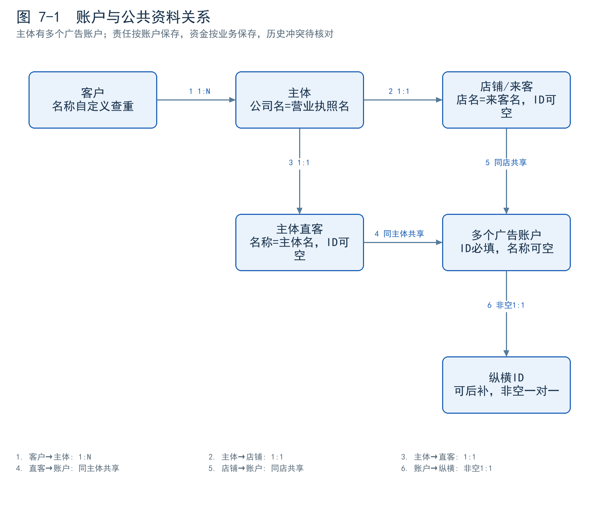

图7-1为V1.5沿用的目标关系：客户1:N主体；主体1:1店铺、1:1直客资料，同时主体1:N广告账户。直客名称等于主体名，直客ID可空且由同主体多账户共享；店铺名等于来客名，来客ID可空。纵横仍是账户独立非空一对一字段。历史冲突单列待核对，不自动迁移，也不据关系合并资金。[R17、R05、R06]

**图 7-2　资金对象与可追溯分录**

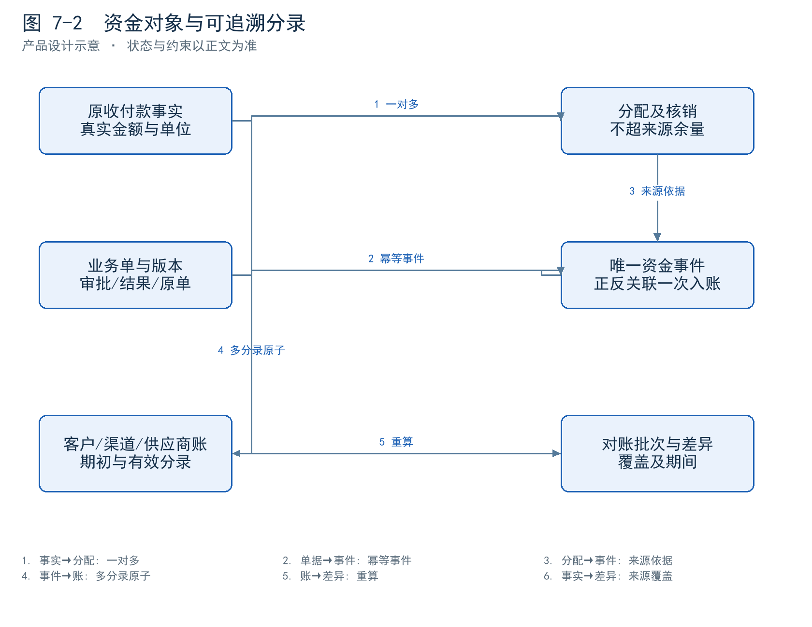

图 7-2：一个收款事实可有多笔分配；一个业务单可产生多个不同语义但唯一的事件；事件的全部分录原子保存。原始来源和账内余额都进入对账，不能只做内部表间相等检查。[R10]

| 对象/稳定主键 | 关键字段与关系 | 约束与生命周期 |
| --- | --- | --- |
| 公共客户 customer_id | 名称、规范化查重键、普通/渠道标签、来源、关联主体 | 同名新建拦截；共享引用不建立钱包操作权；停用保留历史 |
| 主体 subject_id | 客户引用、法律名称、信用代码、证照、直客ID、地址、联系人、旧ID映射 | 可靠证照查重；客户1:N主体；主体当前1:1店铺及直客、1:N账户；历史多店待核对 |
| 店铺 shop_id | 主体、店名即来客名、产品适用资料、可空来客ID、核验状态 | 主体当前一个店铺；一店一个可空来客ID；不据号长识别，变更保留历史 |
| 广告账户 account_id | 平台、完整外部ID、产品、办理路径、店铺、归属商务 | 真实平台身份唯一；跨入口/供应商同号必须提示拦截，跨平台命名空间由平台契约定义，不擅自全平台混同 |
| 平台专有资料 | 来客→店铺；直客→主体；纵横→账户；名称派生与来源 | 直客ID可空且同主体多账户共享，直客名=主体名；来客名=店铺名；纵横非空账户一对一可补 |
| 账户责任/协办关系 relation_id | account_id、负责商务、有效起止、协办授权、变更原因 | 申请阶段有业务责任，成功落档；历史操作及收益快照不覆盖 |
| 供应商服务关系 service_id | 账户/申请、供应商、产品能力、生效区间 | 开户逐次选择；不锁在主体；变更需可执行能力与流转记录 |
| 结算方与逻辑资金账 settlement_id | 普通/渠道、受控资金属性、一类/二类旧映射、单位 | 渠道统一总账视图不抹去旧资金限制；人员不是资金账主键 |
| 收付款事实/分配 fact_id/allocation_id | 银行账户、来源交易、实际对方、金额单位、分配与核销 | 去重含来源账户；分配累计不超可分配来源，未认领保留 |
| 申请/批次/行 order_id/line_id | 业务类型、负责商务、经办、版本、金额、执行请求 | 行级结果与批次汇总；新执行关联旧行，不重复成功事实 |
| 未提交开户草稿 draft_id | 创建人稳定身份、负责商务、表单值、创建及更新时间 | 一人多份，创建人与商务归属分开；提交仅移除对应草稿，未知历史归属保留 |
| 开户通知展示及阅读 applicationId/person/revision | 原申请当前摘要、个人已读版本 | 每申请聚合一条；展示记录不复制业务结果，阅读按个人隔离 |
| 资金事件/分录 event_id/entry_id | 语义唯一键、原事件、更正关联、方向金额单位、记账日 | 不可直接覆盖已生效分录；原子写入、幂等、可重算 |
| 信用/债务 credit_id/debt_id | 类型、批准上限、有效期、在途、未偿、应还日、核销 | 信用权限和真实债务分开；到期/冻结不删除债务 |
| 合同/发票/返利 document_id | 版本、应付/应开、实际金额、关联分配、实际付款证据 | 关联有金额与单位；申请、批准、开出/支付、核销分层 |
| 流程/配置/审计 instance_id/version_id | 流程快照、参与人、表单版本、动作前后值、原因、来源 | 在途版本不等于保留已失效人员权限；敏感字段受权访问 |
| 员工/任职/工资 employee_id/tenure_id/batch_id | 企微映射、任职生效、考勤、薪资规则、期间与发布版 | 角色不等于岗位；工资私密；更正形成新差额版 |

### 7.2 数据规范

平台编号、证照和银行账号使用字符串，保留原始值与清洗后查重值；不设未经证实的固定位数，不使用浮点或科学计数法存 ID。金额采用精确十进制、显式单位和分支舍入，旧三位小数不统一截两位。所有计算记录模板版本、输入值、换算基数和舍入位置。

记录真实发生时间、系统登记时间、审批/执行时间、业务期间与业务时区。迁移同时保留旧入口、旧表主键、旧分类、来源文件/批次及映射依据，禁止只留新 ID。名称、人员和模板变更不反写历史快照。停用、合并、更正须有引用处理策略，不能物理删除已参与业务的事实。

### 7.3 生产兼容矩阵与迁移

| 旧入口 | 旧类型 | 解释 | 普通账户 | 平台共享钱包 |
| --- | --- | --- | --- | --- |
| 1 | 100 | 巨量 AD 自有 | 15 | 0 |
| 1 | 102 | 本地推自有 | 3,668 | 2 |
| 10 | 100 | 巨量 AD 外转 | 5 | 0 |
| 10 | 1001 | 本地推外转 | 6,937 | 0 |
| 10 | 1002 | 腾讯 K4 外转 | 415 | 1 |
| 10 | 1003 | 快手外转 | 10 | 0 |
| 10 | 1004 | 巨量 AD 外转 | 1,622 | 0 |

上表来自 R05 的历史统计，普通合计 12,672、特殊对象 3，不作为本轮生产实时总量。产品、平台、办理路径、账户对象类型、供应商和资金属性必须分别映射；相同旧类型码跨入口不代表同一语义。不能只迁本地推而使其他旧产品失效。

| 迁移对象 | 核对方法 | 冲突处理与放行条件 |
| --- | --- | --- |
| 146组跨入口重复账号 | 按真实平台ID候选，核对主体/店铺/供应商/责任/资金来源 | 不直接删292行；建立合并映射与历史来源，业务负责人确认 |
| 历史主体多店/分散直客 | 原行、原值、原申请和映射依据分别保留 | 标历史关系待核对；不自动合并删改，不声明新规则已经迁移 |
| 66条本地推无店铺账户 | 由原申请/资料/平台证据补核 | 无证不造来客；待核对可读但限制高风险新动作 |
| 3条平台共享钱包 | 明确对象类型及原引用 | 不能变成普通广告账户或丢失旧服务费/资金关系 |
| 一类/二类与旧钱包 | 每属性期初/变动/期末及单位单独复算 | 逻辑总账可汇总展示，不任意相加消差或取第一只钱包 |
| 信用、负备款与期账 | 核对同一缺口是否已经计债；保留真实未偿及应还日 | 不得把历史负备款和已用信用重复计债 |
| 在途单和外部请求 | 保存原请求、流程版本、冻结及外部结果 | 切换只一个执行系统；未知保留核实，禁止双执行 |
| 工资收益、票据及归属历史 | 按期间和当时规则/人员映射 | 已发布快照不按新角色重算；可关联更正 |
| 附件及导出 | 核验文件可读、原单引用、访问范围与完整性 | 缺件明确登记；临时下载不可绕过权限 |

## 8. 非功能需求

正确性门槛与容量建议分开。下列 P 类数值为便于技术评估的候选测试目标，尚未得到资源或压测支持，不能写成已承诺 SLA；上线前在附录 C 中关闭。

| 编号 | 规格/测试条件 | 状态与验证 |
| --- | --- | --- |
| P01 | 候选：1万/5万/20万账户数据、20并发查询下，常用筛选列表 P95≤2秒；导出不阻塞列表 | 待压测确认资源、索引及数据分布；测试含权限过滤 |
| P02 | 候选：1万行导入预检≤60秒，进度可见且可下载错误行 | 待压测；正式业务执行耗时不包含在预检目标 |
| P03 | 候选：本地提交确认反馈 P95≤2秒；外部等待及时进入可追踪状态 | 待实测；不承诺媒体或企微完成时延 |
| P04 | 候选：备份目标 RPO≤15分钟、恢复 RTO≤4小时 | 待资源与演练批准；资金真实事实不能靠恢复旧库覆盖 |
| C01 | 重复资金生效、未授权成功、原子事件半笔入账，验收出现数均为0 | 并发、重复回调、进程中断、重放和权限撤销测试 |
| C02 | 关键变更审计覆盖100%测试样本，包含人/时间/原单/前后值/版本/来源 | 业务与安全验收；日志本身不泄露凭据 |
| C03 | 7类旧入口产品组合、普通/共享钱包对象、旧资金分支分别验证 | 数据迁移及历史样本重算 |
| C04 | 候选适配1280/1440/1920桌面宽度；核心表格固定列和键盘可用 | 实际浏览器版本及测试设备待实施选定；图示不是响应式实测 |
| C05 | 菜单、按钮、字段、数据范围、导出和后台API授权一致 | 不能仅前端隐藏；有效权限变更立即影响执行 |
| C06 | 备份可恢复、附件引用可核；异步任务可重启、可追踪、不重复执行 | 恢复演练及任务幂等验证，记录真实环境结果 |

敏感信息分级访问与导出：银行账号、手机号、工资、费用凭证、审批意见按字段与业务权限展示；访问、批量导出及下载留记录。持久化凭据不进入 PRD、埋点、导出或普通日志。审计保存时长和附件保留周期由公司配置与评审确定，不伪造已批准天数。

## 9. 数据埋点

事件用于验证体验和业务闭环，不替代资金账。事件包含稳定对象 ID、时间、角色/动作、结果与配置版本；不把手机号、银行账号或附件原文作为分析属性。

| 事件 | 触发时点 | 核心属性 | 指标用途 |
| --- | --- | --- | --- |
| E01 申请提交 | 业务校验通过并形成申请 | 单号、类型、产品、提交/责任角色、流程版本 | K02 |
| E02 状态变更 | 持久化真实状态转换 | 原/新状态、行/批次、等待类型、原因、外部结果 | K01/K02 |
| E03 资金事件生效 | 完整分录原子提交后 | 事件键、原单、单位、金额、资金范围、冲正关联 | K01/G01 |
| E04 对账及差异状态 | 完成核对或处理 | 批次、覆盖范围、差异类型、解释/调整/复查结果 | K01/G02 |
| E05 任务分配/办理 | 生成、接单、转派、办结 | 任务原单、责任角色、区域、开始/结束、等待原因 | K02 |
| E06 资料检索与复用 | 候选显示、选择或有据新增 | 对象类型、候选数、选择行为、是否新建 | K03 |
| E07 授权校验结果 | 敏感业务动作执行校验 | 动作、角色、对象范围、允许/拒绝、原因 | G03 |
| E08 归属/协办/任职变更 | 批准并生效时 | 原/新责任引用、有效期、原因、影响范围 | G03/历史核算 |
| E09 模板发布/迁移 | 发布或迁移确认 | 模板旧/新版本、模拟结果、影响单数、操作者 | 变更风险审计 |
| E10 导入/导出/接口任务 | 提交、逐行结束、失败、下载 | 批次、对象范围、行数、来源、结果、文件权限 | 数据质量与运维 |

采集遵循事实提交：事务失败不发送“资金成功”；异步重投按事件 ID 去重。聚合看板明确数据截至时间、统计期间、单位、数据口径版本和权限范围，不能将不同单位数据简单求和。

## 10. 权限与角色矩阵

权限配置由角色、动作、对象范围、字段及必要的当前流程责任共同决定。以下是角色模板的基线，具体人员与区域由后台配置。多角色可合并合法能力，但资金正确性与配置的职责分离规则仍强制执行。

| 角色 | 公共资料/账户 | 发起业务 | 实际执行 | 资金确认/支付 | 特有权限 |
| --- | --- | --- | --- | --- | --- |
| 普通商务 | 范围内可见/办理 | 开户、充值、退款、续费 | 本人获授权动作 | 无默认财务确认/支付 | 无跨客户渠道转账 |
| 渠道商务 | 范围内及其渠道关联 | 同上＋代客户信用申请 | 授权渠道CRM转账 | 不能自行批准信用 | 指定渠道总账出资及授权转账 |
| 协办 | 按委托账户与期限 | 被授权申请/办理 | 范围内代办 | 无默认财务权 | 记录本人，不变账户归属 |
| 商务主管 | 本团队/配置范围 | 交接与异常协调 | 授权继承/转交 | 无默认支付 | 不能改已发布历史收益 |
| 媒介主管 | 区域和产品范围 | 派单/重派 | 有办理权时可亲自执行 | 无默认确认到账 | 开户与充值媒介分别指派 |
| 开户/充值媒介 | 办理所需资料 | 退回补件/核实 | 被派且获授权业务 | 不代财务确认到账 | 开户结果/纵横；充值退币真实结果 |
| 财务确认/核算 | 必要账务及证据 | 规则、认领、调整 | 确认到账、核销、对账 | 按动作授权；不因同组自动拥有支付 | 前后返/尾差/开票/期间 |
| 财务付款 | 待付单及凭证 | 付款异常处理 | 真实付款并回填 | 独立付款动作授权 | 退款最终实际付款人 |
| Boss/审批角色 | 申请所需信息 | 审批/驳回 | 当前有效版本批准 | 无自动银行支付 | 批准信用，CRM保存后生效 |
| 人事/薪酬 | 组织与本职范围 | 任职/考勤/工资 | 复核发布，规则约束不同人时强制 | 工资发布不代替财务付款 | 私密字段单独权限 |
| 配置管理员 | 模板及模拟数据 | 编辑、模拟、发布 | 配置许可范围 | 无直接调余额权 | 禁止配置关闭正确性约束 |
| 审计/资料管理员 | 各自获授权范围 | 治理或只读核对 | 资料改动按权限 | 不默认办理资金 | 查询审计也记录访问 |

当流程要求提交与复核为不同人员时，以人员稳定 ID 强制不同，不能用同一人的两个角色绕过。正常业务不机械加双人审批；同样，配置管理员不能通过给自己附加一个步骤绕过真实付款和当前权限校验。企业微信同意、拒绝与 CRM 动作使用同一审批实例和版本。[R12、R13]

## 11. 风险与依赖

| 风险/确定性 | 影响 | 应对、依赖角色与关闭条件 |
| --- | --- | --- |
| 历史身份冲突：已观察 | 错误合并账户、主体或钱包影响所有业务 | 资料/业务负责人核实146组及缺关系样本；映射可追溯后关闭 |
| 旧核算分支未全部复算：明确技术核验项 | 改错前返、服务费、期账和收益 | 财务＋开发固定旧分支输入与结果，历史样本及边界复算一致；不是认定已造成损失 |
| 外部接口能力与限额：尚未逐项验证 | 自动开户/充值/通知范围无法承诺 | 接口负责人按产品核验、保留人工证据途径；能力矩阵和故障恢复演练完成 |
| 配置自由度过大：设计风险 | 发布不可执行流程或越权 | 配置管理员使用校验与模拟、版本影响预览；CFG全部满足 |
| 人员组织映射变化：持续风险 | 派给离职人员、继承错误、薪酬泄露 | 主管/人事对稳定ID和有效期核实；停权及转派演练通过 |
| 图文版本漂移：交付风险 | 实现时使用旧来客/直客模型 | 源清单、版本与生成脚本一致；旧图片禁用，新关系验收T01–T04 |
| 资源和性能未知：不虚构概率 | 排期/SLA缺依据 | 技术负责人补容量测试与恢复演练；候选目标会签后成为发布门槛 |
| 旧系统实现不完整：已知范围差异 | 菜单存在被误当作可用业务 | 以真实路径与结果核验；新设计单列行为，不能把静态风险写成事故 |

依赖以角色表示，尚未指定个人或确定日期。未解决风险可以进入评审稿，必须明确关闭条件；涉及资金正确性、身份兼容和有效权限的风险未关闭，不放行对应生产范围。没有会计税务系统依赖。

## 12. 项目计划与发布

### 12.1 依赖顺序与交付门

**图 12-1　阶段依赖与发布轨道**

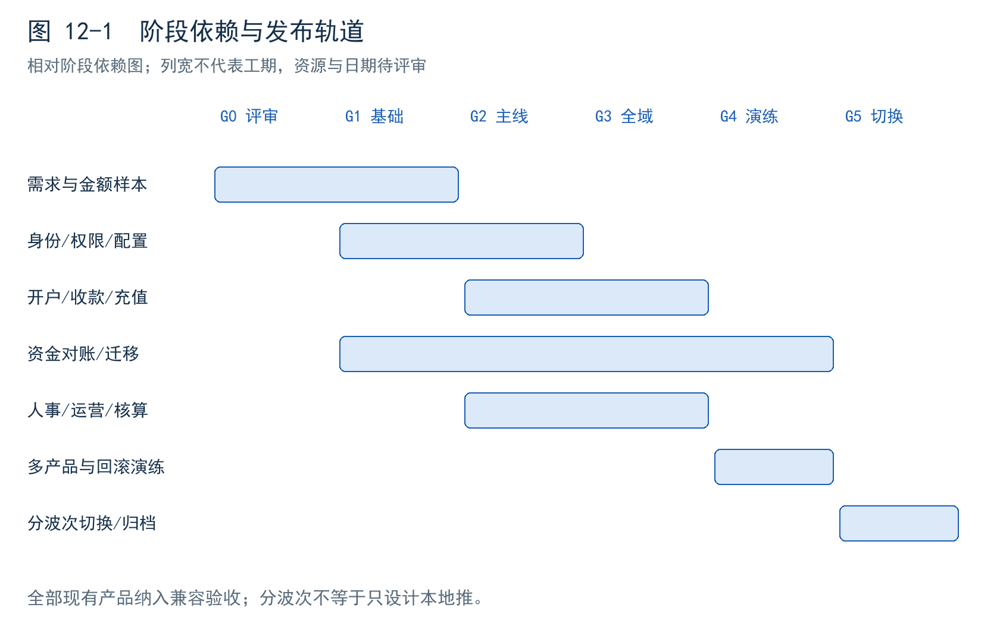

图 12-1 为相对阶段及并行工作轨道，长度不代表工期。需求评审、数据核验、接口验证可并行，依赖关闭后才承诺开发日期。没有擅自指定上线时间、流量百分比或观察天数。

| 阶段 | 可验收交付 | 进入下一阶段条件 |
| --- | --- | --- |
| G0 业务评审 | 本PRD、图示、当前规则与待发布参数清单 | 业务/财务/媒介/人事逐域会签；矛盾有明确处理 |
| G1 基础与契约 | 身份模型、权限、配置版本、资金事件、兼容映射 | 关键关系与正确性不变量可测试；数据冲突清单可处理 |
| G2 核心流程 | 个人工作台、列表、开户、收款、充值/续费、退款、渠道、对账 | 核心正反用例及旧兼容分支通过，不仅本地推 |
| G3 完整业务扩展 | 合同开票、费用供应商、收益报表、素材、人事考勤薪资 | 所有40模块有对应交付与验收；分批不删除未上线模块 |
| G4 迁移及故障演练 | 样本/全量复算、权限、容量、外部未知恢复、回退演练 | 期初和来源覆盖一致，异常可恢复，无未解释资金差异 |
| G5 分批切换与核对 | 明确人员/产品/资金范围的切换批次 | 单一执行系统、前后核对、在途映射完整、监测合格后扩大 |

### 12.2 灰度与放行

灰度按完整业务闭环及资金范围切换，避免同一钱包/账户同时被两套系统写入。每批记录范围、旧系统写入口控制、期初、在途、外部请求、回退触发及实际观察结果。批次大小和观察窗口由真实容量、业务节奏与验收结果确定，不机械照抄模板的 5%→50%→100%。

放行至少满足：账户关系无未解释冲突；同一资金范围重算与来源覆盖通过；重复/并发/未知/部分成功可恢复；授权及离职交接生效；财务能定位每笔事实及差异；旧7类产品入口所涉及业务有已验证兼容路径。新接口未验证的自动动作不进入本批自动执行范围。

### 12.3 回滚四要素

- 数据：保留切换映射、校验快照和新增事件；生产已发生的新收付款/平台事实不可用旧备份抹去，必须先对账和补记。
- 流量：按获批范围关闭新写入并切换唯一执行入口；只读查询可保留，避免两套同时提交。
- 在途单：停止新派发，保留外部请求、冻结与未知结果；指定承接系统与责任人，仅核实/补同步，不新充新付。
- 归档：保存切换批次、前后版本、操作人、原因、差异与复查结论。重新切换需新验收记录。

## 13. 验收标准与评审记录

### 13.1 模块与跨模块验收

第 6 章包含每个模块2条正反/边界验收，共87条。它们是开发与业务验收规格，不是本轮已执行的软件测试。下表补充跨模块的关键关联。

| 编号 | 给定/触发 | 预期 | 对应模块 |
| --- | --- | --- | --- |
| T01 | 同店两个账户 | 共享唯一店铺来客和主体直客；两账户归属各自保存；不新增主体第二个店铺或直客 | M03/M05/M06 |
| T02 | 直客ID未知 | 主体名仍作为直客名展示，直客ID可空且不造值；允许按材料阶段继续 | M03/M06 |
| T03 | 同主体多账户共享直客 | 复用主体直客正常通过；冲突属于另一主体时给关系核对入口，不覆盖另一主体资料 | M03/M06 |
| T04 | 纵横为空或后补 | 名称可空，以唯一真实账户ID及适用供应商完成材料合格的开户；纵横可空、非空一对一，补资料不改归属 | M05/M06 |
| T05 | 同主体同店跨供应商或商务开户 | 公共资料复用；新ID合法则可建；责任、供应商分别保存 | M04/M08 |
| T06 | 跨旧入口录入同一真实账号 | 提示并拦截重复，已有冲突保留来源进入核对 | M05/M37 |
| T07 | 协办完成、主管继承、商务离职 | 实际经办与历史归属可查；当前权限即刻更新，不覆盖历史收益 | M08/M26/M33 |
| T08 | 一个人兼商务与其他角色 | 按动作和范围可见，敏感工资/资金不能因公共客户访问泄露 | M01/M31/M33 |
| T09 | 多角色收到同一任务 | 工作台去重；站内及企微同一原单，已读不关闭业务 | M01/M35 |
| T10 | 复制开户申请 | 同主体共享直客引用，清空新户账户ID/纵横及外部结果；重新查重 | M07/M06 |
| T11 | 三位旧金额和不同单位 | 保留原精度与舍入分支，不统一截两位、不混加 | M10/M19/M37 |
| T12 | 渠道给他客户账户充值 | 渠道扣一次、目标不生额外备款、账户归属不变、消耗不再扣 | M10/M12/M24 |
| T13 | 旧资方渠道转账差额 | 源目标按各自返点计算，差额有去向，所有分录一起成功；普通模板仍等额 | M16/M19 |
| T14 | 开户跨批次结果/充值部分成功 | 开户同次登记校验失败不写本批结果；跨次已成功行保留。只重办明确失败行，未知查原执行，外部成功只补同步 | M06/M12/M40 |
| T15 | 续费与公共客户复用 | 收款/账户/收益分类分别保存，按旧结算身份兼容，不按新公共客户总次数误分类 | M13/M26 |
| T16 | 发票部分、多次、作废/红冲 | 分配金额可核、状态不混淆；不增加备款，不覆盖原票 | M21/M22 |
| T17 | 人事变动跨薪资期 | 按当期任职和规则试算；发布后更正形成差额，不以现职重算历史 | M29/M30/M31 |
| T18 | 导入与页面创建相同事实 | 使用一致查重、权限、金额和事件规则；导入不是绕行入口 | M36/M37 |
| T19 | 配置模拟含支付/充值节点 | 无真实外部调用、入账和通知；可看路由及异常预览 | M34 |
| T20 | 旧账户对象与新产品扩展 | 7类兼容组合和3个共享钱包对象分别验证，未知映射不强制当普通账户 | M05/M37 |

### 13.2 财务与配置异常验收

以下35条保留原调研编号及预期，作为评审基线。[R10、R12] F-AC18 的等额守恒仅适用于普通同单位转账模板；旧资方分支按 T13 和第5.3节包含差额分录的整体守恒验证，不能把原简写推广成所有转账都等额。

| 编号 | 触发/测试条件 | 明确预期 | 来源 |
| --- | --- | --- | --- |
| F-AC01 | 同一收款确认连续提交、并发提交和超时重试 | 同一个资金事件；公司现金及客户资金只变化一次，重试返回同一结果。 | R10 |
| F-AC02 | 不同公司银行账户发生同时间、同金额、同付款方记录 | 不因旧指纹冲突丢掉一笔；各自保留来源和账户。 | R10 |
| F-AC03 | 同账户同金额有多个匹配候选 | 显示候选及依据，不自动认领到错误客户。 | R10 |
| F-AC04 | 已入账流水连续复核 | 金额、余额和资金事件数不变，只新增/返回复核记录。 | R10 |
| F-AC05 | 已入账金额或账户要更正 | 无直接覆盖/物理删除；有关联更正单，旧值可查，依赖账同步更正。 | R10 |
| F-AC06 | 普通收款、服务费收款、还款、钱包分配分别更正或冲正 | 撤销范围内分录严格反向；真实到账仍在而仅改客户认领时公司现金不减少；重复记账冲正多记部分；余额与快照一致，原关联保留。 | R10 |
| F-AC07 | 资金已被使用后撤销或退回收款 | 不假装资金未发生，不产生无来源可用资金；按真实场景处理欠款/归属更正/实际退款。 | R10 |
| F-AC08 | 一笔 10 万元分配为 6 万与 4 万、随后重复分配 1 元 | 前两项成功，额外分配拦截；公司现金只记 10 万，允许保持未分配余额。 | R10 |
| F-AC09 | 来源 265.490，拟分配 265.494 | 实际资金分配不得超 265.490；若需结清，0.004 独立进入允许的差额处理，不伪造现金。 | R10 |
| F-AC10 | 950.52 应收、950/951 实收且命中已发布接受规则 | 应收和实收不改写；分别形成 -0.52/+0.48 差额处理；不默认催零头或生备款。 | R10 |
| F-AC11 | 尾差超规则、或模板未发布 | 进入财务处理，不无限自动接受；手工处理留依据和权限。 | R10 |
| F-AC12 | 余额 5 万，两人同时申请 4 万 | 至多一笔冻结成功，另一笔提示资金不足；未引入商务个人额度。 | R10 |
| F-AC13 | 充值成功但响应丢失/接口超时 | 维持待核实，通过原业务标识查询；不自动释放资金或再次新充值。 | R10 |
| F-AC14 | 充值/退币/退款部分成功 | 分段保存事实；只核算实际成功部分；剩余分清未知/失败，不能整单重复。 | R10 |
| F-AC15 | 用户先在外部完成业务再补录，包括备款不足 | 只补 CRM 事实与账，不再次下发外部操作；保留真实欠款及异常，不伪造信用批准；补录人、证据、发生时间保留。 | R10 |
| F-AC16 | 退款审批通过但未付款、付款失败、付款成功 | 三者状态和冻结分别正确；只有真实付款成功才是已付。 | R10 |
| F-AC17 | 后返改付款方式/收款方，或改为转备款 | 实际路径有据、金额只支付/转换一次；返利应付与已付能勾稽。 | R10 |
| F-AC18 | 渠道跨客户转账及撤销 | 同笔来源与目标等额同单位，内部净变化为零，公司现金不变；权限及历史清晰。 | R10 |
| F-AC19 | 渠道子广告账户消耗同步 | 不再次扣渠道结算总账；不改变商务归属。 | R10 |
| F-AC20 | 货币期账结清、取消结清、再结清 | 对应现金与货币使用量正反对称；历史比例不被当前模板覆盖。 | R10 |
| F-AC21 | 事件执行中任一步骤失败、进程退出、重复消息 | 本地事件无半笔入账；外部任务可恢复并去重，未知状态保留。 | R10 |
| F-AC22 | 改历史业务日期或补登记已封存期间业务 | 保留发生日与记账日，走调整/重开版本；不无痕重排旧账。 | R10 |
| F-AC23 | 期末余额重算 | 可信期初加期间有效分录等于期末；各资金桶、单位分别校验，未用任意总余额相互抵消差异。 | R10 |
| F-AC24 | 迁移找不到旧钱包或旧主记录 | 保留原身份、原单及差异状态，不能随意归当前同名钱包；解决后留映射依据。 | R10 |
| F-AC25 | 录入完所有业务但漏掉一笔真实来源流水/一笔平台交付 | 覆盖核对产生待认领或缺失业务差异；不能仅因 CRM 内部各表相等判全对。 | R10 |
| F-AC26 | 开票、财务返点模板改版、人员离职交接 | 不自动改变历史到账、应收、归属与收益快照；新业务按新版本生效。 | R10 |
| F-AC27 | 货币期账改返点、移入/移出及跨期拆分流水 | 按本期确认消耗与规则版本统一换算应收；现金和广告币各自守恒；达到结清时调用同一结清逻辑，不能仅改表头；封存期走更正版本。 | R10 |
| CFG01 | 新增节点、修改表单或条件分支后未发布 | 现行业务不受草稿影响，模拟无外部副作用 | R12 |
| CFG02 | 发布新版本时旧单正在等待媒介办理 | 新单按新版本，旧单默认按原版本，版本均可追溯 | R12 |
| CFG03 | 路由冲突、无匹配模板或无可用办理人 | 发布时尽量拦截；运行时保留原单及资金状态并生成配置/待派任务，不自动跳步 | R12 |
| CFG04 | 迁移或回退已完成部分资金动作的在途单 | 原动作不重复执行，真实结果不回滚，保留迁移前后映射及操作者 | R12 |
| CFG05 | 金额/结算方变更后收到旧企微同意回调 | 识别旧版本，不批准变更后的金额；无重复入账 | R12 |
| CFG06 | 修改返点或尾差模板 | 预览受影响范围，新版本按生效规则使用，已确认历史金额不被重算 | R12 |
| CFG07 | 办理人离职或角色权限收回 | 当下操作被限制，任务进入转交/主管待派；历史办理与归属不被覆盖 | R12 |
| CFG08 | 配置尝试绕过实际到账、关闭守恒检查或给普通商务渠道动作 | 发布或执行校验拒绝，不能因配置权限获得资金越权能力 | R12 |

### 13.3 评审与会签

| 评审范围 | 参与角色 | 当前结果 | 关闭依据 |
| --- | --- | --- | --- |
| 公共资料、账户、归属和开户 | 业务负责人/媒介主管 | 待评审，未代签 | T01–T10及开户流程确认 |
| 资金、返点、授信、对账、票据 | 财务/Boss/渠道业务代表 | 待评审，未代签 | 财务35条及兼容公式样本 |
| 组织、权限、人事和薪酬 | 人事/主管/财务 | 待评审，未代签 | 任职期间、历史核算、敏感范围 |
| 技术可行性与上线参数 | 开发/运维/测试 | 待核验 | 附录C、故障演练与迁移对照 |
| 文档方法和成品一致性 | Codex及独立代理 | 检查结果另见质量记录 | 只证明文档检查，不代替业务/运行验收 |

## 附录 A. 术语

| 术语 | 本文含义 |
| --- | --- |
| 公共客户 | 资料检索及复用对象；不是所有关联账户的唯一归属 |
| 主体 | 名称与营业执照一致的法律主体；客户1:N主体，主体当前1:1店铺及直客，1:N账户 |
| 店铺/来客 | 店铺名即来客名，主体当前一个店铺；来客ID可空，同店多个账户共享 |
| 直客 | 主体资料，名称等于主体公司名；ID可空，同主体多个广告账户共享，商务和授权媒介维护 |
| 纵横 | 与直客分开的账户资料，媒介手填、一对一、允许后补 |
| 广告账户 | 真实平台账户，业务归属挂在该账户，完整ID重复要拦截 |
| 结算方 | 本笔业务承担资金和债务的对象，可以是渠道，与公共资料/人员分离 |
| 渠道逻辑总账 | 渠道统一管理的资金视图，保留旧资金属性及单位，不重复计算子户消耗 |
| 信用/授信 | 经批准的借款权限；未使用不是现金，实际支用形成债务 |
| 在途/冻结 | 执行权占用或结果未闭合的资金，不等于已经真实消费 |
| 已核对/已结清/已封存 | 分别是核对状态、债权债务状态、期间修改控制，不互相替代 |
| 协办/归属 | 协办是有范围期限的办理授权；归属是账户责任，不由点击人决定 |

## 附录 B. 来源与决策追溯

R17含本轮V1.5个人多份草稿、个人申请通知与TSV粘贴预览，以及沿用的批量表格、供应商应用、整批登记、显式完成、汇总待办、权限、行业、可选备注及供应商维护边界确认；R18只用于旧供应商字段来源核实，不复用其中已被替代的关系建议。R01及R15中冲突内容仅作历史，不能覆盖R17。R02按顶部当前结论使用；保留的旧问答只作历史。R07 内商务个人额度旧建议由 R09 取消；R08 文件名虽含“待定”，顶部及本轮核对确认四项已经最终确认。R13/R14 的旧待定表述不能覆盖后续确认。R15 仅取已修正文字，不复用已废止的旧图片。文件路径与SHA-256存于sources.json，便于识别源版本。旧生产统计仍为原调查时点，本轮未重新访问生产。

| 证据ID | 本地来源 | 用途 |
| --- | --- | --- |
| R01 | [店铺来客与直客账户关系更正-20260921-Codex.md](<D:/PROJECT/薪火CRM系统/重构调研/店铺来客与直客账户关系更正-20260921-Codex.md>) | 历史调研/已确认规则；本轮核对文档 |
| R02 | [待确认问题清单-Codex.md](<D:/PROJECT/薪火CRM系统/重构调研/待确认问题清单-Codex.md>) | 历史调研/已确认规则；本轮核对文档 |
| R03 | [全业务功能覆盖与闭环缺口检查-20260920-Codex.md](<D:/PROJECT/薪火CRM系统/重构调研/全业务功能覆盖与闭环缺口检查-20260920-Codex.md>) | 历史调研/已确认规则；本轮核对文档 |
| R04 | [旧系统遗漏功能与交互优化复核-20260921-Codex.md](<D:/PROJECT/薪火CRM系统/重构调研/旧系统遗漏功能与交互优化复核-20260921-Codex.md>) | 历史调研/已确认规则；本轮核对文档 |
| R05 | [生产兼容矩阵与完整PRD范围-20260920-Codex.md](<D:/PROJECT/薪火CRM系统/重构调研/生产兼容矩阵与完整PRD范围-20260920-Codex.md>) | 历史调研/已确认规则；本轮核对文档 |
| R06 | [账户归属模型修订-20260920-Codex.md](<D:/PROJECT/薪火CRM系统/重构调研/账户归属模型修订-20260920-Codex.md>) | 历史调研/已确认规则；本轮核对文档 |
| R07 | [渠道总账与跨客户转账及商务额度设计-20260920-Codex.md](<D:/PROJECT/薪火CRM系统/重构调研/渠道总账与跨客户转账及商务额度设计-20260920-Codex.md>) | 历史调研/已确认规则；本轮核对文档 |
| R08 | [四项授信待定规则与旧系统对照建议-20260921-Codex.md](<D:/PROJECT/薪火CRM系统/重构调研/四项授信待定规则与旧系统对照建议-20260921-Codex.md>) | 历史调研/已确认规则；本轮核对文档 |
| R09 | [商务额度取消与续费功能核验-20260920-Codex.md](<D:/PROJECT/薪火CRM系统/重构调研/商务额度取消与续费功能核验-20260920-Codex.md>) | 历史调研/已确认规则；本轮核对文档 |
| R10 | [CRM内部对账深度调研与闭环设计-20260921-Codex.md](<D:/PROJECT/薪火CRM系统/重构调研/CRM内部对账深度调研与闭环设计-20260921-Codex.md>) | 历史调研/已确认规则；本轮核对文档 |
| R11 | [返点返付与收款尾差开票核验-20260921-Codex.md](<D:/PROJECT/薪火CRM系统/重构调研/返点返付与收款尾差开票核验-20260921-Codex.md>) | 历史调研/已确认规则；本轮核对文档 |
| R12 | [后台流程与财务规则配置确认-20260921-Codex.md](<D:/PROJECT/薪火CRM系统/重构调研/后台流程与财务规则配置确认-20260921-Codex.md>) | 历史调研/已确认规则；本轮核对文档 |
| R13 | [权限组织与离职交接确认-20260920-Codex.md](<D:/PROJECT/薪火CRM系统/重构调研/权限组织与离职交接确认-20260920-Codex.md>) | 历史调研/已确认规则；本轮核对文档 |
| R14 | [服务器财务表格检查与计算基线确认-20260920-Codex.md](<D:/PROJECT/薪火CRM系统/重构调研/服务器财务表格检查与计算基线确认-20260920-Codex.md>) | 历史调研/已确认规则；本轮核对文档 |
| R15 | [图片原型-v1-20260921/第一批-列表与完整开户/角色与开户流程说明.md](<D:/PROJECT/薪火CRM系统/重构调研/图片原型-v1-20260921/第一批-列表与完整开户/角色与开户流程说明.md>) | 历史调研/已确认规则；本轮核对文档 |
| R16 | [业务保留与交互数据流转重构原则-20260920-Codex.md](<D:/PROJECT/薪火CRM系统/重构调研/业务保留与交互数据流转重构原则-20260920-Codex.md>) | 历史调研/已确认规则；本轮核对文档 |

| R17 | [PRD修订补充-V1.2-20260922.md](PRD修订补充-V1.2-20260922.md) | 本轮V1.5确认；个人多草稿、个人通知与TSV预览，沿用批量登记及已确认基线 |

| R18 | [旧字段映射核验](<D:/PROJECT/日常问题/research/current-field-mapping-review.md>) | 2026-09-20静态核验；本轮重新读DDL及Mapper核对供应商字段，不代表当前生产填充率 |

## 附录 C. 上线前需关闭的配置及技术核验

以下是未发布参数或技术验证，不是重新询问已经确认的业务规则；不阻塞 PRD 评审，但影响对应范围的生产放行。标红项不得被实现人员当成默认制度。

| 编号 | 待发布/验证项 | 内容 | 依赖角色 | 关闭条件 |
| --- | --- | --- | --- | --- |
| V01 | 旧计算及分类样本 | 各产品/一二类/期账/服务费/提成/续费的分支复算 | 财务＋开发 | 固定样本输入、旧结果、新结果、差异解释会签 |
| V02 | 尾差与财务模板参数 | 适用范围、阈值、额度/返点、不同返付方式 | 财务 | 已发布模板或有据人工处理；不能默认1元/0.1元/全局8点 |
| V03 | 派单与提醒名单 | 区域、角色、主管、升级路径及等待时长 | 业务主管 | 有效人员与无匹配兜底模拟通过 |
| V04 | 外部接口能力 | 各产品自动/人工、查询、幂等、回调签验和限额 | 接口负责人 | 能力矩阵及故障恢复验证，不假设银行支付回调已经存在 |
| V05 | 性能、容量与恢复 | P01–P04候选目标、实际资源和浏览器 | 技术/运维 | 压测与恢复演练后会签目标；当前未实测 |
| V06 | 保留与导出策略 | 日志/附件/工资保留周期、导出脱敏及授权范围 | 业务/人事/系统管理 | 策略发布并做权限测试 |
| V07 | 历史身份及资金映射 | 重复账号、无店铺、同主体多店/直客冲突、无旧钱包、跨期余额 | 资料/财务/业务负责人 | 逐组来源依据、期初对平与异常处理记录 |
| V08 | 新增定制核算规则 | 后续财务自定义提成、工资或新资金模板 | 财务/人事 | 草稿试算、样本比对、发布生效，不能直接覆盖历史 |

## 附录 D. 完整功能覆盖矩阵

B/F/R/S 为旧全业务检查24组，A 为后续遗漏/优化检查18项。代码仅用于追踪，不代表独立新产品或实施数量。每项可追到第6章模块和验收。

| 检查项 | 范围 | 详设模块 |
| --- | --- | --- |
| B01 | 公海与客户 | M02、M38 |
| B02 | 开户与资料 | M03、M06 |
| B03 | 账户/关系及继承 | M04、M05、M08 |
| B04 | 充值与续费 | M12、M13 |
| F01 | 银行流水/收款 | M09 |
| F02 | 撤销/冲正 | M09 |
| F03 | 供应商往来 | M18 |
| F04 | 服务费/返点 | M19 |
| F05 | 退币/退款/转账 | M12、M14、M15、M16、M17 |
| F06 | 对账与期账 | M10、M11、M22、M39 |
| F07 | 合同/开票 | M20、M21 |
| F08 | 费用/报销 | M23 |
| R01 | 业务收益/提成 | M26 |
| R02 | 员工/任职 | M29 |
| R03 | 考勤/请假 | M30 |
| R04 | 工资 | M31 |
| R05 | 目标/经营报表 | M25、M32 |
| R06 | 激励 | M27 |
| R07 | 素材/剪辑 | M28 |
| S01 | 机器人/通知 | M12、M35 |
| S02 | 同步/定时任务 | M04、M40 |
| S03 | 导入导出 | M05、M24、M36 |
| S04 | 流程/权限/审计 | M01、M33、M34、M39 |
| S05 | 迁移/兼容 | M02、M03、M05、M37 |
| A01 | 开户后关系变更 | M08 |
| A02 | 批量办理 | M06 |
| A03 | 合同及实际开票 | M20、M21 |
| A04 | 导入和未知结果 | M12、M24、M36、M40 |
| A05 | 续费三种分类 | M13 |
| A06 | 机器人通知 | M35 |
| A07 | 公海状态 | M38 |
| A08 | 复制业务 | M07 |
| A09 | 激励处理 | M27 |
| A10 | 素材交付 | M28 |
| A11 | 报表口径 | M25 |
| A12 | 消耗匹配 | M24 |
| A13 | 收益重算 | M26、M31 |
| A14 | 任职生命周期 | M29、M32 |
| A15 | 附件权限 | M36 |
| A16 | 导出范围 | M36 |
| A17 | 个人工作台 | M01 |
| A18 | 费用付款 | M23 |

## 附录 E. 图示及交付索引

图示中开户与关系相关图按当前V1.5重绘，其余复用V1.0保留图并核对文件哈希，源PNG可放大。箭头图附边列表说明，正文解释业务条件；不能仅凭线条交汇推断新增流程。图示中的短码和人名均为演示。

| 图号 | 图名 | 文件 |
| --- | --- | --- |
| 4-1 | 功能结构：业务域 → 模块 → 子功能 | assets/fig-4-1.png |
| 5-1 | 开户主线泳道 | assets/fig-5-1.png |
| 5-2 | 收款认领、分配与还债 | assets/fig-5-2.png |
| 5-3 | 充值结果、入账与重试 | assets/fig-5-3.png |
| 5-4 | 渠道三种资金动作 | assets/fig-5-4.png |
| 5-5 | 信用、欠款与实际还款 | assets/fig-5-5.png |
| 5-6 | 对账差异、调整及期间 | assets/fig-5-6.png |
| 7-1 | 账户与公共资料关系 | assets/fig-7-1.png |
| 7-2 | 资金对象与可追溯分录 | assets/fig-7-2.png |
| 5-7 | 配置发布与在途版本 | assets/fig-5-7.png |
| 5-8 | 人事与薪资的事实分层 | assets/fig-5-8.png |
| 6-1 | 价值与确定性优先级矩阵 | assets/fig-6-1.png |
| 12-1 | 阶段依赖与发布轨道 | assets/fig-12-1.png |
| 4-2 | 个人工作台：个人草稿与申请通知 | assets/fig-4-2.png |
| 4-3 | 广告账户完整列表：一账户一行 | assets/fig-4-3.png |
| 4-4 | 一条账户的完整资料 | assets/fig-4-4.png |
| 4-5 | 商务申请：合并录入与搜索选择 | assets/fig-4-5.png |
| 4-6 | 同页主体店铺与名称联动 | assets/fig-4-6.png |
| 4-7 | 同页账户数量与资质附件 | assets/fig-4-7.png |
| 4-8 | 合并页提交与原单摘要 | assets/fig-4-8.png |
| 4-9 | 媒介批量办理：TSV预览与草稿填入 | assets/fig-4-9.png |
| 5-9 | 批量校验与行级状态：原单续办 | assets/fig-5-9.png |
| 4-10 | 产品资质：主体与供应商资料分开 | assets/fig-4-10.png |
| 5-10 | 实际退款/返付：审批、支付、核销分开 | assets/fig-5-10.png |

本轮交付是待评审的产品需求文档与图示，不是已实现的新系统。本轮文档检查、图片查看与Word结构验证的实际结果记录在《质量检查记录》中；本轮UI集成验收由主助手另行记录，未以文档检查代替；未执行的生产验证、压测、完整 Word 分页渲染不得据此宣称通过。
