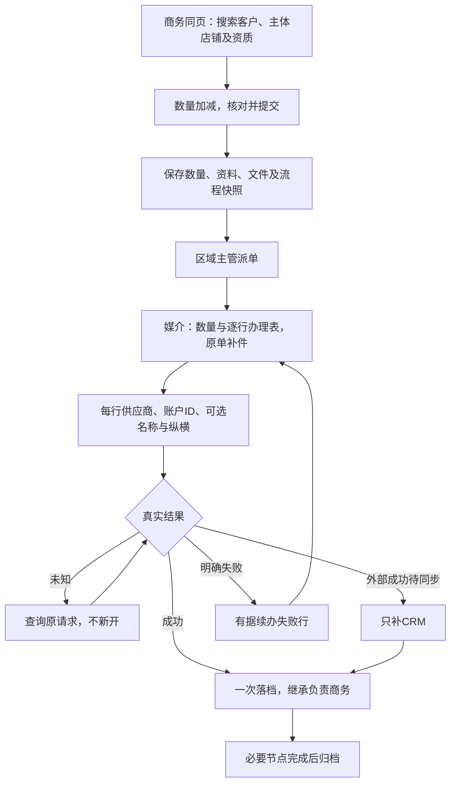
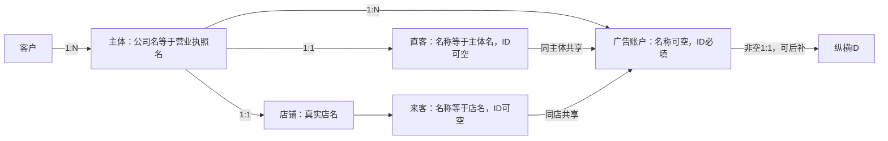

# 开户操作指南 · 原原型当前修订 · 2026-09-22

商务在同一页面完成原前三步资料录入，只选择开户数量；媒介按数量逐行办理。本指南对应当前V1.2规则，旧版浏览器记录不证明本轮新关系及附件能力已经通过，实际验证由协调者另记。

## 当前字段与关系

| 字段 | 填写位置 | 当前要求 |
| --- | --- | --- |
| 客户名称 | 商务同页搜索、选择/新增 | 自定义名称查重；客户1:N主体；保留既有主体共享引用，不推定反向独占 |
| 主体公司名称 | 同页新增/编辑主体，媒介原单可补 | 与营业执照主体名一致，同时就是直客名称，不双填 |
| 主体信用代码及资质 | 主体维护 | 有据录入查重，按产品材料阶段校验；不造未知值 |
| 直客ID | 主体维护 | 可空，主体当前1:1直客，同主体多个账户共享，无逐行直客编辑 |
| 店铺名称 | 同页维护主体唯一店铺 | 自定义真实店名，同时就是来客名称，不双填 |
| 来客ID | 店铺维护 | 可空，每店当前一个值，多账户共享 |
| 开户数量 | 商务同页“− 数字 +” | 正整数；商务不逐行填账户名、供应商或平台ID |
| 营业执照和资质 | 商务同页选文件、媒介原单补件 | 产品×材料类型设置显示与必需阶段；默认可选；真实本地文件可预览 |
| 账户名称 | 媒介逐行列表 | 自定义、非必填，空名称不阻止完成 |
| 供应商 | 媒介逐行列表 | 执行前明确适用供应商，保留版本 |
| 广告账户ID | 媒介逐行结果 | 完成必填防重，完整字符串保存 |
| 纵横ID | 媒介逐行结果或成功后补 | 可后补、非空一对一，不阻挡开户或充值 |

## 按角色办理

1. **商务/渠道商务**进入“开户申请与办理→新增开户”。同页输入客户名搜索，选择已有或查重新增，选择产品、区域及负责商务。
2. 客户选定后无需再输入关键词，立即展示全部已关联主体；可按名称或信用代码筛选。当前客户无匹配时查看清楚空态，再到单独标注“尚未关联此客户”的全局查重结果明确选择复用；不自动关联。空搜索亦可打开新增主体，保存查重无命中才新建。选主体后唯一店铺自动展示复用，无店可同页新增，历史多店显示待核对且不自动选第一店。公司名按营业执照填写，直客名自动跟随，直客ID可空；店铺真实名同时作为来客名，来客ID可空。
3. 根据材料清单选择真实营业执照或其他资质文件，预览文件。默认材料可选；已发布规则设为申请必需则提交前满足，执行前补齐可按提示后补。
4. 用“− 数字 +”确定数量，核对同页摘要后保存草稿或提交。提交成功进入原模块原单详情，保留菜单展开和来源筛选。
5. **区域媒介主管**在原单指派媒介；额外流程节点使用该单绑定版本。默认开户不固定增加财务或Boss审批。
6. **开户媒介**查看数量及对应逐行列表，在原单补全主体、店铺和ID，补上传执行阶段材料；直客名来自主体，不按行编辑。
7. 媒介逐行确认供应商并根据真实结果填写广告账户ID。账户名称可空，纵横可后补；结果、请求及凭证逐行保留。
8. 成功行一次落档；未知只核实原请求；外部成功待同步只补CRM。不得因换资料、改身份或减数量重复开户；仅明确失败未发生部分有据续办。
9. 成功后可有据补主体直客、店铺来客及账户纵横。当前资料、提交快照、执行快照分开，更正留前后值与操作者，商务归属不变。

减少数量不得删除已受理、未知、成功或待同步行。历史同主体多店等保留原行并标“历史关系待核对”，不自动选第一店或合并。

## 流程图

## 数据关系图

## 后台材料及文件边界

“表单与工作流”按产品与材料类型设置显示、可选、申请必需或执行前补齐。默认`license`营业执照与`qualification`其他资质均可选。草稿不影响现行，新单采用已发布版本，在途保留快照；隐藏且必需的冲突不得发布。未知或待同步继续处理原请求，不被后来新增的材料门槛迫使重开。

真实文件存当前浏览器的本地IndexedDB，原单保存存储键和元数据，可预览/下载，不是远端生产上传。换浏览器、清理本地数据或更换独立HTML来源后可能读不到文件，必须提示缺件，不能伪称已同步服务器。

上传前先选主体。切换主体会解除本申请原附件关联并提示重新选择；提交或新的外部执行不能使用另一主体附件。已提交历史快照保留，未知和待同步仍核实原请求。

## 当前文档入口与验证

原PRD目录`D:/PROJECT/薪火CRM系统/重构调研/PRD评审稿-20260921`继续使用“薪火CRM-完整PRD-V1.0.md/html/docx/pdf”文件名，正文注明2026-09-22当前修订V1.2。完整40模块、字段、关系、图示和验收直接更新在正文，修订补充仅用于追溯。

本指南描述当前应有操作。文档结构与成品检查不等于UI验证；本轮浏览器及集成场景以协调者的实际验证记录为准，不沿用旧关系版本的通过结论。

本次客户/主体选择专项验收：未选客户不展示主体；客户有12个主体时空搜索展示全部12个；输入后清空仍恢复全部；全局候选仅选择时关联；唯一店铺复用原ID、无店新增、多店不自动选；更换客户清空原主体店铺及附件关联。此处为验收要求，实际浏览器结果由协调者记录。
